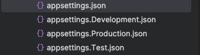
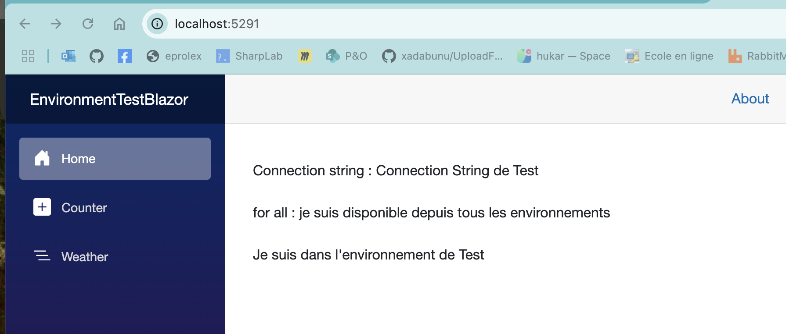
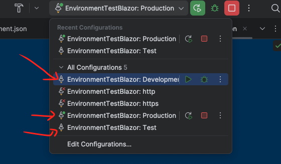
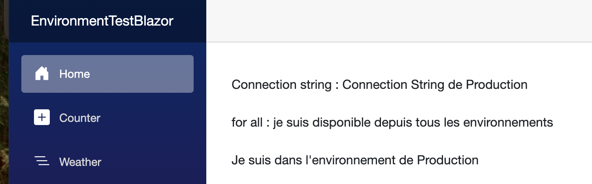

# 24.5 gestion des différents environnements

## ´DOTNET_ENVIRONMENT´ et ´ASPNETCORE_ENVIRONMENT´
Il y a une préséence de ´DOTNET_ENVIRONMENT´ sur ´ASPNETCORE_ENVIRONMENT´, le meilleur moyen de régler ce genre de problème est d'ajouter dans ´LaucnSettings.json´ les deux variables :
´´´json
"Test": {
      "commandName": "Project",
      "environmentVariables": {
        "ASPNETCORE_ENVIRONMENT": "Test",
        "DOTNET_ENVIRONMENT": "Test"
      },
      "launchBrowser": false,
      "dotnetRunMessages": true,
      "applicationUrl": "https://localhost:6443;http://localhost:6080"
    },
´´´
    

## Plusieurs `appsettings.json`

On peut créer autant de `appsettings.json` que d'environnements qu'on désire :



Si `ASPNETCORE_ENVIRONMENT` vaut `Test` par exemple, les valeurs de `appsettings.json` et `appsettings.Test.json` seront lues. Si une clé est identique et présente dans les deux fichiers, le plus spécifique écrase le plus générique. Ici `appsettings.Test.json` écrase `appsettings.json`.

`appsettings.json`

```json
{
  "MyConnectionString" : "Connection String de unknow ???",
  "AllowedHosts": "*",
  "Logging": {
    "LogLevel": {
      "Default": "Information",
      "Microsoft.AspNetCore": "Warning"
    }
  },
  "MyStringForAll": "je suis disponible depuis tous les environnements"
}
```


`appsettings.Test.json`

```json
{
  "MyConnectionString" : "Connection String de Test"
}
```

Ici `Configuration["MyConnectionString"]` vaudra donc `"Connection String de Test"`.

### Test dans `Blazor Server`

```react
@page "/"

@inject IConfiguration Configuration


Connection string : @_connectionString<br/>
for all : @_forAll

@if (Environment.GetEnvironmentVariable("ASPNETCORE_ENVIRONMENT") == "Test")
{
    <p>Je suis dans l'environnement de Test</p>
}

@if (Environment.GetEnvironmentVariable("ASPNETCORE_ENVIRONMENT") == "Development")
{
    <p>Je suis dans l'environnement de Development</p>
}

@if (Environment.GetEnvironmentVariable("ASPNETCORE_ENVIRONMENT") == "Production")
{
    <p>Je suis dans l'environnement de Production</p>
}


@code
{
    string _connectionString = string.Empty;
    string _forAll = string.Empty;

    protected override void OnInitialized()
    {
        _connectionString = Configuration["MyConnectionString"] ?? "";
        _forAll = Configuration["MyStringForAll"] ?? "";
    }
}
```




## Accès à l'`Environment` et aux différents `appsettings`

### `ASPNETCORE_ENVIRONMENT`

On accède à l'environnement avec `Environment.GetEnvironmentVariable("ASPNETCORE_ENVIRONMENT")` dans un composant `Blazor`.

```react
@if (Environment.GetEnvironmentVariable("ASPNETCORE_ENVIRONMENT") == "Production")
{
    <p>Je suis dans l'environnement de Production</p>
}
```

Dans `Program.cs`, on a différent `helpers` :

```cs
if(app.Environment.IsDevelopment()) Console.WriteLine("Test ddevelopment");
if(app.Environment.IsProduction()) Console.WriteLine("Test production");
```

Par défaut `asp.net` a trois environnements (valeur pour `ASPNETCORE_ENVIRONMENT`) définis:

- `Development`
- `Staging`
- `Production`

Si on veut créer un nouvel environnement, `Test` par exemple on a :

```cs
if(app.Environment.IsEnvironment("Test")) Console.WriteLine("Test environment");
```


### `IConfiguration`

C'est en injectant `IConfiguration Configuration` que l'on accède aux données contenues dans les différents `appsettings`.

 `asp.net` va charger `appsettings.<valeur de ASPNETCORE_ENVIRONMENT>.json`.

```react
@inject IConfiguration Configuration

@code
{
    string _connectionString = string.Empty;
    string _forAll = string.Empty;

    protected override void OnInitialized()
    {
        _connectionString = Configuration["MyConnectionString"] ?? "";
        _forAll = Configuration["MyStringForAll"] ?? "";
    }
}
```


## Tester les environnements depuis son `IDE`

Le fichier `launchSettings.json` permet de définir les paramètres d'exécution de l'application, notamment `ASPNETCORE_ENVIRONMENT`.

```json
{
  "$schema": "https://json.schemastore.org/launchsettings.json",
  "profiles": {
    "Test": {
      "commandName": "Project",
      "dotnetRunMessages": true,
      "launchBrowser": false,
      "applicationUrl": "http://localhost:5291",
      "environmentVariables": {
        "ASPNETCORE_ENVIRONMENT": "Test"
      }
    },
    "Development": {
      "commandName": "Project",
      "dotnetRunMessages": true,
      "launchBrowser": false,
      "applicationUrl": "http://localhost:5291",
      "environmentVariables": {
        "ASPNETCORE_ENVIRONMENT": "Development"
      }
    },
    "Production": {
      "commandName": "Project",
      "dotnetRunMessages": true,
      "launchBrowser": false,
      "applicationUrl": "http://localhost:5291",
      "environmentVariables": {
        "ASPNETCORE_ENVIRONMENT": "Production"
      }
    }
  }
}
```



```json
  "$schema": "https://json.schemastore.org/launchsettings.json",
```

### 🔹 `$schema` : Fournit un lien vers le schéma `JSON` pour l'autocomplétion et la validation du fichier dans l'éditeur.


```json
"commandName": "Project",
```


### 🔹 **`commandName`** : Définit le mode d'exécution.

- `"Project"` : Démarre l'application en mode projet (`dotnet run`).
- D'autres valeurs possibles :
  - `"IISExpress"` : Lance avec `IIS Express`.
  - `"Executable"` : Démarre une application publiée.

```json
  "dotnetRunMessages": true,
```


### 🔹 `dotnetRunMessages` :

`true` → Affiche les logs de démarrage dans la console (dotnet run).

`false` → Désactive ces messages.


> ## Exécuter un `profile` en `CLI`
>
> ### `--launch-profile`
>
> ```bash
> dotnet run --launch-profile Production
> ```
>
> 
>
> ### Priorité par défaut
>
> **`dotnet run` sans argument** Utilise **le premier profil** défini dans `launchSettings.json`. la valeur première valeur de `ASPNETCORE_ENVIRONMENT` dans le fichier `launchSettings` écrasera donc la valeur définie par :
>
> ```bash 
> export ASPNETCORE_ENVIRONMENT=Production
> ```
>
> Je peus aussi utiliser `--no-launch-profile` pour ne pas tenir compte de `launchSettings.json` :
>
> ```bash
> echo $ASPNETCORE_ENVIRONMENT        
> Production
> 
> dotnet run --no-launch-profile 
> ```
>
> Mon application tourne en `Production`
>
> ```bash
> dotnet run
> ```
>
> Mon application tourne en `Test`, qui est le premier `profile` défini dans `launchSettings.json`.
