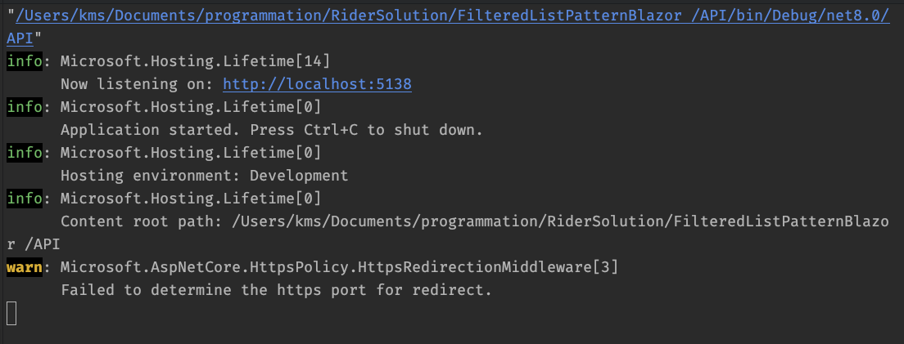
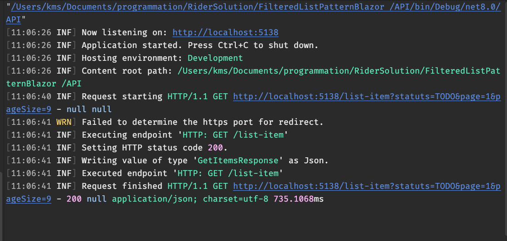

# 30.6.5 `Serilog`

Les choses simples doivent être simples et les choses compiquées doivent être possible.

https://www.youtube.com/watch?v=hJ0QHRV3RPQ&ab_channel=RainerStropek


## Installer `Serilog`

```bash
dotnet add package Serilog.AspNetCore
```


## Activer dans `Program.cs`

```cs
var builder = WebApplication.CreateBuilder(args);

Log.Logger = new LoggerConfiguration()
    .WriteTo.Console()
    .CreateLogger();

// ...

builder.Services.AddSerilog();

var app = builder.Build();
// ...
```


## `Logs` par défaut

Sans rien faire d'autre on a déjà une qualité de `logs` très intéressante :

### `Sans`



On ne voit même pas les requêtes arrivantes.


### `Avec`



On a maintenant le `endpoint` concerné, la `requête` ainsi que le `type` de la réponse.