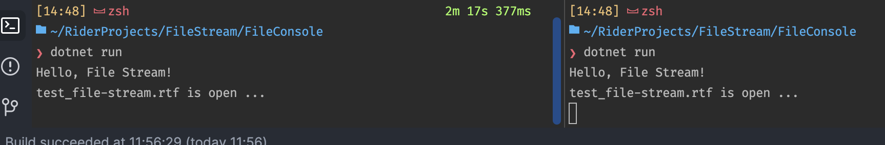
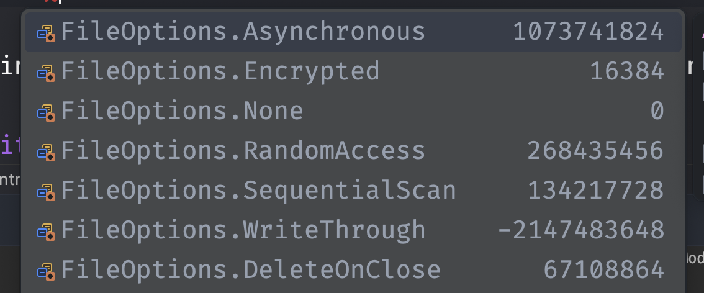
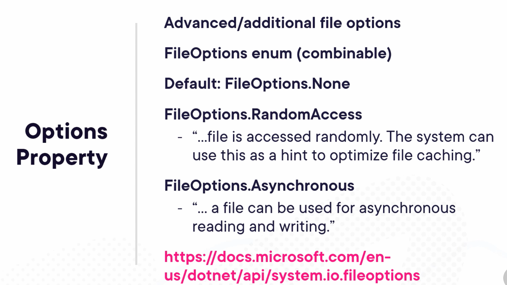
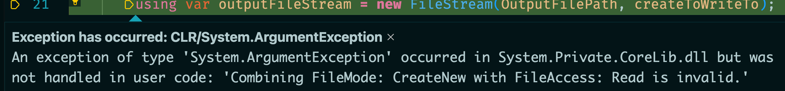

# 09 Utilisation des `Stream`


## `FileStream`

```cs
public void Process()
{
    using var inputFileStream = new FileStream(InputFilePath, FileMode.Open);
    using var outputFileStream = new FileStream(OutputFilePath, FileMode.CreateNew);
}
```

`using` car `FileStream` implémente `IDisposable`, en générale tout appelle à l'extérieur du programme nécessite un `using` pour disposer proprement les ressources.

`FileMode.CreateNew` car on ne souhaite pas que le fichier de sortie existe déjà.


## `FileStreamOptions`

On peut définir les `options` dans un objet `FileStreamOptions` :

```cs
var openToReadFrom = new FileStreamOptions { Mode = FileMode.Open };
using var inputFileStream = new FileStream(InputFilePath, openToReadFrom);

var createToWriteTo = new FileStreamOptions { Mode = FileMode.CreateNew };
using var outputFileStream = new FileStream(outputFilePath, createToWriteTo);
```

Voici les paramètres ainsi que les valeurs par défaut (version simplifiée de la classe) :

```cs
class FileStreamOptions
{
    FileMode = FileMode.Open;
    FileAccess  = FileAccess.Read;
    FileShare = FileShare.Read;
    PreallocationSize;
    BufferSize = 4096;
    UnixCreateMode;
}
```

`FileShare` défini comment le fichier peut être partagé par les processus.

`PreallocationSize` définit la taille initiale en octet pour le fichier. Utilisé pour les gros fichier, cela peut réduire la fragmentation du disque et améliorer les performances.

`BufferSize` 0 ou 1 signifie que le `buffer` n'est pas utilisé.


### Variation de `BufferSize`

Programme de test :

```cs
var random = new Random();

int bufferSize;

const string desktopPath = "/users/hukar/Desktop";
const string fileToCopy = "114-file.txt";
const string startPath = $"{desktopPath}/LargeFile/{fileToCopy}";

for (var i = 0; i < 18; i++)
{
    bufferSize = (int)Math.Pow(2, i);
    
    var destinationPath = $"{desktopPath}/outputFiles/copy{random.Next(1000,2000)}-{fileToCopy}";

    var readOptions = new FileStreamOptions
    {
        Mode = FileMode.Open,
        Access = FileAccess.Read,
        BufferSize = bufferSize,
    };
    await using var fsRead = new FileStream(startPath, readOptions);

    var writeOptions = new FileStreamOptions
    {
        Mode = FileMode.Create,
        Access = FileAccess.Write,
        Options = FileOptions.DeleteOnClose,
        BufferSize = bufferSize,
    };

    await using var fsWrite = new FileStream(destinationPath, writeOptions);

    var sw = new Stopwatch();

    sw.Start();
    await fsRead.CopyToAsync(fsWrite);
    sw.Stop();

    Console.WriteLine($"buffer size: {bufferSize}, ms: {sw.ElapsedMilliseconds}");
}
```

```
buffer size: 1, ms: 2202
buffer size: 2, ms: 2113
buffer size: 4, ms: 2498
buffer size: 8, ms: 2412
buffer size: 16, ms: 2653
buffer size: 32, ms: 2463
buffer size: 64, ms: 2450
buffer size: 128, ms: 2522
buffer size: 256, ms: 2151
buffer size: 512, ms: 2183
buffer size: 1024, ms: 2197
buffer size: 2048, ms: 2132
buffer size: 4096, ms: 2041
buffer size: 8192, ms: 2438
buffer size: 16384, ms: 2302
buffer size: 32768, ms: 2271
buffer size: 65536, ms: 2836
buffer size: 131072, ms: 3369
```

Pas de résultat significatif.


#### Essayons de pré-allouer la mémoire précisement

Code de test :

```cs
var readOptions = new FileStreamOptions
{
    Mode = FileMode.Open,
    Access = FileAccess.Read,
};
await using var fsRead = new FileStream(startPath, readOptions);

Console.WriteLine($"stream lenght:{fsRead.Length}");

var file = new FileInfo(startPath);
Console.WriteLine($"file length: {file.Length}");

var preallocationSize = file.Length*2; // 1, 10, 1024*1024, ...

var writeOptions = new FileStreamOptions
{
    Mode = FileMode.Create,
    Access = FileAccess.Write,
    Options = FileOptions.DeleteOnClose,
    PreallocationSize = preallocationSize,
};

await using var fsWrite = new FileStream(destinationPath, writeOptions);

var sw = new Stopwatch();

sw.Start();
await fsRead.CopyToAsync(fsWrite);
sw.Stop();

Console.WriteLine($"Preallocationsize: {preallocationSize}  ms: {sw.ElapsedMilliseconds}");
```

Pour avoir la taille du fichier on peut utiliser `fsRead.Length` ou avec `FileInfo`, `file.Length`.

```
stream lenght:2415919104
file length: 2415919104

Preallocationsize: 1  ms: 2506
Preallocationsize: 10  ms: 3203
Preallocationsize: 1048576  ms: 3119
Preallocationsize: 2415919104  ms: 1902
Preallocationsize: 4831838208  ms: 1918
```

Par contre ici, la valeur exact du fichier (ou plus grand mais ça ne sert à rien) apporte un résultat significatif, c'est `1,5 fois` plus rapide.


### `FileMode`

Lorsqu'on crée un `FileStream`, on doit préciser un `FileMode` :

- `Open` ouvre un fichier, lance une `exception` s'il n'existe pas
- `OpenOrCreate` ouvre un fichier ou le crée s'il n'existe pas
- `Create` crée un fichier ou l'écrase s'il existe déjà
- `CreateNew` crée un fichier ou lance une `exception` s'il existe déjà
- `Append` ouvre ou crée un fichier et se place à la fin du fichier pour y ajouter des données
- `Truncate` supprime le contenu d'un fichier (met à 0 `byte`), on peut donc ré-écrire un fichier sans avoir à le supprimer. Lance une exception si le fichier n'existe pas.


### `FileShare`

Cela défi nit comment le fichier peut-être paratagé entre divers processus.

Un `FileShare` à `None` spécifie qu'il ne peut pas être partagé :

```cs
var inputStreamOptions = new FileStreamOptions
{
    Mode = FileMode.Open, 
    Access = FileAccess.Read, 
    Share = FileShare.None
};
using var inputFileStream = new FileStream(inputPath, inputStreamOptions);
```

Si un deuxième processus (une nouvelle instance du programme `Console` par exemple) essaye d'ouvrir le même fichier, on obtient une exception :

```
Unhandled exception. System.IO.IOException: The process cannot access the file '/Users/hukar/Desktop/test_file-stream.rtf' because it is being used by another process.
```

Maintenant si je règle `FileShare` sur `Read` :

```cs
Share = FileShare.Read
```



Les deux processus ont ouvert le même fichier.


### `FileOptions`



Des options supplémentaire sur la gestion du fichier par le système.




#### Utilisation de `FileOptions.DeleteOnClose`

```cs
var random = new Random();

var fileToCreatePath = Path.Combine("/Users/hukar/Desktop", "test_file-stream.rtf");

var options = new FileStreamOptions
{
    Mode = FileMode.Append, 
    Access = FileAccess.Write, 
    Options = FileOptions.DeleteOnClose
};

await using var fs = new FileStream(fileToCreatePath, options);
var bytes = new byte[1024 * 1024];

for (var i = 0; i < 12; i++)
{
    random.NextBytes(bytes);
    
    fs.Write(bytes);

    await Task.Delay(TimeSpan.FromSeconds(1));
    Console.Write(".");
}
```

Va écrire dans un fichier existant, puis à la fin supprimer le fichier.


### Ajout de `StreamReader` et `StreamWriter`

```cs
var openToReadFrom = new FileStreamOptions { Mode = FileMode.Open };
using var inputFileStream = new FileStream(InputFilePath, openToReadFrom);
using var inputStreamReader = new StreamReader(inputFileStream);

var createToWriteTo = new FileStreamOptions { Mode = FileMode.CreateNew };
using var outputFileStream = new FileStream(OutputFilePath, createToWriteTo);
using var outputStreamWriter = new StreamWriter(outputFileStream);

while(!inputStreamReader.EndOfStream)
{
    string inputLine = inputStreamReader.ReadLine()!;
    string processedLine = inputLine.ToUpperInvariant();
    outputStreamWriter.WriteLine(processedLine);
}
```

`streamReader.EndOfStream` retourne `true`à la fin d'un `stream`.

`inputStreamReader.ReadLine()!` on sait qu'il n'est pas `null` avec la condition du `while`, on le spécifie au compilateur avec le `bang operator` : `!`.



On obtient une `exception` :

> Combiner `FileMode: CreateNew` et `FileAccess: Read` est invalide.

C'est parce que par défaut `FileAccess` vaut `Read`, on va donc modifier les options :

```cs
var createToWriteTo = new FileStreamOptions { 
    Mode = FileMode.CreateNew,
    Access = FileAccess.Write
};
```


## Exemple complet de lecture d'un fichier texte `rtf`

```cs
const string inputPath = "/Users/hukar/Desktop/test_file-stream.rtf";
const string outputDirectory = "/Users/hukar/Desktop/outputFiles";

if (!Directory.Exists(outputDirectory)) Directory.CreateDirectory(outputDirectory);

using var inputFileStream = new FileStream(inputPath, FileMode.Open, FileAccess.Read);
using var outputFileStream = new FileStream($"{outputDirectory}/my-copy.rtf", FileMode.Create, FileAccess.Write);
```
ou en utilisant `FileStreamOptions`

```cs
var inputStreamOptions = new FileStreamOptions { Mode = FileMode.Open, Access = FileAccess.Read};
using var inputFileStream = new FileStream(inputPath, inputStreamOptions);

var outputStreamOptions = new FileStreamOptions { Mode = FileMode.Create, Access = FileAccess.Write };
using var outputFileStream = new FileStream($"{outputDirectory}/my-copy.rtf", outputStreamOptions);
```

puis la lecture/écriture du fichier de texte (`StreamReader` et `StreamWriter` étant utilisés pour du texte) :

```cs

using var streamReader = new StreamReader(inputFileStream);
using var streamWriter = new StreamWriter(outputFileStream);

while (!streamReader.EndOfStream)
{
    var line = streamReader.ReadLine();
    streamWriter.WriteLine(line);
}
```

