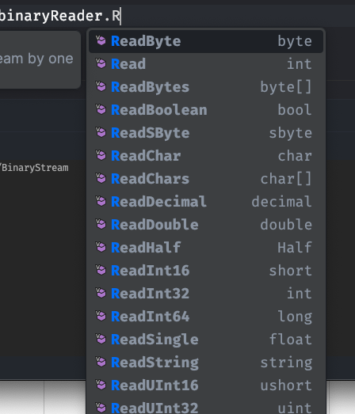
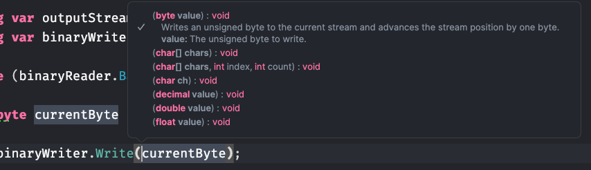
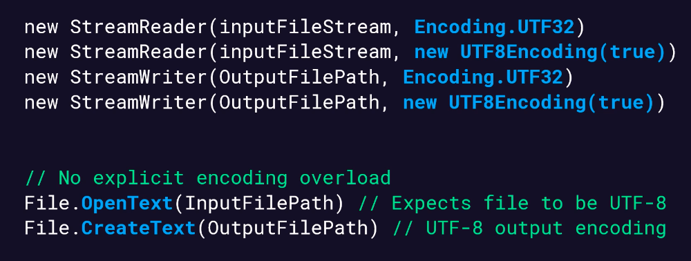
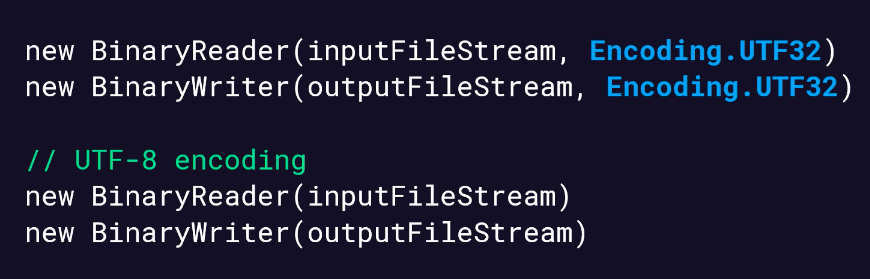
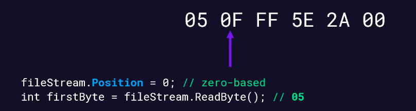
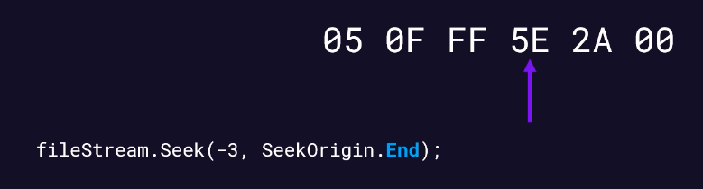

# 11 Binary `Stream`


## Mise en place
```cs
var random = new Random();

var basePath = "/Users/kms/Desktop";
var uploadFile = "LargeFilesToUpload";
var outputFile = "outputFile";
var fileName = "text-little.rtf";
var outputFileName = $"copy-{random.Next(100, 1000)}-{fileName}";

var inputPath = Path.Combine(basePath, uploadFile, fileName);
var outputPath = Path.Combine(basePath, outputFile, outputFileName);
```
## Les méthodes de `File`, utilisation de `FileStream`

```cs
var optionsRead = new FileStreamOptions
{
    Mode = FileMode.Open
};
using var inputStream = File.Open(inputPath, optionsRead);
using var outputStream = File.Create(outputPath);

const int endOfStream = -1;

int currentByte = inputStream.ReadByte();

while (currentByte != endOfStream)
{
    outputStream.WriteByte((byte)currentByte);

    currentByte = inputStream.ReadByte();
}
```

On peut ici copier `byte` par `byte` un fichier.

`ReadByte` renvoie le `byte` suivant du fichier ou `-1` s'il n'y a plus de `byte`.


## `BinaryReader` et `BinaryWriter`

### Création des `BinaryReader` et `BinaryWriter`

```cs
using var inputStream = File.Open(inputPath, optionsRead);
using var binaryReader = new BinaryReader(inputStream);

using var outputStream = File.Create(outputPath);
using var binaryWriter = new BinaryWriter(outputStream);
```


### Utilisation

La classe `BinaryReader` dispose de plusieurs méthode pour convertir des `bytes` dans un type `.net` :



```cs
while (binaryReader.BaseStream.Position < binaryReader.BaseStream.Length)
{
    byte currentByte = binaryReader.ReadByte();
    
    binaryWriter.Write(currentByte);
}
```

De même `Write` possède plusieurs `overload` (surcharge) acceptant tous les types de base `.net` en argument.



On compare la position sur le `stream` à sa taille totale comme condition de sortie de la boucle `while`.

> L'utilisation des `BinaryReader` et  `BinaryWriter` ne se justifie que s'il y a un besoin de conversion des `bytes` vers des types `.net`.


## spécifier l'`Encoding`



De même avec `BinaryReader` et `BinaryWriter` on a:



Si on ne précise rein c'est `UTF-8` par défaut.


## Ajouter du contenu : `Append`

On a un `overload` du constructeur de `StreamWriter` qui permet de rajouter du texte à un fichier texte :

```cs
using var sw = new StreamWriter(inputPath, true);

sw.Write("Toto");
sw.WriteLine("Titi");
```

Rien besoin d'autre.


### Pour un fichier `Binary`

```cs
using var fs = new FileStream(inputPath, FileMode.Append);

using var sw = new BinaryWriter(fs);

sw.Write("Hello");
sw.Write(476541998432);
```


## Random FileStream Access

La `position` d'un `stream` commence par 0.

On peut lire ensuite `byte` par `byte`, le `byte 1` étant à la `position 0`, le `byte 2` à la `position 1` etc.



```cs
using var fs = new FileStream(inputPath, FileMode.Open);

fs.Position = 4;

var byteValue = new byte[1];

for (var i = 0; i < 6; i++)
{
     byteValue[0] = (byte)fs.ReadByte();
     Console.Write(Convert.ToHexString(byteValue) + " ");
}
```

```
54 69 74 69 0A 54
```


### `Seek(offset, SeekOrigin)`

On peut aussi utiliser la méthode `Seek` de `FileStream` :

```cs
fs.Seek(2, SeekOrigin.Begin);

var seekValue = (byte)fs.ReadByte();

byte[] byteValue = [ seekValue ];

Console.Write(Convert.ToHexString(byteValue));
```

```
74
```

On a aussi `SeekOrigin.Current` et `SeekOrigin.End`.

On peut aussi utiliser un `offset` négatif :

```cs
fs.Seek(-12, SeekOrigin.End);
```



Tous les `stream` ne supportent pas un `random Access`, on utilise `fs.CanSeek` pour savoir si on peut utiliser `Seek`.


