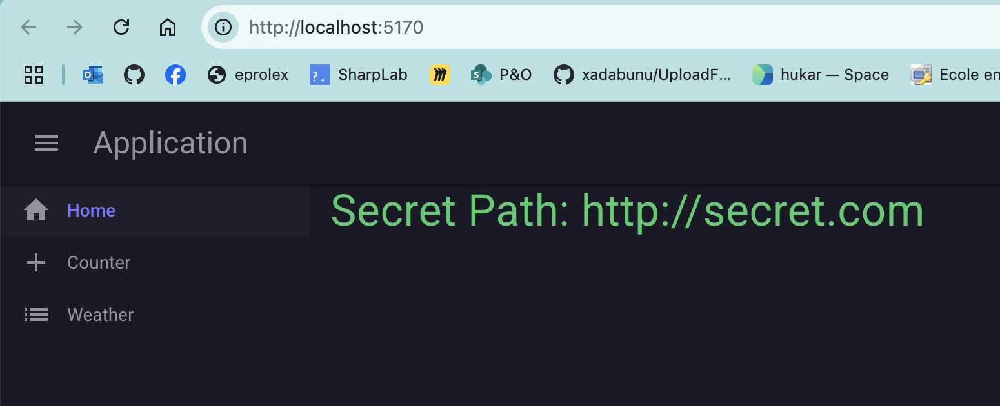
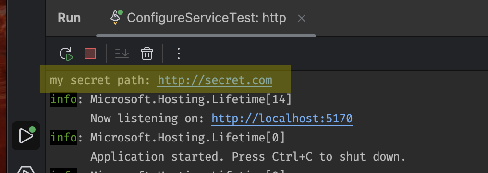
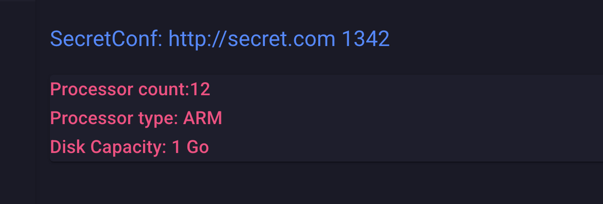
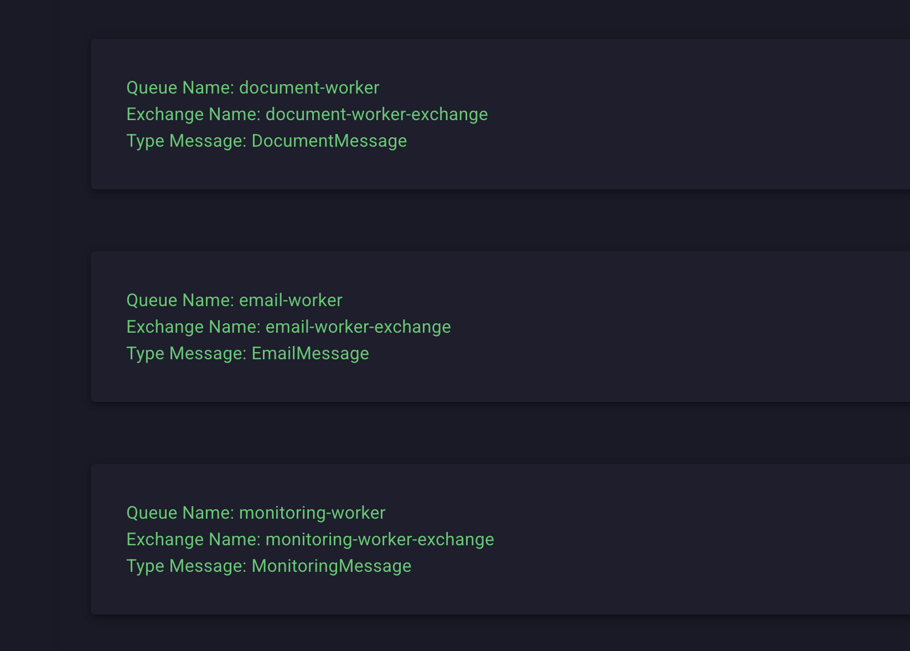

# 36.5 Injection de dépendance et `configuration`


## Utiliser un fichier de `configuration`

Par défaut nous avons `Appsettings.json` et `Appsettings.Development.json`

comme fichier de configuration.

On peut créer ses. propres fichiers de configuration de type `MyConf.json` par exemple :

```json
{
  "MySecretPath": "http://secret.com"
}
```

On le renseigne (l'enregistre). comme ceci :

```cs
builder.Configuration.AddJsonFile("MyConf.json");
```

Utilisation dans une `razor page` :

```ruby
@inject IConfiguration Configuration

<MudText Typo="Typo.h4" Color="Color.Success">
    Secret Path: @Configuration["MySecretPath"]
</MudText>
```



ou bien dans `Program.cs` :

```cs
Console.WriteLine($"my secret path: {app.Configuration["MySecretPath"]}");
```




## Mapper un fichier de configuration avec une `classe`

### `Configuration.Get<T>`

`MyConf.json`

```json
{
  "MySecretPath": "http://secret.com",
  "MySecretNumber": 1342
}
```

`SecretConfiguration.cs`

```cs
public class SecretConfiguration
{
    public string MySecretPath { get; set; } = string.Empty;

    public int MySecretNumber { get; set; }
}
```

Enregistrement dans `Program.cs`

```cs
builder.Configuration.AddJsonFile("MyConf.json");

var  config = builder.Configuration.Get<SecretConfiguration>();

if(config is not null) builder.Services.AddSingleton(config);
```

Puis dans un composant :

```ruby
@inject SecretConfiguration SecretConf

<MudText Typo="Typo.h5" Color="Color.Info">
    SecretConf: @SecretConf.MySecretPath @SecretConf.MySecretNumber
</MudText>
```

On remarque que le nom de la classe ne correspond pas forcement au nom. du fichier, seul les champs (les propriétés) doivent correspondre.


### Mapper une section `GetSection("MaSection")`

`MyConf.json`

```json
{
  "MySecretPath": "http://secret.com",
  "MySecretNumber": 1342,
  "HardwareSection": {
    "ProcessorCount": 12,
    "ProcessorType": "ARM",
    "HardDiskCapacity": "1 Go"
  }
}
```

On créé une classe de `Mapping` :

`MyHardware.cs`

```cs
public class MyHardware
{
    public int ProcessorCount { get; set; }
    public string ProcessorType { get; set; } = string.Empty;
    public string HardDiskCapacity { get; set; } = string.Empty;
}
```

Et on enregistre tout ça dans `Program.cs`

```cs
var hardwareOptions = builder.Configuration
    .GetSection("HardwareSection")
    .Get<MyHardware>();

if(hardwareOptions is not null) builder.Services.AddSingleton(hardwareOptions);
```

Il suffit ensuite d'injecter `MyHardware` dans une `classe` ou dans un `composant`.




### Mapper une liste de configurations `Get<List<T>>`

ON peut aussi utiliser et injecter une `list` de configurations :

`Appsettings.json`

```json
// ...
"AllowedHosts": "*",
  "RabbitMqConnections": [
    {
      "TypeMessage": "DocumentMessage",
      "QueueName": "document-worker",
      "ExchangeName": "document-worker-exchange"
    },
    {
      "TypeMessage": "EmailMessage",
      "QueueName": "email-worker",
      "ExchangeName": "email-worker-exchange"
    },
    {
      "TypeMessage": "MonitoringMessage",
      "QueueName": "monitoring-worker",
      "ExchangeName": "monitoring-worker-exchange"
    }
  ]
}
```

On a une classe pour chaque `Configuration` : `RabbitMqConnection.cs`

```cs
public class RabbitMqConnection
{
    public string TypeMessage { get; set; } = string.Empty;
    public string QueueName { get; set; } = string.Empty;
    public string ExchangeName { get; set; } = string.Empty;
    
}
```

Puis dans `Program.cs` :

```cs
var rabbitConnectionOptions = builder.Configuration
    .GetSection("RabbitMqConnections")
    .Get<List<RabbitMqConnection>>();

if (rabbitConnectionOptions is not null) builder.Services.AddSingleton(rabbitConnectionOptions);
```

Utilisation dans un composant `Blazor` :

```ruby
@inject List<RabbitMqConnection> RabbitConnections

@foreach (var options in RabbitConnections)
{
    <MudPaper Elevation="4"  Class="pa-8 ma-4">
    <MudText Typo="Typo.body1" Color="Color.Success">
        Queue Name: @options.QueueName
    </MudText>
    <MudText Typo="Typo.body1" Color="Color.Success">
        Exchange Name: @options.ExchangeName
    </MudText>
    <MudText Typo="Typo.body1" Color="Color.Success">
        Type Message: @options.TypeMessage
    </MudText>
    </MudPaper>
}
```




## Utiliser `IOptions<T>`

> Réponse de ChatGPT

## 🧠 Alors, pourquoi `Configure<T>()` et `IOptions<T>` existent ?

Voici les **4 raisons principales** :

------

### 1. 🔁 **Reload automatique (`IOptionsMonitor<T>`)**

Si tu veux que **la configuration se mette à jour à chaud** (ex: changement de fichier `appsettings.json` avec `reloadOnChange: true`), alors il te faut `IOptionsMonitor<T>`.

> Ta méthode avec `.Get<T>()` donne une **copie figée** au démarrage.

```csharp
builder.Configuration.AddJsonFile("settings.json", reloadOnChange: true);

builder.Services.Configure<MyOptions>(
    builder.Configuration.GetSection("MyOptions"));

// Et dans le service :
public MyService(IOptionsMonitor<MyOptions> monitor) { ... }
```

------

### 2. 🔄 **Scopes dynamiques avec `IOptionsSnapshot<T>`**

Quand tu es dans un contexte **scoped** (ex: requête HTTP, Blazor Server, SignalR), tu peux avoir **des options différentes par scope**, si besoin, avec `IOptionsSnapshot<T>`.

Utilisation typique dans ASP.NET :

```csharp
public MyService(IOptionsSnapshot<MyOptions> options)
{
    var current = options.Value;
}
```

------

### 3. ✅ **Validation intégrée avec `ValidateDataAnnotations()` ou `Validate(...)`**

Si tu veux ajouter des validations fortes (ex: champ requis, pattern, range) :

```csharp
builder.Services
    .AddOptions<MyOptions>()
    .Bind(configuration.GetSection("MyOptions"))
    .ValidateDataAnnotations();
```

Et ta classe :

```csharp
public class MyOptions
{
    [Required]
    public string ApiKey { get; set; } = default!;
}
```

Avec `.Get<T>()`, tu dois faire **tes propres validations à la main**.

------

### 4. 📦 **Standardisation & compatibilité**

- Des packages .NET officiels utilisent `IOptions<T>` pour te fournir des hooks configurables (`AddAuthentication()`, `AddAuthorization()`, `AddSignalR()`, etc.).
- Cela permet d’avoir une configuration **testable, moquable**, injectée comme n’importe quel service.
- C’est aussi utile pour les **librairies réutilisables** ou des **options générées par d’autres services**.

------

## 🧾 Résumé

| Méthode                           | Avantages                                | Limites                            |
| --------------------------------- | ---------------------------------------- | ---------------------------------- |
| `.GetSection(...).Get<T>()`       | Simple, direct, sans `IOptions`          | Pas de reload, pas de validation   |
| `.Configure<T>()` + `IOptions<T>` | Reload possible, validation, DI-friendly | Plus verbeux, un peu plus complexe |


------

### 🎯 Ta méthode est la bonne...

... **si tu contrôles tout**, veux de la simplicité, et n’as pas besoin de reload automatique. Beaucoup de devs expérimentés font comme toi dans des apps internes ou maîtrisées.

