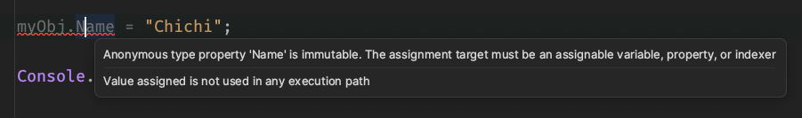
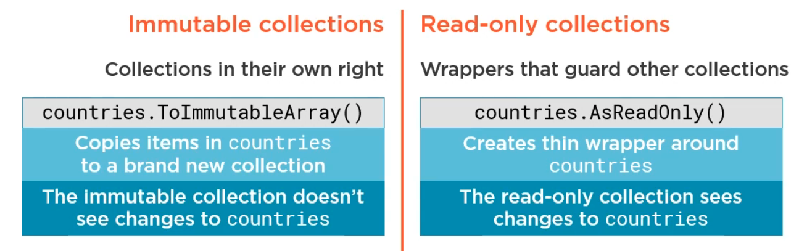
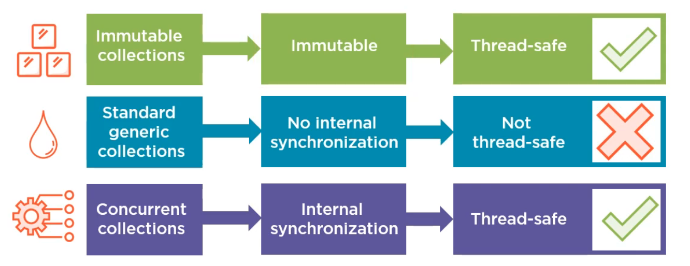
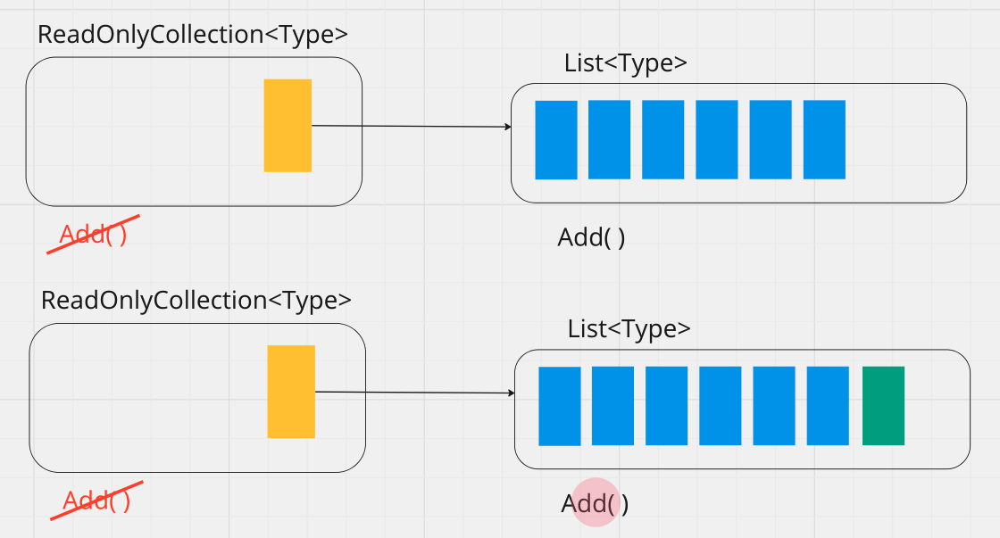

# 13 Les collections `Immutables`


## Les objets `anonymes`

```cs
var myObj = new
{
    Name = "Chouchou",
    Age = 45
};
```

Les propriétés des objets anonymes sont `immutable`:




### Utilisation de `with`

> Fonctionnalité identique avec les types `record`.

On peut utiliser `with` pour créer une modification non-destructive:

```cs
var myObj = new
{
    Name = "Chouchou",
    Age = 45
};

var chouchou = myObj with { Age = 23 };

Console.WriteLine(myObj);
Console.WriteLine(chouchou);
```

```json
{ Name = Chouchou, Age = 45 }
{ Name = Chouchou, Age = 23 }
```


### Implémentation d'`Equals`

Les `types anonymes` implémente `Equals` sur l'égalité des propriétés :

```cs
var myObj = new
{
    Name = "Chouchou",
    Age = 45
};

var chouchou = new
{
    Name = "Chouchou",
    Age = 45
};

Console.WriteLine(myObj.Equals(chouchou));
```

```bahs
true
```


## `ImmutableList`

```cs
using System.Collections.Immutable;

var listOne = ImmutableList.Create<string>("Chichi");
var listTwo = listOne.Add("chocho");

Console.WriteLine(listOne.Count);
Console.WriteLine(listTwo.Count);
```

```
1
2
```

La méthode `Add` de `ImmutableList` n'ajoute pas un entrée à la liste (`listOne`) sur laquelle elle est appliquée, mais crée une nouvelle liste (`listTwo`).


### Créer une `ImmutableList` à partir d'une `List`

```cs
ImmutableList<Bot> bots = firstList.ToImmutableList();
```

```cs
Console.WriteLine(bots.Count);

bots.Add(new Bot());

firstList.Add(new Bot());

Console.WriteLine(bots.Count);
```

```bash
3
3
```

Ni le fait d'ajouter un élément dans la `ImmutableList`, ni le fait d'en ajouter un dans la `List` d'origine, ne modifie la `ImmutableList`.

La deuxième ligne crée une nouvelle `ImmutableList` que l'on peut assigner à une variable:

```cs
ImmutableList<Bot> newBots = bots.Add(new Bot());
```




### `Concurrency` et `ImmutableList`

Les `ImmutableList` sont `Thread Safe` de par leur nature `Immutable` contrairement au `ConcurrentCollection` qui utilise un algorithme complex de synchronisation.




## `List<T>.AsReadOnly()`

```cs
var listThree = (new List<string> { "Toto" }).AsReadOnly();
listThree.Add("Titi");
```

```bash
error CS1061: 'ReadOnlyCollection<string>' does not contain a definition for 'Add' and no accessible extension method 'Add' accepting a first argument of type 'ReadOnlyCollection<string>' could be found 
```

Avec `AsReadOnly`, on a plus accès aux méthodes `Add` et `Remove`.


## `ReadOnlyCollection`

Etrangement `microsoft` a donné le nom de type aux listes `ReadOnly` `ReadOnlyCollection` plutôt que `ReadOnlyList`.

Ce type vient de `using System.Collections.ObjectModel`.

```cs
using System.Collections.ObjectModel;

var firstList = new List<Bot>() { /* ... */ };

ReadOnlyCollection<Bot> bots = new(firstList);

// OU

ReadOnlyCollection<Bot> bots = firstList.AsReadOnly();

Console.WriteLine(bots.Count);
```

```bash
3
```

```cs
bots.Add(new Bot);
```

On obtient une erreur !!

La méthode `Add` n'est plus exposée (ainsi que toutes les méthodes de mutation de la liste).

<div style="color:red"> 
error CS1061: 'ReadOnlyCollection<Bot>' does not contain a definition for 'Add' and no accessible extension method 'Add' accepting a first argument of type 'ReadOnlyCollection<Bot>' could be found
</div>

Maintenant rien ne nous empêche de modifier la liste d'origine et voire que la liste en `ReadOnly` a été modifiée:

```cs
firstList.Add(new Bot());

Console.WriteLine(bots.Count);
```

```bash
4
```

### ! Une `ReadOnlyCollection` est juste une enveloppe (`Wrapper`) sur une `list`.

La collection en `ReadOnly` peut donc être modifiée si on a une référence vers la liste contenue.




## `Mapper`

```bash
dotnet add package automapper
```

`Bot.cs` : type `Mutable`

```cs
public class Bot
{
    public int Id { get; set; }
    public string Name { get; set; } = String.Empty;
}
```

`Robot.cs` : type `Immutable`

```cs
public record Robot(int Id, string Name);
```

`Program.cs`

```cs
var bots = new List<Bot> { /* ... */ };

var config = new MapperConfiguration(cfg => cfg.CreateMap<Bot, Robot>());
var mapper = config.CreateMapper();

var robots = mapper.Map<List<Robot>>(bots);
```

On transforme avec `Mapper` une liste d'éléments `Mutable` en une liste d'éléments `Immutable`.

La même chose avec une classe `Immutable`:

`Robot.cs`

```cs
public class Robot
{
    public int Id { get; }
    public string Name { get; }

    public Robot(int id, string name)
    {
        Id = id;
        Name = name;
    }

    public override string ToString()
    {
        return $"Class Robot {{ Id = {Id}, Name = {Name} }}";
    }
}
```

```cs
foreach(var robot in robots) Console.WriteLine(robot);
```

```ruby
Class Robot { Id = 1, Name = DRT-5 }
Class Robot { Id = 2, Name = C3-PO }
Class Robot { Id = 3, Name = BB-9 }
```


## Le `Builder Pattern`

Il expose un objet `Mutable` pour configurer les options et retourne un objet d'options `Immutable`.

Exemple avec `EF Core`

```cs
app.UseDbContext(optionsBuilder => {
    optionsBuilder.ConnectionString = "abcdf";
    optionBuilder.UseConnectionPool();
})
```

Ce qui est exposé est un objet `Immutable` d'options :

```cs
public class DbContextOptions
{
    public string ConnectionString { get; }
    public bool UseConnectionPool { get; }
}
```


## Les `Services` doivent être `Immutable`

Il ne doit pas être possible de modifier un `service` passé par `Dependency Injection`, il pourrait alors être modifié par un objet et utilisé par un autre dans un état alors non connu (!?).

On peut utiliser le pattern `Factory` pour renvoyer un `immutable service`.

> à approfondir ...
