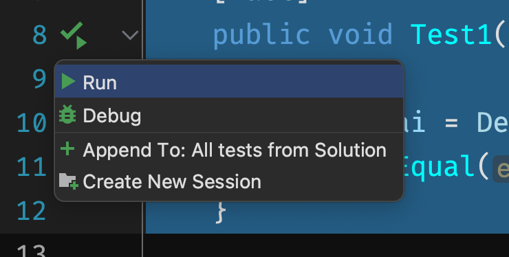
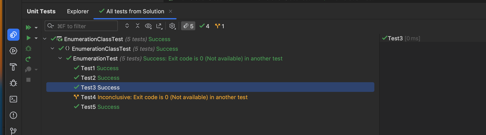

# 15 Tests `Unitaire` : X `unit`

## Installation

On a besoin de trois packages :

```bash
dotnet add package xunit
```

```bash
dotnet add package xunit.runner.visualstudio
```

```bash
dotnet add package Microsoft.NET.Test.Sdk
```


## Test simple `[Fact]`

```cs
using Xunit;

namespace EnumerationClassTest;

public class EnumerationTest
{
    [Fact]
    public void Test1()
    {
        var delai = Delai.SansDelai;
        Assert.Equal(delai, Delai.SansDelai);
    }
	// ...
```

On peut les lancer directement depuis le code :



Ou depuis la console de test :

