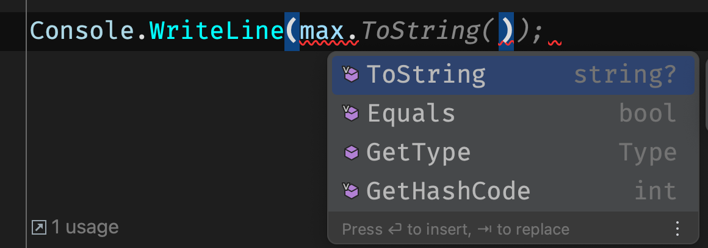

# 16 `c# 12` les nouveautés

## Définition de `Type` avec using

On créé un `alias` sur un `type` ou une construction de `types` déjà existant.

```cs
using Note = int;

Note note = 7;

Console.WriteLine(note);
```

### `using Note = int`


On peut aussi créer des choses plus complexes avec les `tulpes`:

```cs
using Note = (string cours, int noteObtenu);

Note note = ("math", 7);

Console.WriteLine(note);
```

```
Note note = ("math", 7);
```


## Primary Constructor

Contrairement aux `record`, les `class` utilisant un `primary constructor` ne déclare pas des `Public Property` mais plutôt des `parameters` accessible dans la `class`.

```cs
public class Student(int id, string name, Note[] notes)
{
    
}
```

```cs
Student max = new(1, "Max Planck", []);

Console.WriteLine(max. )
```



Les `paramètres` ne sont pas directement disponibles.

Les `paramètres` sont en quelque sorte **capturés** par la `classe`.

```cs
public class Student(int id, string name, Note[] notes)
{
    public string Name { get; set; } = name;
    public int Id => id;
    
    public int GetIdPlusOne() => id + 1;
}
```

Le corps de la `classe` devient alors le corps du `constructeur`.

> ### ! On peut capturer plusieurs fois le même paramètre
>
> ```cs
> public string Name { get; set; } = name;
> public int Id => name.Length;
> ```
>
> La capture a lieu ici deux fois, ce qui n'est pas forcement souhaitable.
>
> Il vaut mieux alors enregistrer (capturer) une seule fois le `paramètre` dans un `private field`:
>
> ```cs
> private readonly string _name = name;
> 
> public string Name => _name;
> public int Id => _name.Length;
> ```
>
> 


### Chaînage des `constructeurs`

On peut chaîner différents constructeurs avec la seule contrainte de fournir des valeurs au `primary constructor`.

```cs
public class Student(int id, string name, Note[] notes)
{
    public Student(int id, string name) : this(id, name, Array.Empty<Note>())
    {
    }
```

```cs
Student max = new(1, "Max Planck", [1, 3, 7]);

Student Paul = new(2, "Paul Gauguin");
```


## `Collection` Expression `[a, b, c]`

```cs
Student max = new(1, "Max Planck", new [] {1.6m, 3.8m, 7.9m});

public Student(int id, string name) : this(id, name, Array.Empty<Note>())  { }
```

J'ai plusieurs endroit dans le code où le changement d'une collection vers une autre nécessitera une réécriture.

Par exemple si je change

```cs
public class Student(int id, string name, Note[] notes)
```

en

```cs
public class Student(int id, string name, ImmutableList<Note> notes)
```

la réécriture peut-être compliquée.

À la place je vais utiliser la nouvelle `collection expression syntax` :

```cs
Student max = new(1, "Max Planck", [1.6m, 3.8m, 7.9m]);

public Student(int id, string name) : this(id, name, [])  { }
```


### `..` spread operator

```cs
List<int> alexScores = [1, 2, 3, 4, 5];

List<int> rachelScores = [6, 7, 8, ..alexScores];
```

Permet d'aplatir (`flattenen`) une collection dans une autre.

Cela fonctionne aussi entre différents types de collection :

```cs
List<int> alexScores = [1, 2, 3, 4, 5];

int[] rachelScores = [6, 7, 8, ..alexScores];
```


### `list` pattern

De la même manière on peut utiliser cette syntaxe pour le pattern matching :

```cs
public Note Moyenne => notes switch
{
    [] => 4.0m,
    [var note] => note,
    [.. var all] => all.Average()
};
```

> ###  ! La méthode `Average` n'est pas disponible pour tous les types de collection. Par exemple elle est disponible pour `ImmutableArray` mais pas pour `ImmutableList`.
>
> Je pense que c'est un bug.
>
> Remarque postée sur le GitHub de la conférence
>
> https://github.com/DustinCampbell/CSharpDemos/issues/1
>
> I'm taking the liberty of simplifying the code of your conference to point out an error I have at home.
>
> ```cs
> Console.WriteLine(CheckNotes([]));
> Console.WriteLine(CheckNotes([3.99m]));
> Console.WriteLine(CheckNotes([1.0m, 2.0m, 3.0m, 4.0m]));
> 
> 
> Note CheckNotes(ImmutableArray<Note> notes) => notes switch
> {
>     [] => 2.0m,
>     [var note] => note,
>     [..var all] => all.Average(),
> };
> ```
>
> Here everything works correctly, but if I change ImmutableArray to ImmutableList I get an exception
>
> ```cs
> Note CheckNotes(ImmutableList<Note> notes) => notes switch
> {
>     [] => 2.0m,
>     [var note] => note,
>     [..var all] => all.Average(),
> };
> ```
>
> and the exception
>
> ```
> /***/RiderProjects/Tests/CSharp12Conference/CSharp12Conference/Program.cs(23,6): error CS1503: Argument 1: cannot convert from 'System.Range' to 'int' [/***/RiderProjects/Tests/CSharp12Conference/CSharp12Conference/CSharp12Conference.csproj]
> /***/RiderProjects/Tests/CSharp12Conference/CSharp12Conference/Program.cs(23,20): error CS1929: 'decimal' does not contain a definition for 'Average' and the best extension method overload 'Enumerable.Average(IEnumerable<decimal>)' requires a receiver of type 'System.Collections.Generic.IEnumerable<decimal>' [/***/RiderProjects/Tests/CSharp12Conference/CSharp12Conference/CSharp12Conference.csproj]
> 
> The build failed. Fix the build errors and run again.
> ```
>
> Thank you in advance for any clarification on this behavior.


