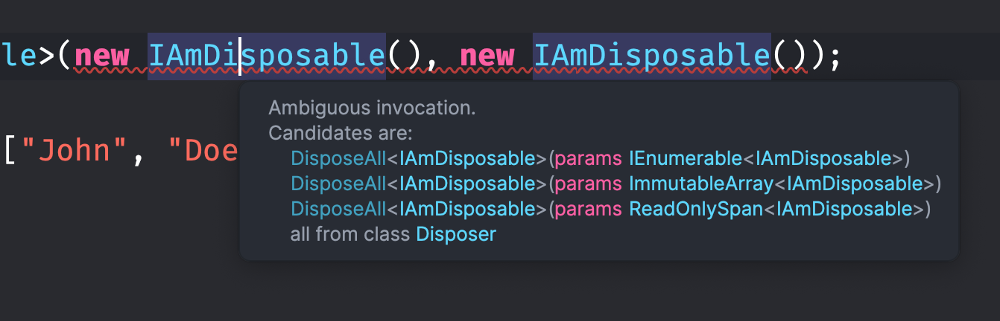

# 18 `c# 13` les nouveautés

## `params`

On peut maintenant utiliser toute sorte de `collection` avec params :

```cs
public class Disposer
{
    public static void DisposeAll<T>(params IEnumerable<T> disposables) where T : class, IDisposable
    {
        foreach(var disposable in disposables) disposable.Dispose();
    }
    
    public static void DisposeAll<T>(params ReadOnlySpan<T> disposables) where T : class, IDisposable
    {
        foreach(var disposable in disposables) disposable.Dispose();
    }

    public static void DisposeAll<T>(params ImmutableArray<T> disposables) where T : class, IDisposable
    {
        foreach(var disposable in disposables) disposable.Dispose();
    }
}
```

> `span` est plus efficace que `array` car il est alloué sur la pile (`stack`) et non le `heap` (création d'une référence vers un objet). Pour une liste de paramètre, il semble logique de plutôt allouer sur la pile (`stack`), du coup l'utilisation de `ReadOnlySpan` est tout à fait appropriée.

Utilisation :

```cs
Disposer.DisposeAll<IAmDisposable>(new IAmDisposable(), new IAmDisposable());
```


## `[OverloadResolutionPriority]` priorité des `overload`

On peut avoir à ce stade une erreur de type `ambiguous invocation` :



Les règles du langage ne sont plus capable de lever l'ambigüité.

Par défaut toute les `overload. resolution priority` . sont de `0`.

On peut modifier cela grâce à l'`attribut` : `IverloadResolutionPriority`.

```cs
public static void DisposeAll<T>(params IEnumerable<T> disposables) 
    where T : class, IDisposable
{
	// ...

[OverloadResolutionPriority(10)]
public static void DisposeAll<T>(params ReadOnlySpan<T> disposables) 
    where T : class, IDisposable
{
    foreach(var disposable in disposables) disposable.Dispose();
}

// on peut mettre une priorité négative
[OverloadResolutionPriority(-5)]
public static void DisposeAll<T>(params ImmutableArray<T> disposables) 
    where T : class, IDisposable
{
	// ...
```


## le mot clé `field`

Pour le moment en `preview` :

```xml
<Project Sdk="Microsoft.NET.Sdk">

    <PropertyGroup>
        <OutputType>Exe</OutputType>
        <TargetFramework>net9.0</TargetFramework>
        <LangVersion>preview</LangVersion>
        <ImplicitUsings>enable</ImplicitUsings>
        <Nullable>enable</Nullable>
    </PropertyGroup>

</Project>
```

Permet de se passer de la déclaration d'un champs privé :

```cs
public class StateService
{
    public bool IsDarkMode
    {
        get;

        set
        {
            field = value;
            NotifyStateChanged();
        }
    }
// ...
}
```

au lieu de 

```cs
public class StateService
{
    private bool _isDarkMode;

    public bool IsDarkMode
    {
        get => _isDarkMode;

        set
        {
            _isDarkMode = value;
            NotifyStateChanged();
        }
    }
```


## L'`index` dans une boucle `foreach` avec `.Index()`

Avant pour obtenir l'`index` dans une boucle `foreach` on utilisait `Select` :

```cs
foreach (var (titre, index) in _titresAvailable.Select((titre, index) => (titre, index)))
{
```

Maintenant on peut simplifier la syntaxe grâce à `.Index()` :

```csharp
foreach (var (index, titre) in _titresAvailable.Index())
{
```

> Il faut juste faire attention à l'ordre du `tuple` : `(index, value)`.

