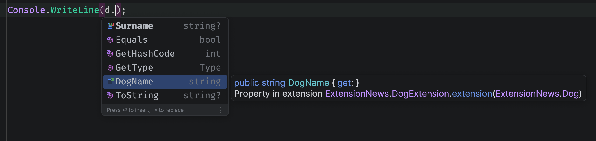
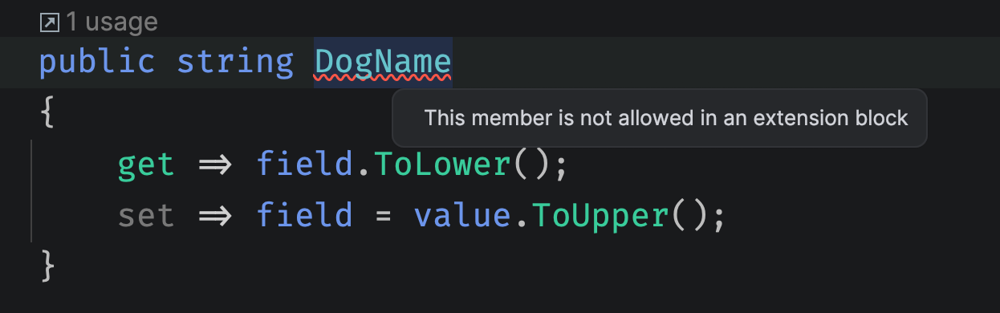

# `C# 14` les nouveautés : 

# Les membres `d'extension`

Nouvelle syntaxe avec le mot clé `extension`.

La classe contenant `extension` doit être `static`.

On peut maintenant déclarer des propriétés d'extension en plus des méthodes (et aussi des opérateurs).

Les méthodes peuvent étendre le `type` plutôt que `l'instance` de type.


## Propriété d'`extension`



```cs
public static class DogExtension
{
    extension(Dog dog)
    {
        public string DogName
        {
            get => "Dog Name";
        }
    }
}
```

Les propriétés doivent être des valeurs calculées, elle ne peuvent avoir un état.



Le code ci-dessus ne compilera pas.

> ### ! Les membres d'extension ne supporte pas les champs (`field`)


## Méthodes d'`extension`

```cs
public class Dog
{
    public string? Surname
    {
        get => field?.ToUpper();
        set => field = $"Mister {value}";
    }
}
```

```cs
public static class DogExtension
{
    extension(Dog dog)
    {
        public string SayHello() => $"{dog.Surname} say hello !";
    }
}
```

```cs
var d = new Dog { Surname = "Bogo" };

Console.WriteLine(d.SayHello());
```

```
MISTER BOGO say hello !
```


## méthode d'extension `static`

On peut maintenant créer une `extension` directement sur un `type`.

```cs
public enum Color
{
    Blue, Grey, Red, Orange, Green, Yellow, Brown
}
```

```cs
public static class ColorExtension
{
    extension(Color)
    {
        public static bool IsPrimary(Color colorToTest) => colorToTest switch
        {
            Color.Blue or Color.Red or Color.Yellow => true,
            _ => false
        };
    }
}
```

```cs
var brown = Color.Brown;
var red = Color.Red;

Console.WriteLine($"Is {nameof(brown)} is primary {Color.IsPrimary(brown)}");
Console.WriteLine($"Is {nameof(red)} is primary {Color.IsPrimary(red)}");
```

```
Is brown is primary False
Is red is primary True
```

