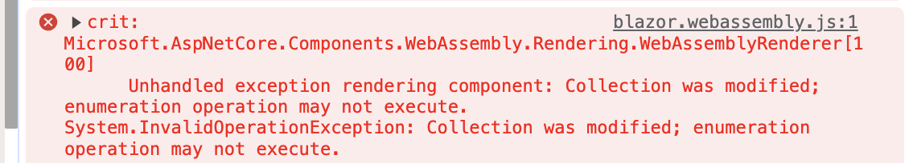

# AA. `Exception` avec les collections


## `System.InvalidOperationException: Collection was modified; enumeration operation may not execute.`

> La collection a été modifiée ; l'opération d'énumération ne peut pas être exécutée.

Cette `Exception` a lieu lorsqu'une collection est modifiée par une méthode pendant qu'en même temps une autre méthode itère dessus.

```cs
private static ImmutableList<DemandeAvis> _demandesAvis = new() { ... };
```


### Accès à la `List`

```cs
public async Task<IEnumerable<DemandeAvisListDto>> GetAll()
{
	foreach (var demande in _demandesAvis)
    {
        // ...
```


### Modification de la `List`

```cs
public async Task<DemandeAvis> Create()
{
    // ...
    _demandesAvis.Add(demandeAvisToCreate);
    // ...
```

Dans une application `Blazor` il est possible d'appeler `Create` alors que la `List` est affichée quelque part.

On a l'erreur suivante :




## Solution: `ImmutableList<T>`

Les listes `Immutable` de par leur nature ne craignent pas les accès concurrents en lecture et modification car elle ne peuvent pas être modifiées.


On corrige le `code` facilement de cette façon :

```cs
private static ImmutableList<DemandeAvis> _demandesAvis 
    = ImmutableList.Create<DemandeAvis>( ... );
```

La lecture de la `ImmutableList` est identique.

Par contre la modification consiste maintenant à remplacer la `List` par une nouvelle :

```cs
public async Task<DemandeAvis> Create()
{
    // ...
    _demandesAvis = _demandesAvis.Add(demandeAvisToCreate);
```

`Add` étant devenue une `pure function` ne modifiant plus la `List` d'origine.

