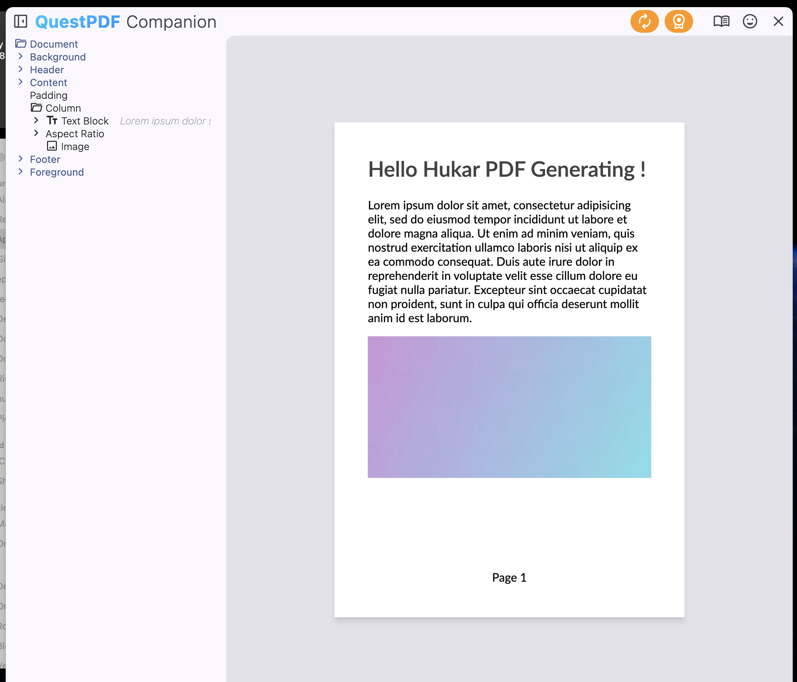
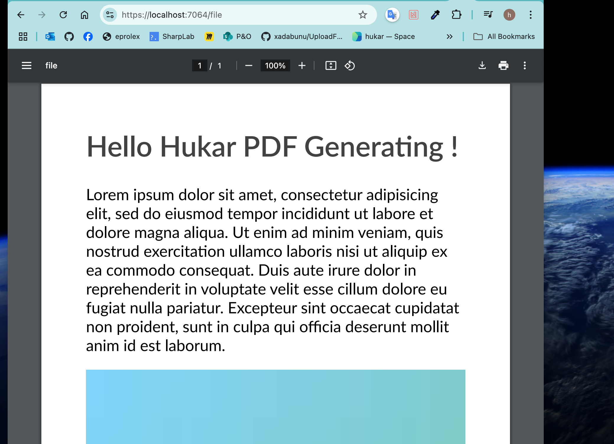

# 01 Quest PDF

## Installation

```bash
dotnet add package QuestPDF
```


### Spécifier la licence

Si on ne le fait pas on obtient une `exception`

Mettre en haut de `Program.cs` :

```cs
QuestPDF.Settings.License = LicenseType.Community;
```


### Utiliser le `Companion`

https://www.questpdf.com/companion/download.html

Il suffit de télécharger le logiciel et d'ajouter ceci en combinaison avec le `hot-reload` :

```cs
// use the following invocation
document.ShowInCompanion();
```




## Exemple de `document`

```cs
var document = Document.Create(container =>
{
    container.Page(page =>
    {
        page.Size(PageSizes.A4);
        page.Margin(2, Unit.Centimetre);
        page.PageColor(Colors.White);
        page.DefaultTextStyle(x => x.FontSize(20));
        
        page.Header()
            .Text("Hello Hukar PDF Generating !")
            .SemiBold().FontSize(36).FontColor(Colors.Grey.Darken3);
        
        page.Content()
            .PaddingVertical(1, Unit.Centimetre)
            .Column(x =>
            {
                x.Spacing(20);
                
                x.Item().Text(Placeholders.LoremIpsum());
                x.Item().Image(Placeholders.Image(200, 100));
            });
        
        page.Footer()
            .AlignCenter()
            .Text(x =>
            {
                x.Span("Page ");
                x.CurrentPageNumber();
            });
    });
});
```


## générer le `PDF`

```cs
document.GeneratePdf("my-path/hello.pdf");
```


## Renvoyer le `PDF` via une `API`

```cs
app.MapGet("/file", () =>
{
    var document = Document.Create(container =>
    {
        // ...
    });

    var pdf = document.GeneratePdf();
    
    return Results.File(pdf, "application/pdf");
});
```




