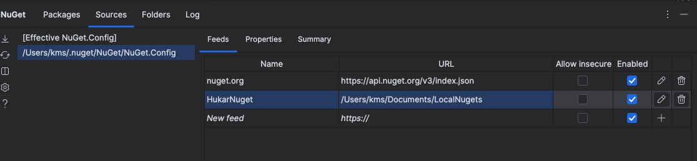
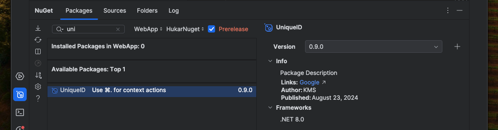

# 02 `Source` local pour `nuget`


## Lister les sources `list source`

On peut lister les sources avec cette commande :

```bash
dotnet nuget list source

Registered Sources:
  1.  nuget.org [Enabled]
      https://api.nuget.org/v3/index.json
```

On voit que pour le moment seul `nuget.org` est enregistré comme `source`.


## Ajouter une source `add source`

l'argument peut être un chemin `windows` ou `linux` ou bien une `url`.

```bash
dotnet nuget add source /Users/kms/Documents/LocalNugets -n HukarNuget
```

```bash
dotnet nuget list source

Registered Sources:
  1.  nuget.org [Enabled]
      https://api.nuget.org/v3/index.json
  2.  HukarNuget [Enabled]
      /Users/kms/Documents/LocalNugets
```

Maintenant dans `Rider` cette source est aussi diponible :



On observe qu'un fichier `NuGet.Config` contient ces informations :

```xml
<?xml version="1.0" encoding="utf-8"?>
<configuration>
  <packageSources>
    <add key="nuget.org" value="https://api.nuget.org/v3/index.json" protocolVersion="3" />
    <add key="HukarNuget" value="/Users/kms/Documents/LocalNugets" />
  </packageSources>
</configuration>
```


## Ajouter un `package`

On peut copier le `nuget package` comme on le souhaite mais on peut aussi utiliser `nuget push`.

```bash
dotnet nuget push <chemin du package> -s <chemein de la source>
```

```bash
dotnet nuget push /Users/kms/Desktop/MyPackages/UniqueID.0.9.0.nupkg -s /Users/kms/Documents/LocalNugets 
```


## Utiliser le package



Si on sélectionne la source `HukarNuget` on voit notre `package`, on voit aussi les quelques infos renseignées.

Le package est ajouté à `.csproj` :

```xml
<Project Sdk="Microsoft.NET.Sdk.Web">

    <PropertyGroup>
        <TargetFramework>net8.0</TargetFramework>
        <Nullable>enable</Nullable>
        <ImplicitUsings>enable</ImplicitUsings>
    </PropertyGroup>

    <ItemGroup>
      <PackageReference Include="UniqueID" Version="0.9.0" />
    </ItemGroup>
    
</Project>
```

On peut bien sûr le lier en `CLI` :

```bash
dotnet add package UniqueID -v 0.9.0
```

