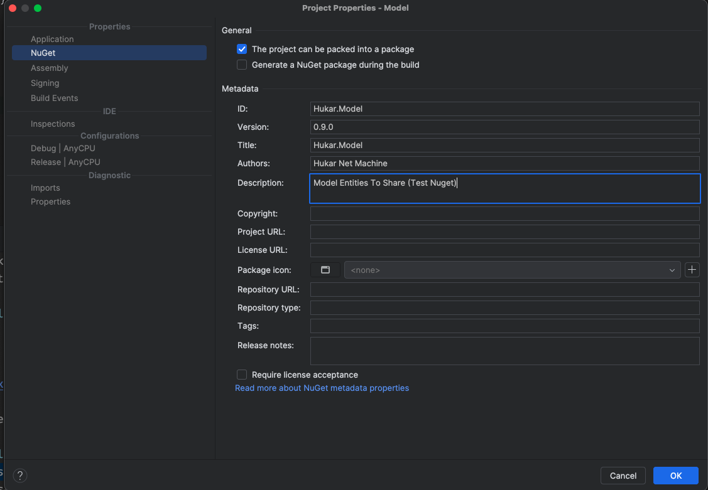
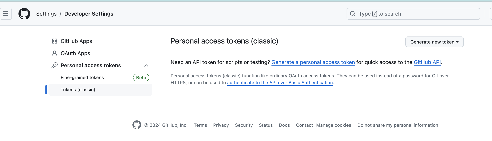
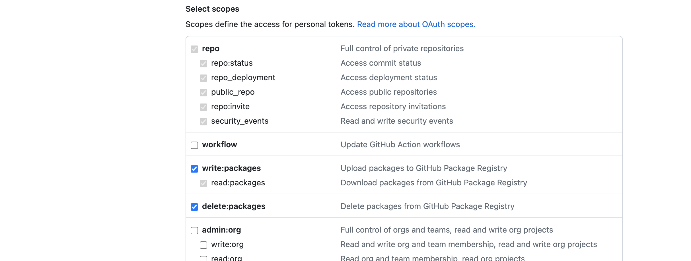
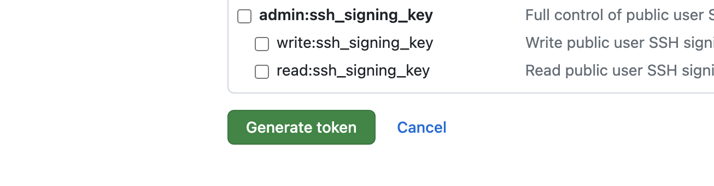
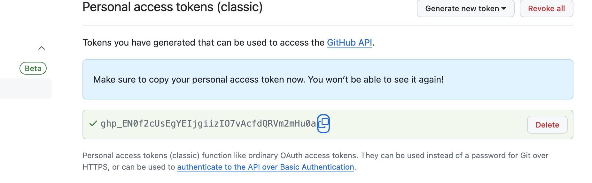

# 03 Une `source` sur `GitHub`

## Informations du package (dans `.csproj`)

On peut remplir certaine information directement danbs les `properties` du projet dans l'interface de `Rider` :



Ces informations se retrouve dans `.csproj`, si on veut une description pour `GitHub`, il faut ajouter la balise `PackageDescription` :

```xml
<Project Sdk="Microsoft.NET.Sdk">

    <PropertyGroup>
        <TargetFramework>net8.0</TargetFramework>
        <ImplicitUsings>enable</ImplicitUsings>
        <Nullable>enable</Nullable>
        <PackageId>Hukar.Model</PackageId>
        <Version>0.9.0</Version>
        <Authors>Hukar Net Machine</Authors>
        <Company>Council Of State</Company>
        <Product>Eprolex</Product>
        <Title>Hukar.Model</Title>
        <PackageDescription>Description pour GitHub</PackageDescription>
        <Description>Model Entities To Share (Test Nuget)</Description>
    </PropertyGroup>

</Project>
```


## Le fichier `nuget.config`


## Commande pour ajouter la source

```bash
dotnet nuget add source --username eprolex-org --password TOKEN --store-password-in-clear-text --name github "https://nuget.pkg.github.com/eprolex-org/index.json"
```


## Publier le projet

```bash
dotnet pack --configuration Release
```

```bash
dotnet nuget push "Hukar.Model.0.9.0.nupkg" --source "github"
```


## Personal Access Token

On a besoin avant de publier un `package` sur `GitHub` de créer un `Personal Access Token`.










