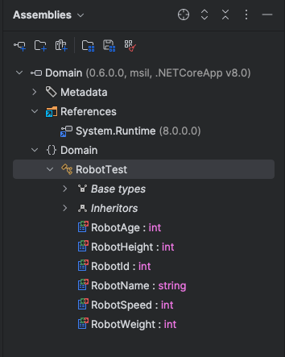
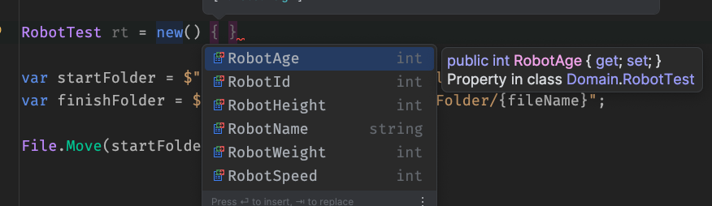

# AA `Nuget package` pour `Eprolex`


## Dépôt sur un disque partagé

L'idée est de créer un dépôt sur l'intranet, sur un disque en réseau accessible à tous.

Sur `MacOS` il faut utiliser le protocole `Samba` pour accéder au disque. Il suffit de deux commandes :

```bash
mkdir w

mount -t smbfs //raadvst-consetat.be/shared/infcel ./w
Password for raadvst-consetat.be: #A_4E_
```

Ensuite on peut créer un emplacement et copier les package dedans :

```bash
mkdir -p nuget/packages

mv Eprolex.Domain.Shared.0.2.0.nupkg nuget/packages
mv Eprolex.Domain.Shared.0.6.0.nupkg nuget/packages
```


## Créer une source

Sur la machine local, on doit ajouter une source de `nuget` à la liste des sources (contenu dans le fichier `nuget.config`) :

```bash
dotnet nuget add source /Users/kms/w/Eprolex/nuget/packages -n NetworkNuget
La source de package nommée NetworkNuget a été correctement ajoutée.
```

On peut voire le contenu du fichier `nuget.config` :

```bash
cd ~/.nuget/Nuget

cat NuGet.Config
```

```xml
<?xml version="1.0" encoding="utf-8"?>
<configuration>
  <packageSources>
    <add key="nuget.org" value="https://api.nuget.org/v3/index.json" protocolVersion="3" />
    <add key="HukarNuget" value="/Users/kms/Documents/LocalNugets" />
    <add key="NetworkNuget" value="/Users/kms/w/Eprolex/nuget/packages" />
  </packageSources>
</configuration>
```


## Ajouter le package à un `projet`

```bash
dotnet add package Eprolex.Domain.Shared --version 0.6.0
```

On peut vérifier dans l'explorateur d'`assembly` que le package est bien là :



Et dans le code :


