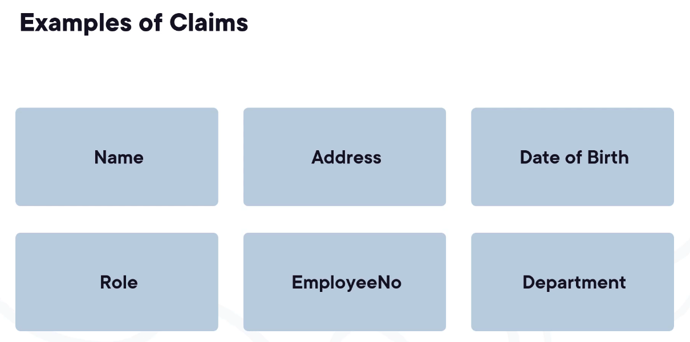
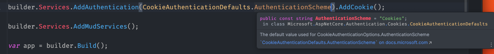

# 01 `Authentification` les basiques

Vérifier une identité est nommé `authentication` : `authentification`.


## `authentication` dans `asp.net`

Plusieurs possibilités :

- Identity Cookies

- ASP.NET Core Identity

- Identity Provider (OpenId Connect et OAuth)

À cette étape, sont obtenues les `claims` :




## `Authorization`

Si on fait une analogie avec un hôtel, l'`authentication` a lieu à la reception en vous demandant vos papiers d'identité par exemple. L'`authorization` elle, est réalisée par la carte d'accès que l'on vous fournit. Cette carte vous `authorise` à certain endroit seulement (ma chambre, sauna, toilettes, ...). 

On a un `accès limité` : `limited access`, c'est ce qu'on appelle `authorization`.

On détermine les `authorizations` grâce aux `claims` récupérées pendant l'`authentication`.

- ASP.NET Core Authorization


## Ajouter l'`authentication` à une application

> Pour ma part j'utilise `Blazor Web App` en mode `Interactive server` de manière globale.

On ajoute Les services d'`authentication` au conteneur de service dans `Program.cs` :

```cs
builder.Services.AddAuthentication();
```

Si on veut utiliser les `cookies` pour cette `authentication` on écrit :

```cs
builder.Services.AddAuthentication().AddCookie();
```

Lorsque l'on configure une méthode d'`authentication` on lui donne un nom, on définit un `scheme`.

Si on ne donne pas de `Scheme name ` à `AddCookie`, le `Scheme name` sera par défaut `Cookies`.


### Spécifier explicitement le `Scheme name`

```cs
AdCookie("IdentityCookie"); 
```

Ou

```cs
builder.Services
    	.AddAuthentication(CookieAuthenticationDefaults.AuthenticationScheme)
    	.AddCookie();
```



On voit que tout simplement c'est un `string` de valeur `"Cookies"`.


### Ajouter le `middleware`

Il doit être placé après le routage et avant l'`authorization` :

```cs
```

