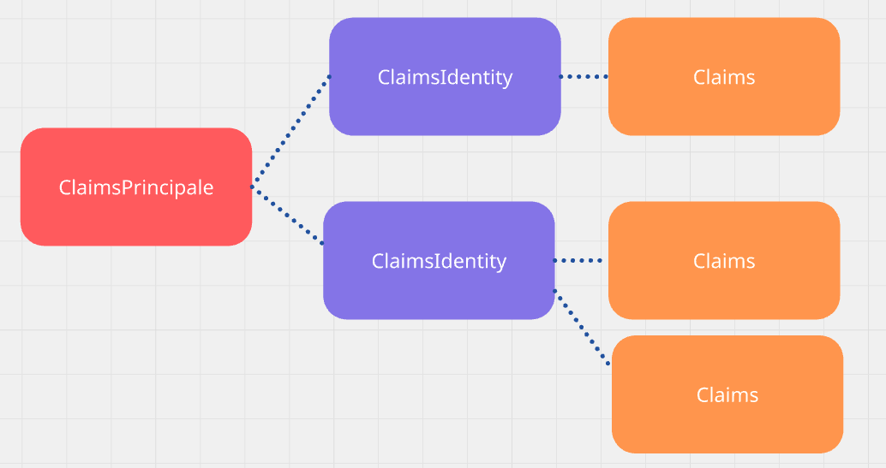

# 01 `Authentification` les basiques

Vérifier une identité est nommé `authentication` : `authentification`.

Cela nécessite un `password` ou un mécanisme analogue de vérification.

## `authentication` dans `asp.net`

Plusieurs possibilités :

- Identity Cookies

- ASP.NET Core Identity

- Identity Provider (OpenId Connect et OAuth)

À cette étape, sont obtenues les `claims` :

> `Claims` : les revendications => revendiquer (clamer) un droit.
>
> On peut aussi voire les `claims` comme les informations liées  à une personne, réunies dans un document d'identité : `ClaimsIdentity`.

## `Authorization` : Limité l'accès

Si on fait une analogie avec un hôtel, l'`authentication` a lieu à la reception en vous demandant vos papiers d'identité par exemple. L'`authorization` elle, est réalisée par la carte d'accès que l'on vous fournit. Cette carte vous `authorise` à certain endroit seulement (ma chambre, sauna, toilettes, ...). 

On a un `accès limité` : `limited access`, c'est ce qu'on appelle `authorization`.

On détermine les `authorizations` grâce aux `claims` récupérées pendant l'`authentication`.

- ASP.NET Core Authorization

