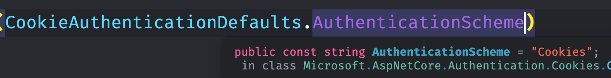
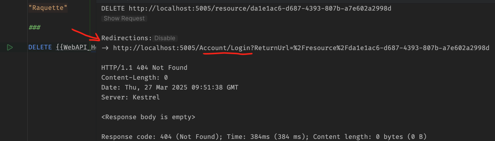

# 02 Cookie `Authentication`


## Ajouter l'`authentication` à une application

> Pour ma part j'utilise `Blazor Web App` en mode `Interactive server` de manière globale.

On ajoute Les services d'`authentification` au conteneur de service dans `Program.cs` :

```cs
builder.Services.AddAuthentication();
```

Si on veut utiliser les `cookies` pour cette `authentication` on écrit :

```cs
builder.Services.AddAuthentication().AddCookie();
```

Lorsque l'on configure une méthode d'`authentication` on lui donne un nom, on définit un `scheme`.

Si on ne donne pas de `Scheme name` à `AddCookie`, le `Scheme name` sera par défaut `Cookies`.

### Un `authentication scheme ` est une façon d'authentifier un utilisateur (un `schéma d'authentification`).


### Spécifier explicitement le `Scheme name`

```cs
AdCookie("IdentityCookie"); 
```

Ou

```cs
builder.Services
    	.AddAuthentication(CookieAuthenticationDefaults.AuthenticationScheme)
    	.AddCookie();
```



On voit que tout simplement c'est un `string` de valeur `"Cookies"`.

Lorsque le `scheme name` est passé en paramètre à `AddAuthentication`, c'est celui qui sera défini par défaut.

Si on ne précise rien, `asp.net` utilise le premier `authentication scheme` renseigné comme celui par défaut.


### Ajouter le `middleware`

Il doit être placé après le routage et avant l'`authorization` :

```cs
// ...
app.UseStaticFiles();

app.UseAuthentication();

app.UseAntiforgery();
// ...
```


## `[Authorize]` l'attribut pour Restreindre un accès

`[Authorize]` signifie ici juste être authentifié, c'est le rôle du `cookie`.

Si vous n'êtes pas authentifié, `[Authorize]` vous bloque l'accès.

Il est possible de passer le `authentication scheme name` à l'attribut `Authorize` :

```css
@attribute [Authorize(CookieAuthenticationDefaults.AuthenticationScheme)]
```

```ruby
.RequireAuthorization(CookieAuthenticationDefaults.AuthenticationScheme);
```

```css
[Authorize("MyScheme")]
```


### `Blazor Server` : 

On ajoute l'attribut `[Authorize]` en haut d'un composant (d'une page).

```ruby
@page "/"
@using Microsoft.AspNetCore.Authorization
@attribute [Authorize] 


<PageTitle>Home</PageTitle>
```

> Cependant il est facile de hacker cette sécurité en allant sur un composant non protégé et en revenant sur celui protégé, il est maintenant accessible !
>
> 
>
> Il faut modifier le `Router` avec `AuthorizeRouteView` :
>
> ```cs
> @using Microsoft.AspNetCore.Components.Authorization
> 
> <Router AppAssembly="typeof(Program).Assembly">
>     <Found Context="routeData">
>     
>       <AuthorizeRouteView 
>     		RouteData="routeData" 
>     		DefaultLayout="typeof(Layout.MainLayout)"/>
>     
>       <FocusOnNavigate RouteData="routeData" Selector="h1"/>
>     
>     </Found>
> </Router>
> ```
>
> 

À la première requête `HTTP`, on a une redirection vers l'`url` :

```http
http://localhost:5088/Account/Login?ReturnUrl=%2F
```

De par la nature particulière de `Blazor Server`, le check n'est pas réalisé par la navigation interne d'où le hack plus haut.

À la place on arrive sur une page avec un message `Not authorized`.


(ici le `[Authorize]` est placé sur la page `counter`)


### `Minimal Api` :

Il faut toujours mettre `UseAuthentication` et `UseAuthorization` avant les `Endpoints`

( en `minimal api` avant les `MapSomething`).

Il faut utiliser `UseAuthorization` de paire avec `UseAuthentication`.

```cs
app.UseAuthentication();
app.UseAuthorization();

app.MapSomething();
```

#### Il n'est pas possible d'utiliser `UseAuthorization` sans `UseAuthentification`  (`Exception` : `InvalidOperation`)

Il est aussi obligatoire d'avoir définit un `authentication scheme` (un schéma d'authentification).

#### Syntaxe : `[Authorize]`

```cs
app.MapDelete("/{guidstr}", [Authorize] (string guidstr) =>
{
    // ...

    return Results.NoContent();
});
```

#### ou bien : `.RequireAuthorization()`

```cs
app.MapDelete("/{guidstr}", (string guidstr) =>
{
    // ...
}).RequireAuthorization();
```

> ### ! `[Authorize]` se place avant `async` sinon on a une erreur :
>
> ```cs
> app.MapGet(
>  "/customers",  
>  [Authorize] async (IRepository db) => await db.GetAll()
> );
> ```
>
> 

On obtient un résultat `Not Found` :



Il y a en fait une redirection depuis le `middleware` vers `/Account/Login`.


## `[AllowAnonymous]` : `.AllowAnonymous()`

### `Secure by default`

On peut vouloir aussi tous bloquer par défaut au niveau d'un `group` sauf certain `endpoint` :

```cs
var resourceGroup = app
            .MapGroup("/resource")
            .RequireAuthorization(); // au niveau de MapGroup
```

On autorise alors chaque `endpoint` individuellement :

```cs
resourceGroup.MapGet("/", [AllowAnonymous] () => Results.Ok(_resources));
```

ou bien :

```cs
resourceGroup.MapGet("/", () => Results.Ok(_resources))
            .AllowAnonymous();
```

