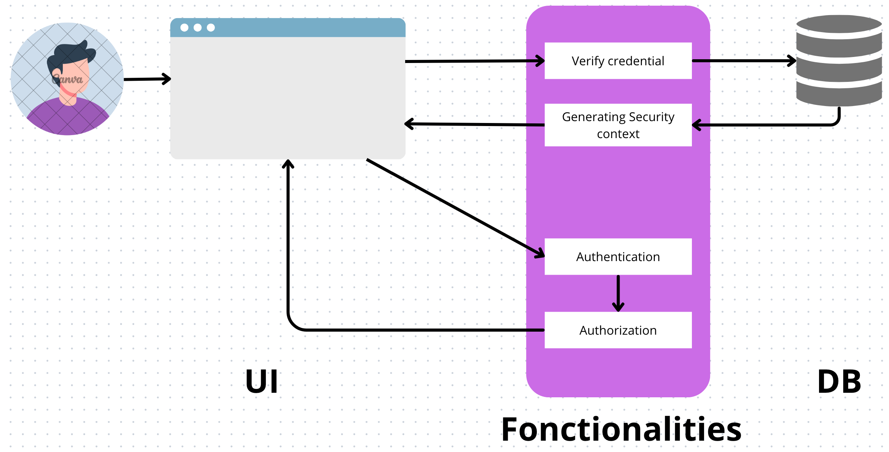

# 01 Instalation de `Identity`

## Qu'est-ce que `Identity`

`Identity` est constitué de 3 parties :

1. Une partie `UI`
2. Des fonctionnalités d'authentification et d'autorisation
3. Une base de donnée



Le `security context` étant le `cookie` ou le `token` contenant les `claims`.


## Création d'un nouveau projet

On va créer un nouveau projet `Web App` (en fait `Razor Page`).

Puis ajouter des `packages` :

```bash
Identity.UI
Identity // déjà dans le projet (implicit)
Identity.EntityFrameworkCore
EntityFrameworkCore.SqlServer
EntityFramework.Design
EntityFramework.Tools
```

Pour des raisons pédagogiques, on ne va pas installer `Identity.UI` pour faire tout *from scratch*.


## Création du `DbContext`

On créé un dossier `Data` et dedans une classe `ApplicationDbContext`

```cs
public class ApplicationDbContext(DbContextOptions<ApplicationDbContext> options) 
    : IdentityDbContext(options);
```

`IdentityDbContext` contient toutes les classes dont on a besoin.

Il n'y a pas de besoin d'ajouter de nouveaux `DbSet`.


## Ajout du `service`

`program.cs`

```cs
var connectionString = builder.Configuration.GetConnectionString("Default");

builder.Services.AddDbContext<ApplicationDbContext>(
    options =>
    {
        options.UseSqlServer(connectionString);
    }
);
```


## Création de la `DB`

Je créé dans `Azure Data Studio` une `DB` : `AppUsers`


Je place le `Connection String` dans `AppSettings.Development.json`

```json
{
  // ...
  },
  "ConnectionStrings": {
    "Default": "Server=localhost,1433;Database=AppUsers;User=sa;Password=huk@r2Xmen99;Encrypt=false"
  }
}
```


