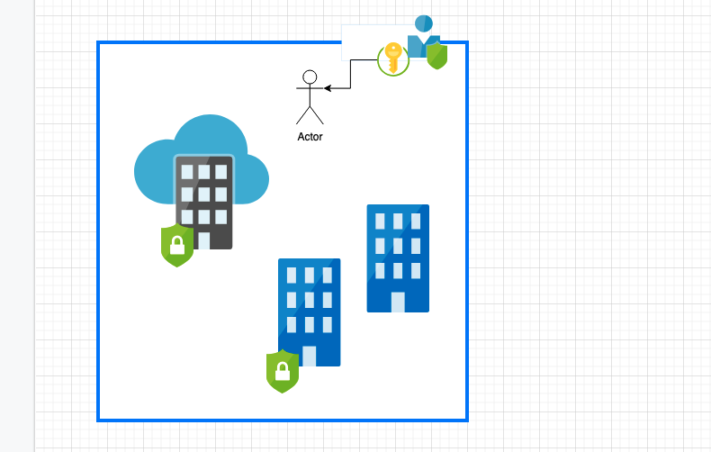
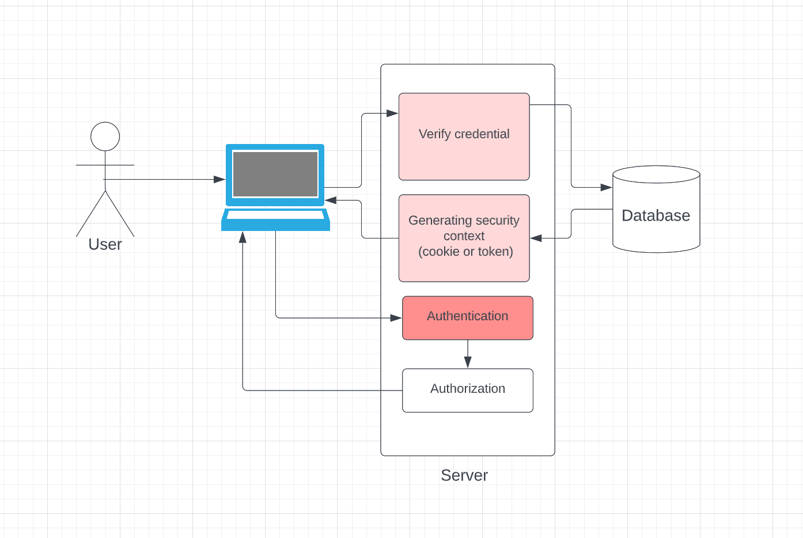
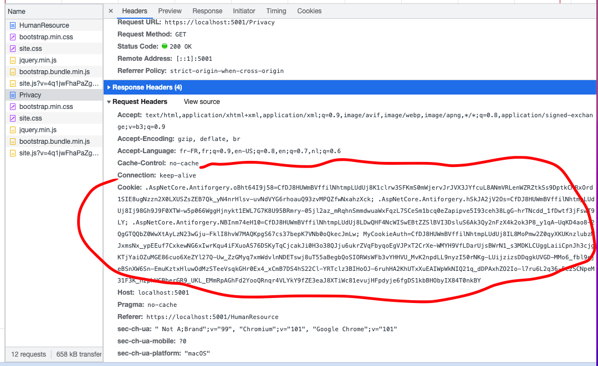

# 01 Les concepts

## Les trois concepts clés

1. Identité : `authentification` => Vérifier qui vous êtes
2. `Context de Sécurité` => on reçoit une carte d'accès avec un temps limité et nos informations d'identité
3. Permissions : `authorisation` => vérifier que votre `context de sécurité` satisfait les droits d'accès `access requirements`

Dans une application web le `login` (passer le `username` et le `password`) représente l'`authentification`.

Ensuite vous recevez un `cookie` ou un `token` représentant le `Security Context`.

Puis la page Web sur le serveur vérifie que votre `Security Context` vous  `authorize` à accéder à une ressource (une `Page`, un `Endpoint`).

Si vous n'êtes pas authentifier (vous n'êtes pas logguer), vous recevez une erreur `401`  `unauthorized` (qui réellement veut dire`unauthenticated`)

Si vous n'avez pas le droit d'accéder à une ressource, c'est le code `403` `forbidden` (qui signifie `unauthorized`), contrairement de l'erreur `401`, ici la personne est `authentifiée`.

## `Cookie`

Un `cookie` est un morceau d'information stocké dans le `header` des requêtes `HTTP Request` et `HTTP Response` provenant du même `Domain` par sécurité.

L'échange de `cookies encrypted`  permet d'authentifier la personne (savoir qui elle est).

Le `Cookie` contient aussi les `Claims` qui serviront aux différentes `authorization` si besoin.

## Processus d'authentification et d'autorisation

Le `Cookie` est retourné via le `Header ` de la requête `Http`

