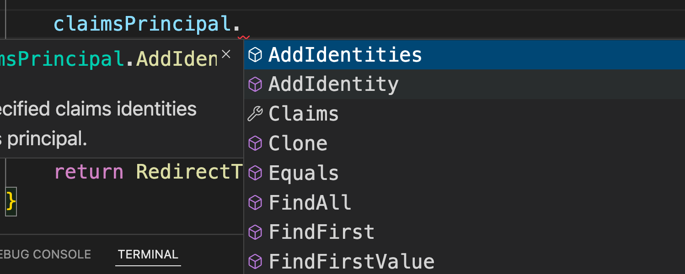
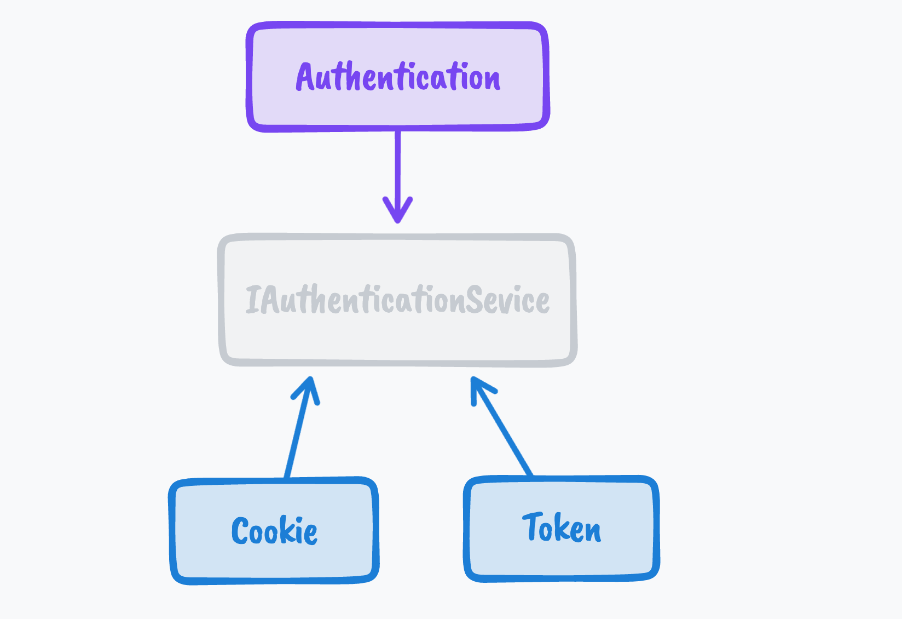
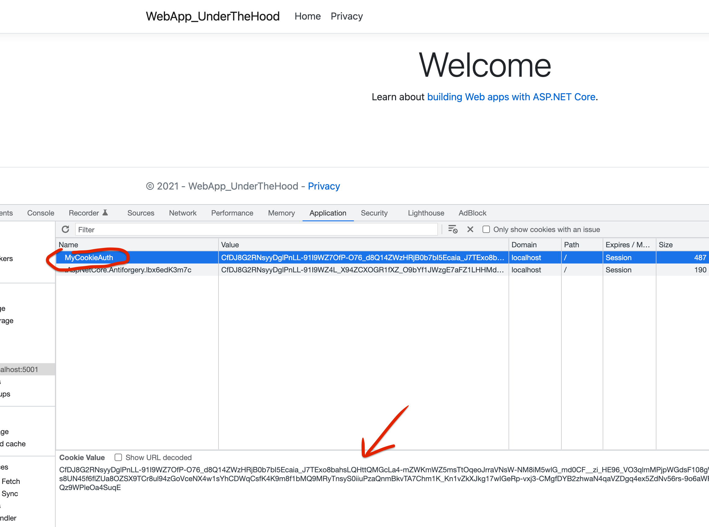
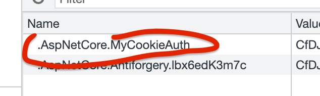
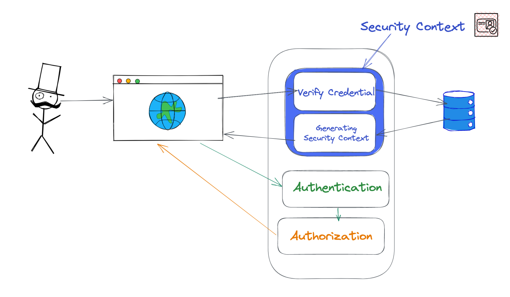

# 04 Générer un `Cookie` : Créer un `Security Context`

## Tester les `Credentials`

Dans la méthode `OnPost` de la `Razor Page` `Login.cshtml.cs`

```cs
public async Task<IActionResult> OnPostAsync()
{
    // renvoie sur la même page
    if (!ModelState.IsValid) return Page();

    if (Credential is not { UserName: "admin", Password: "password" }) return Page();

    // défini le context de sécurité
    List<Claim> claims =
    [
        new Claim(ClaimTypes.Name, "admin"),
        new Claim(ClaimTypes.Email, "admin@gmail.com")
    ];

    var identity = new ClaimsIdentity(claims, "MyCookieAuth");
    var user = new ClaimsPrincipal(identity);

    await HttpContext.SignInAsync("MyCookieAuth", user);

    return RedirectToPage("/Index");

}
```

On crée des `Claims` (déclarations), on les passe à une `Identity` et on lui donne un nom (`authenticationType`) `"MyCookieAuth"` (qui est identique à `authenticationScheme`).

Ensuite on construit le `ClaimsPrincipal` avec cette `Identity`.

> ### Ajouter des `Identities`
>
> Il est bien sûr possible d'ajouter des `Identities` au `claimsPrincipal` :
>
> 

`SignInAsync` va utiliser (et donc a besoin) d'un gestionnaire d'`authentification` (`authentication handler`).

`SignInAsync` persiste le `ClaimsPrincipal` sous la forme d'un `Cookie` :

- Il serialize le `ClaimsPrincipal` en `string`
- Il l'encrypte
- Le transform en `Cookie`
- Le passe au `HttpContext`


`return Page()` retourne la vue courante.


## `Authentication` Handler

Il faut injecter le `authentication handler` dans le conteneur de services :

```cs
builder.Services.AddAuthentication("MyCookieAuth")
    .AddCookie("MyCookieAuth", options =>
  {
      options.Cookie.Name = "MyCookieAuth";
  });
```

Le service `Authentication` ne parle qu'avec une abstraction `IAuthenticationService`.

Comme il peut y avoir plusieurs sortes/scénario d'authentification, des `handler` spécifiques implémentent `IAuthenticationService`, ici `Cookie` et `Token` :



Comme il peut y avoir plusieurs gestionnaire en même temps, il faut leurs donner un nom : `AuthenticationScheme`.

Dans les `options` du `Cookie` on peut lui donner un nom.



On retrouve le nom qu'on a ajouté `options.Cookie.Name = "MyCookieAuth";`.

Sinon on a un nom par défaut :



En bas c'est le `ClaimsPrincipal` sérialité et encrypté (grâce à `SignInAsync`).

C'est la classe  `CookieAuthenticationHandler` qui au final implémente `SignInAsync`

```
CookieAuthenticationHandler 
	: SignInAuthenticationHandler 
	: IAuthenticationSignInHandler
```


On vient de mettre au point le `Security Context` à l'aide d'un `Cookie` :




## Créer un classe `Auth` contenant les constantes d'authentification

Plutôt que d'avoir en littéral un peu partout l'`authenticationScheme` et `authenticationType` (qui a la même valeur), on peut rationaliser cela avec une classe encapsulant les constantes :

```cs
public static class Auth
{
    public const string CookieAuthScheme = "MyCookieAuth";
}
```

et du coup :

`Program.cs`

```cs
builder.Services.AddAuthentication()
    .AddCookie(Auth.CookieAuthScheme, options =>
    {
        options.Cookie.Name = Auth.CookieAuthScheme;
    });
```

et dans `Login.cshtml.cs`

```cs
// ici c'est authenticationType qui prend la valeur d'authenticationScheme
var identity = new ClaimsIdentity(claims, Auth.CookieAuthScheme);
var user = new ClaimsPrincipal(identity);

await HttpContext.SignInAsync(Auth.CookieAuthScheme, user);
```


