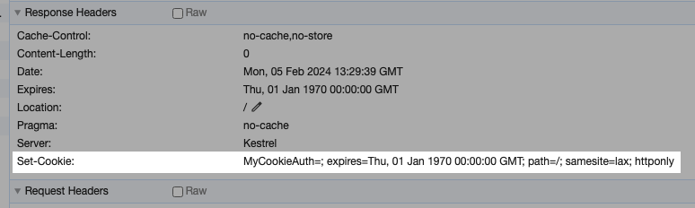

# 08 `Logout`


## Créer une Page `Logout`

Dans le dossier `Account` on va créer une `Razor Page` : `Logout`

> `MyAuthScheme.CookieAuthScheme` est une constante définit dans une classe `==` bonne pratique.

```cs
public class Logout : PageModel
{
    public async Task<IActionResult> OnPostAsync()
    {
        // await HttpContext.SignOutAsync("MyCookieAuth");
        await HttpContext.SignOutAsync(MyAuthScheme.CookieAuthScheme);
        
        return RedirectToPage("/Index");
    }
}
```

> Il vaut mieux utiliser une constante plutôt que le magic string  `"MyCookieAuth"`
>
> Par exemple :
>
> ```cs
> MyAuthenticationScheme.MyCookieAuth; // retourne "MyCookieAuth"
> ```
>
> On a ainsi l'autocomplétion et on peut connaître tous les `Scheme` disponibles.


## Ajouter un bouton de `Logout`

Dans le dossier `Shared` on va créer une `partial view` : `_LoginStatusPartial.cshtml`

```asp
@if (User.Identity is null || User.Identity.IsAuthenticated)
{
    <form method="post" class="form-check-inline" asp-page="/Account/Logout">
        Welcome @User?.Identity?.Name 
        <button class="ml-2 btn btn-link" type="submit">
            Logout
        </button>
    </form>
}
else
{
    <a class="btn btn-link" asp-page="/Account/Login">Login</a>
}
```


### Utiliser ce `partial` dans `Layout.cshtml`

```html
<header>
	<nav>
    	// ...
        <div class="mr-2">
            <partial name="_LoginStatusPartial" />
        </div>
    </nav>
</header>
```


Une fois `Logout` on a :


## Que fait `HttpContext.SignOutAsync`

On passe le nom du `Cookie` a supprimer en paramètre :

```cs 
// await HttpContext.SignOutAsync("MyCookieAuth");
await HttpContext.SignOutAsync(MyAuthScheme.CookieAuthScheme);
```

`SignOutAsync` ajoute alors un `Header` avec `Set-Cookie` et une date dans le passé :



On pourrait implémenter le même comportement avec un `endpoint` :

```cs
app.MapGet("/deletecookie", (HttpContext context) =>
{
    context.Response.Headers
        .Append(
            "Set-Cookie", 
            "MyCookieAuth=; expires=Thu, 01 Jan 1970 00:00:00 GMT;"
            );

    return Results.Ok("cookie is deleted");
});
```


Et si on regarde le `Header` de la `Response` :


