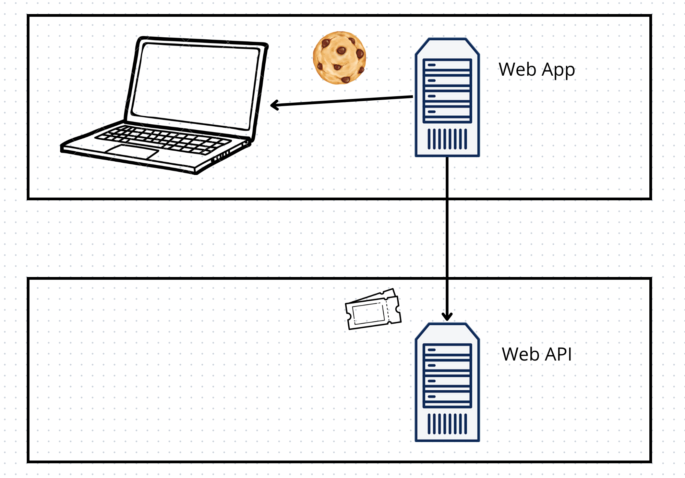
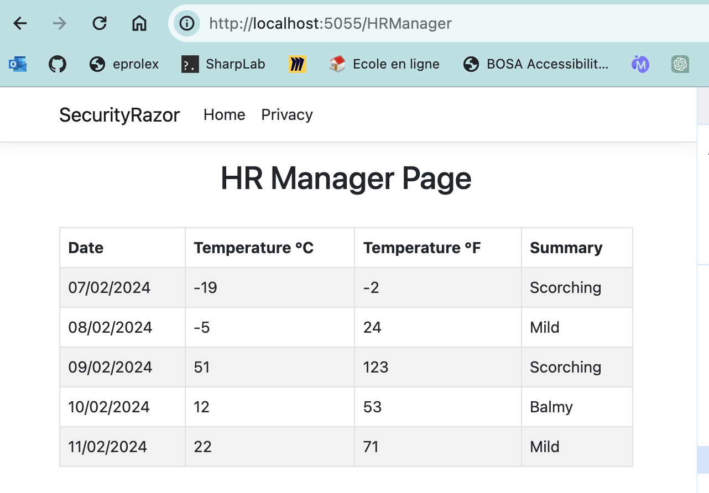

# 02 Mise en place

## Schéma de l'architecture



## Création d'une `API`

On crée une `minimal api` avec `swagger` (`Open API`) et les données d'exemple `WeatherForecast` par défaut.


# Dans l'application `Razor Page`

## Utiliser `HttpClientFactory`

```cs
builder.Services.AddHttpClient("MyClientAPI", client =>
{
    client.BaseAddress = new Uri("https://localhost:5229");
});
```


### Injecter la `factory` dans une page

La page `HRManager`

```cs
[Authorize(policy:MyPolicies.OnlyHRManager)]
public class HRManager(IHttpClientFactory factory) : PageModel
{
    [BindProperty]
    public List<WeatherforecastDto> WeatherforcastItems { get; set; } = [];

    public async Task OnGetAsync()
    {
        var httpClient = factory.CreateClient("MyClientAPI");

        WeatherforcastItems = await httpClient.GetFromJsonAsync<List<WeatherforecastDto>>("/weatherforecast\n") ?? [];

    }
}
```

`BindProperty` qui permet de rendre une propriété accessible via `Model` dans la page `razor`.

`WeatherforecastDto.cs`

```cs
public record WeatherforecastDto(
    DateOnly Date,
    int TemperatureC,
    string? Summary,
    int TemperatureF
);
```

Et enfin dans le `template` de la page :

`HRManager.cshtml`

```html
@page
@model SecurityRazor.Pages.HRManager

@{}

<div class="text-center">
    <h1>HR Manager Page</h1>
    <br/>
</div>

<table class="table table-bordered table-striped">
    <thead>
    <tr>
        <th>Date</th>
        <th>Temperature °C</th>
        <th>Temperature °F</th>
        <th>Summary</th>
        </tr>
    </thead>
    <tbody>
    @foreach (var item in Model.WeatherforcastItems)
        {
            <tr>
                <td>@item.Date</td>
                <td>@item.TemperatureC</td>
                <td>@item.TemperatureF</td>
                <td>@item.Summary</td>
            </tr>
        }
    </tbody>
</table>
```

Il n'y a rien à faire pour l'instant dans l'`API`.




