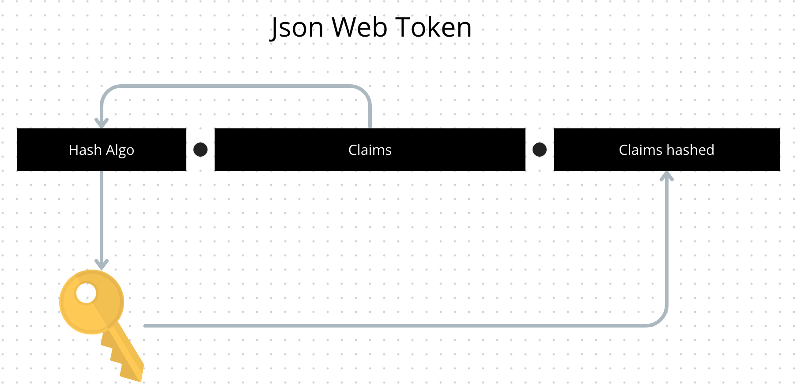
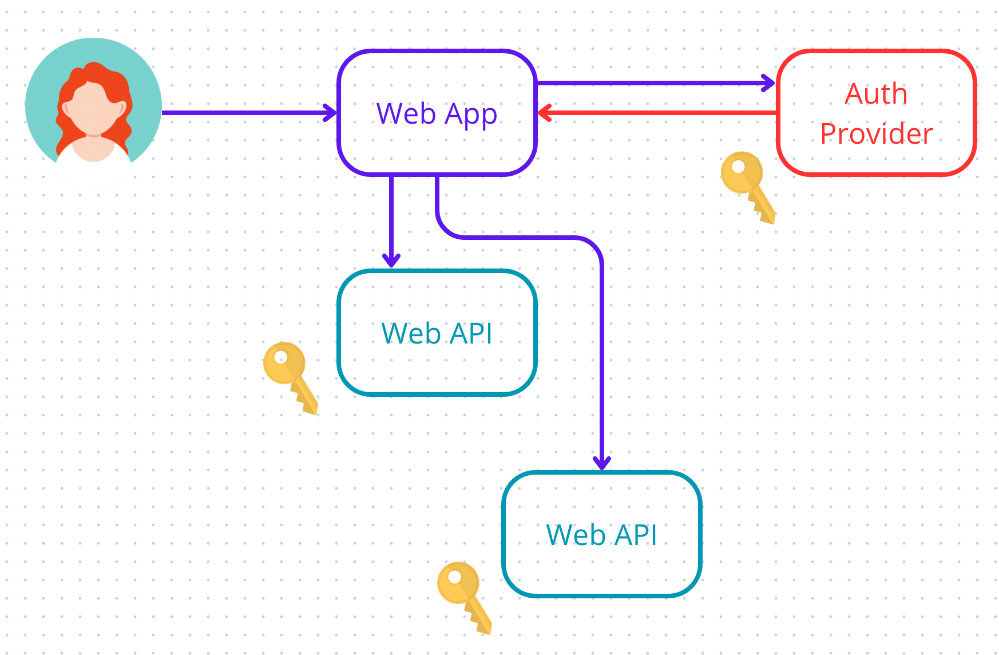

# 03 Jason Web Token `JWT`

Un `token` est un `string` qui peut être transporté par la `requête` et par la `réponse`.

## Anatomie de `JWT`

`JWT` est un `token` avec trois parties séparées par deux points.

1. l'algorithme de hachage 
2. Les `claims` contenant les informations sur l'utilisateur au format `json`
3. Les `claims` hachées par l'algorithme en guise de signature

Les `claims` sont hachées grâce à l'algorithme et une `clé secrète` et donne le `hashed claims` qui sert de signature. C'est un processus unidirectionnel, on ne peut pas l'inverser.

### ! ne pas mettre d'information sensible dans les `Claims`car elles ne sont pas cryptées dans le `JWT`.

## Vérification du `JWT`

Seule les application partageant la même `clé` peuvent vérifier l'authenticité du `JWT` en répétant le processus de génération de la `signature` et en comparant celle-ci à celle du `Token`.

Si un `Hacker` essaye de modifier les `Claims`, il devra créer la signature avec sa propre `clé` et celle-ci ne correspondra plus lors de la vérification.

## `JWT` flow

C'est le `flow` standard où les `Web API` demande la vérification du `token` au `Auth Provider`.

On peut garder l'utilisation des `Cookies` entre l'utilisateur et la `Web App`.

Si les `Web API` et le `Auth Provider` partage la même `clé`, il n'est pas nécessaire de passer par le `Auth Provider` quand la `Web App` demande une ressource à une `Web API`.

