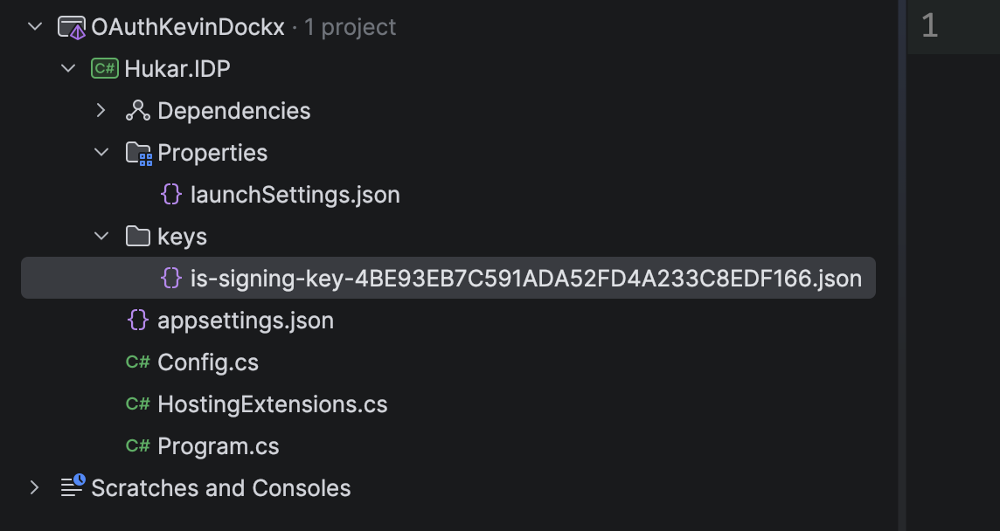
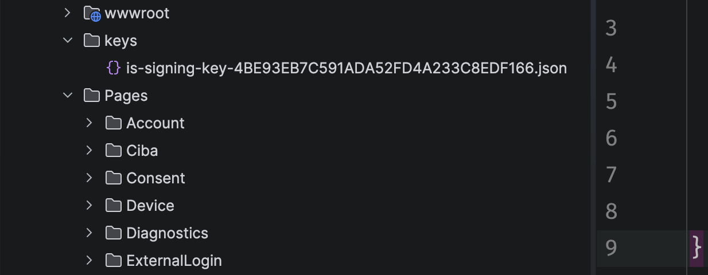
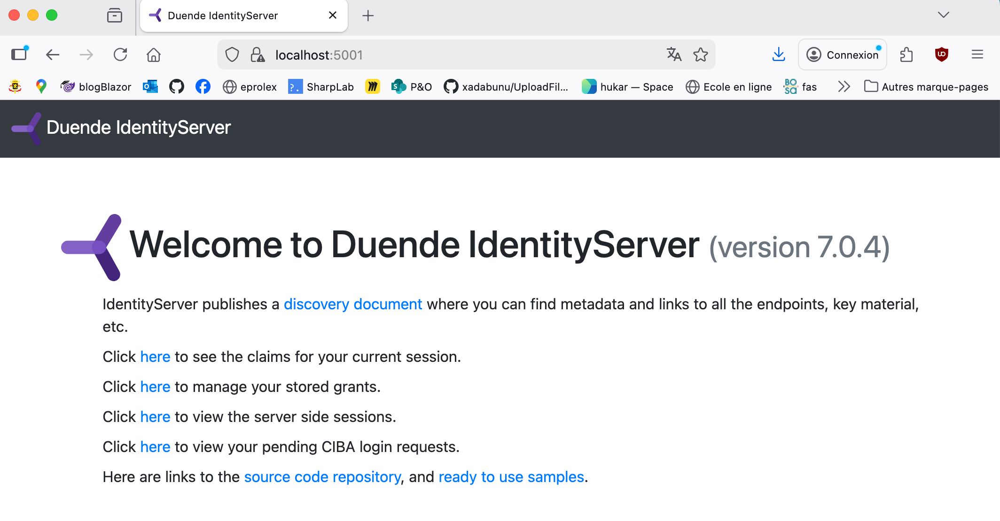
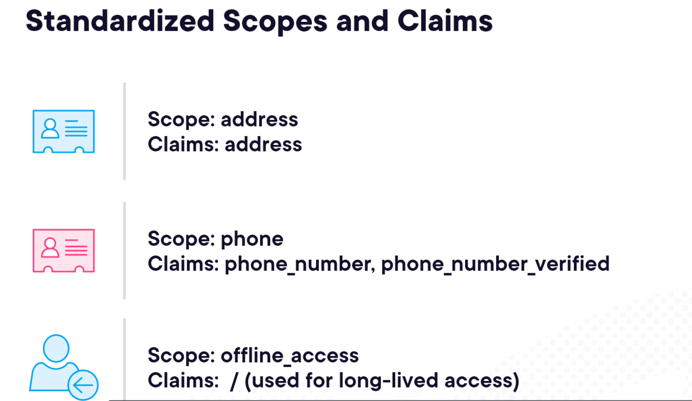
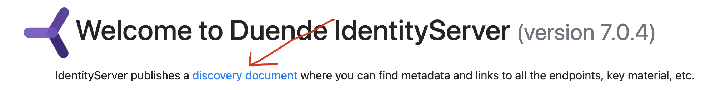

# 03. Identity Server

## Installation

On instale les templates pour `.net`

```bash
dotnet new install duende.identityserver.templates
```

```
Opération réussie : Duende.IdentityServer.Templates::7.0.4 a installé les modèles suivants :
Nom du modèle                         Nom court      Langue  Balises
------------------------------------  -------------  ------  ------------------
Duende BFF Host using a Remote API    bff-remoteapi  [C#]    Web/IdentityServer
Duende BFF using a Local API          bff-localapi   [C#]    Web/IdentityServer
Duende IdentityServer Empty           isempty        [C#]    Web/IdentityServer
Duende IdentityServer Quickstart ...  isui           [C#]    Web/IdentityServer
Duende IdentityServer with ASP.NE...  isaspid        [C#]    Web/IdentityServer
Duende IdentityServer with Entity...  isef           [C#]    Web/IdentityServer
Duende IdentityServer with In-Mem...  isinmem        [C#]    Web/IdentityServer
```

On créé le plus simple template `isempty`

```bash
dotnet new isempty -n Hukar.IDP
```

> Ou bien dans l'`IDE`.


## Lancement de Identity Server

On a une url pour avoir le `discovery document` qui est exposé par le `discovery endpoint` :

```url
https://localhost:5001/.well-known/openid-configuration
```

```json
{
  "issuer": "https://localhost:5001",
  "jwks_uri": "https://localhost:5001/.well-known/openid-configuration/jwks",
  "authorization_endpoint": "https://localhost:5001/connect/authorize",
  "token_endpoint": "https://localhost:5001/connect/token",
  "userinfo_endpoint": "https://localhost:5001/connect/userinfo",
  "end_session_endpoint": "https://localhost:5001/connect/endsession",
  "check_session_iframe": "https://localhost:5001/connect/checksession",
  "revocation_endpoint": "https://localhost:5001/connect/revocation",
  "introspection_endpoint": "https://localhost:5001/connect/introspect",
  "device_authorization_endpoint": "https://localhost:5001/connect/deviceauthorization",
  "backchannel_authentication_endpoint": "https://localhost:5001/connect/ciba",
  "pushed_authorization_request_endpoint": "https://localhost:5001/connect/par",
  "require_pushed_authorization_requests": false,
  "frontchannel_logout_supported": true,
  "frontchannel_logout_session_supported": true,
  "backchannel_logout_supported": true,
  "backchannel_logout_session_supported": true,
  "scopes_supported": [
    "openid",
    "offline_access"
  ],
  "claims_supported": [
    "sub"
  ],
  "grant_types_supported": [
    "authorization_code",
    "client_credentials",
    "refresh_token",
    "implicit",
    "urn:ietf:params:oauth:grant-type:device_code",
    "urn:openid:params:grant-type:ciba"
  ],
  "response_types_supported": [
    "code",
    "token",
    "id_token",
    "id_token token",
    "code id_token",
    "code token",
    "code id_token token"
  ],
  "response_modes_supported": [
    "form_post",
    "query",
    "fragment"
  ],
  "token_endpoint_auth_methods_supported": [
    "client_secret_basic",
    "client_secret_post"
  ],
  "id_token_signing_alg_values_supported": [
    "RS256"
  ],
  "subject_types_supported": [
    "public"
  ],
  "code_challenge_methods_supported": [
    "plain",
    "S256"
  ],
  "request_parameter_supported": true,
  "request_object_signing_alg_values_supported": [
    "RS256",
    "RS384",
    "RS512",
    "PS256",
    "PS384",
    "PS512",
    "ES256",
    "ES384",
    "ES512",
    "HS256",
    "HS384",
    "HS512"
  ],
  "prompt_values_supported": [
    "none",
    "login",
    "consent",
    "select_account"
  ],
  "authorization_response_iss_parameter_supported": true,
  "backchannel_token_delivery_modes_supported": [
    "poll"
  ],
  "backchannel_user_code_parameter_supported": true,
  "dpop_signing_alg_values_supported": [
    "RS256",
    "RS384",
    "RS512",
    "PS256",
    "PS384",
    "PS512",
    "ES256",
    "ES384",
    "ES512"
  ]
}
```


## `Keys`

`Identity Server` va générer des `keys` pour pouvoir signer les `token` :



```json
{
  "Version": 1,
  "Id": "4BE93EB7C591ADA52FD4A233C8EDF166",
  "Created": "2025-12-14T07:59:36.025703Z",
  "Algorithm": "RS256",
  "IsX509Certificate": false,
  "Data": "CfDJ8IUGAYB92w1Bp2Jt2Is8b6sHoKTLDVcKJJ6GzVIBCBUusU1RzSE3YBZR9zvz6_lVesV70mMQwRrbktVWO7E7z5Nbb9P2knlSk2SJcFMRKkLM1A5...7KTqon2HdOH1REI6DWPgyEleO8EQik42VOAinO5aUjq68vgMr3VzF2LTRezbSar7ay",
  "DataProtected": true
}
```


## Ajouter l'interface utilisateur

Dans le projet taper la commande suivante :

```bash
dotnet new isui

Le modèle « Duende IdentityServer Quickstart UI (UI assets only) » a bien été créé.
```



Un dossier `wwwroot` et toutes les pages utiles sont créés.

Ce sont des `Razor Pages`, on doit permettre à l'application de les utiliser.

Il suffit de dé-commenter les lignes relatives aux `Razor Pages` (tout se trouve dans `HostingExtension.cs`).

```csharp
public static WebApplication ConfigureServices(this WebApplicationBuilder builder)
{
    // uncomment if you want to add a UI
    builder.Services.AddRazorPages();

    // ...

public static WebApplication ConfigurePipeline(this WebApplication app)
{
    // ...

    // uncomment if you want to add a UI
    app.UseStaticFiles();
    app.UseRouting();

    app.UseIdentityServer();

    // uncomment if you want to add a UI
    app.UseAuthorization();
    app.MapRazorPages().RequireAuthorization();

```





## Ajouter des `Utilisateurs`  de test

Lorsqu'on a ajouter l'`UI`, un fichier  `TestUsers` a été créé :

```cs
public static class TestUsers
{
    public static List<TestUser> Users
    {
        get
        {
            var address = new
            {
                street_address = "One Hacker Way",
                locality = "Heidelberg",
                postal_code = "69118",
                country = "Germany"
            };
                
            return new List<TestUser>
            {
                new TestUser
                {
                    SubjectId = "1",
                    Username = "alice",
                    Password = "alice",
                    Claims =
                    {
                        new Claim(JwtClaimTypes.Name, "Alice Smith"),
                        new Claim(JwtClaimTypes.GivenName, "Alice"),
                        new Claim(JwtClaimTypes.FamilyName, "Smith"),
                        new Claim(JwtClaimTypes.Email, "AliceSmith@email.com"),
                        new Claim(JwtClaimTypes.EmailVerified, "true", ClaimValueTypes.Boolean),
                        new Claim(JwtClaimTypes.WebSite, "http://alice.com"),
                        new Claim(JwtClaimTypes.Address, JsonSerializer.Serialize(address), IdentityServerConstants.ClaimValueTypes.Json)
                    }
                },
                new TestUser
                {
                    SubjectId = "2",
                    Username = "bob",
                    Password = "bob",
                    Claims =
                    {
                        new Claim(JwtClaimTypes.Name, "Bob Smith"),
                        new Claim(JwtClaimTypes.GivenName, "Bob"),
                        new Claim(JwtClaimTypes.FamilyName, "Smith"),
                        new Claim(JwtClaimTypes.Email, "BobSmith@email.com"),
                        new Claim(JwtClaimTypes.EmailVerified, "true", ClaimValueTypes.Boolean),
                        new Claim(JwtClaimTypes.WebSite, "http://bob.com"),
                        new Claim(JwtClaimTypes.Address, JsonSerializer.Serialize(address), IdentityServerConstants.ClaimValueTypes.Json)
                    }
                }
            };
        }
    }
}
```

Une version personnelle :

```cs
public static class TestUsers
{
    public static List<TestUser> Users =>
    [
        new TestUser
        {
            SubjectId = "ad3e7a0b-3ac4-4085-9734-9443312ad4e7",
            Username = "Isa",
            Password = "password",
            Claims =
            {
                new Claim(JwtClaimTypes.Name, "Isa Mousty"),
                new Claim(JwtClaimTypes.GivenName, "Isa"),
                new Claim(JwtClaimTypes.FamilyName, "Mousty"),
            }
        },

        new TestUser
        {
            SubjectId = "df93f015-c4b7-4638-b25f-62a53cdb9fb5",
            Username = "Hukar",
            Password = "password",
            Claims =
            {
                new Claim(JwtClaimTypes.Name, "Hukar Mousty"),
                new Claim(JwtClaimTypes.GivenName, "Hukar"),
                new Claim(JwtClaimTypes.FamilyName, "Mousty"),
            }
        }
    ];
}
```

Il y a une différence entre les ressources ayant besoin d'une `Identity` et les ressources devant juste accéder à une `API`.

On veut ajouter le support pour le `Profile Scope`. C'est dans le fichier `Config.cs` :

```cs
public static class Config
{
    public static IEnumerable<IdentityResource> IdentityResources =>
    [
        new IdentityResources.OpenId(),
        new IdentityResources.Profile()
    ];

    public static IEnumerable<ApiScope> ApiScopes => [];

    public static IEnumerable<Client> Clients => [];
}
```

Par défaut seul le scope `openid` est obligatoire pour `OIDC`, il contient uniquement l'id de l'utilisateur.

### Différents `Scope`




On pourrait aussi définir notre propre `scope`.

On doit prévenir `Identity Server` d'utiliser nos utilisateurs dans `HostingExtension.cs` :

```cs
public static WebApplication ConfigureServices(this WebApplicationBuilder builder)
{
    // uncomment if you want to add a UI
    builder.Services.AddRazorPages();

    builder.Services.AddIdentityServer(options =>
        {
            // https://docs.duendesoftware.com/identityserver/v6/fundamentals/resources/api_scopes#authorization-based-on-scopes
            options.EmitStaticAudienceClaim = true;
        })
        .AddInMemoryIdentityResources(Config.IdentityResources)
        .AddInMemoryApiScopes(Config.ApiScopes)
        .AddInMemoryClients(Config.Clients)
        .AddTestUsers(TestUsers.Users); // <- ici

    return builder.Build();
}
```


## Discovery document



```url
https://localhost:5001/.well-known/openid-configuration
```

```json
  "scopes_supported": [
    "openid",
    "profile",
    "offline_access"
  ],
  "claims_supported": [
    "sub", // <- openid scope
      // profile scope ↓
    "name",
    "family_name",
    "given_name",
    "middle_name",
    "nickname",
    "preferred_username",
    "profile",
    "picture",
    "website",
    "gender",
    "birthdate",
    "zoneinfo",
    "locale",
    "updated_at"
  ],
```

On voit qu'un `scope` a été ajouté (`profile`) ainsi que les `claims` associées.


