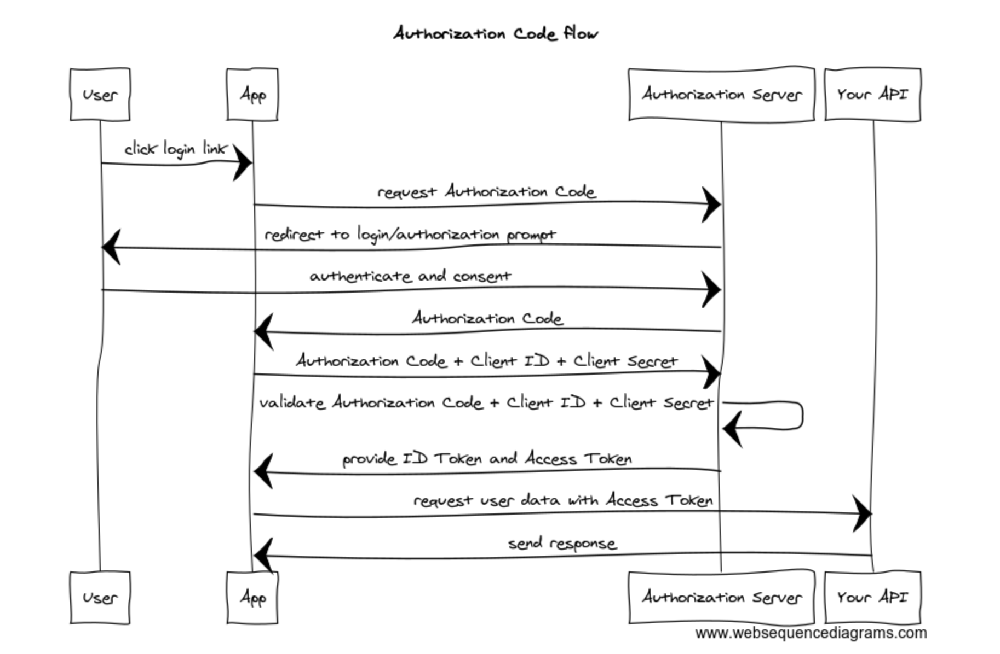
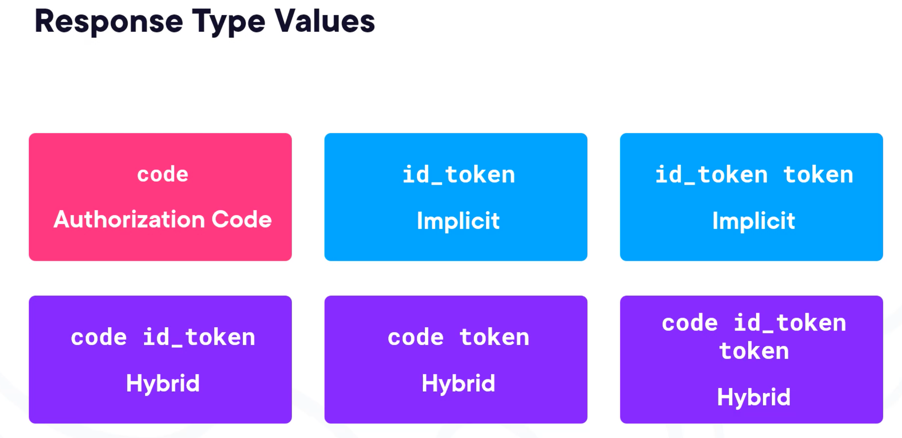

# 04. Sécuriser le processus d'authentification de l'utilisateur



## `authorization code flow` 

Tout commence par une requête à l'`authorization` endpoint :

```url
https://idprovider/connect/authorize?
client_id=hukarappclient
&redirect_uri=https://hukarappClient/signin-oidc
&scope=openid profile
&response_type=code
&response_mode=form_post
&nonce=6775677...juhsffder
```

L'url de `connect/authorize` est fournit par le `discovery document`.

### `response_type`

Sa valeur va déterminer quel type de `flow` on utilise :



`Implicit` et `Hybrid` flow sont considérés comme obsolète.

L'`Id Provider`, après avoir authentifié et obtenu le consentement de l'utilisateur, renvoie un `authorization code` au client.

Ce `code` est visible dans l'url, on parle de `front channel`.


## `Front` et `Back` `Channel`

Le `Front channel` implique le navigateur.

Le `Back channel` est une communication serveur à serveur.

> ### Front channel
>
> Le message passe **par le navigateur (user-agent)**.
>
> - Typiquement : redirects, navigation, chargement d’iframe, etc.
> - L’utilisateur *et tout ce qui est “autour”* (plugins, historique, referer, logs côté client, etc.) est dans le chemin.
>
> Exemples OIDC :
>
> - Redirect vers l’IdP pour login/consent
> - Redirect retour vers ton app avec `code` + `state`
> - (Parfois) `id_token` en “implicit flow” (aujourd’hui plutôt évité)
>
> 👉 Le front channel peut être en **GET ou POST** (ex : `response_mode=form_post` renvoie via un POST auto-submis depuis une page HTML).
>
> ### Back channel
>
> Le message passe **directement entre serveurs** (ton backend ↔ IdP), sans transiter par le navigateur.
>
> - Typiquement : appel HTTP server-to-server, avec client authentication (secret, mTLS, private_key_jwt…)
> - Ce canal est “hors vue” du navigateur.
>
> Exemples OIDC :
>
> - Ton serveur appelle le **token endpoint** (`/token`) pour échanger le `code` contre des tokens (souvent en POST)
> - Ton serveur appelle **userinfo**, **introspection**, **revocation**, etc.
>
> 👉 Le back channel est *souvent* en POST, mais ce n’est pas la définition. On pourrait faire un GET server-to-server (même si c’est rarement approprié).
>
> ------
>
> ## Pourquoi on voit souvent GET en front et POST en back (mais c’est une corrélation, pas la règle)
>
> - Le front channel utilise beaucoup **redirects**, et un redirect HTTP est naturellement basé sur une URL → donc souvent **GET avec query string**.
> - Le back channel échange des secrets/tokens → on préfère **POST** (corps de requête, pas dans l’URL), et les standards OAuth/OIDC ont normalisé ça.
>
> Mais OIDC permet explicitement :
>
> - Front channel en POST : `response_mode=form_post` (les paramètres reviennent dans un POST)
> - Back channel en GET : possible en théorie, juste pas standard pour `/token`
>
> ## Exemple concret (Authorization Code Flow + PKCE)
>
> 1. **Front channel**
>    Browser : app → IdP (redirect)
>    Browser : IdP → app (redirect avec `code` + `state`)
> 2. **Back channel**
>    Backend de l’app → IdP `/token` : échange du `code` contre tokens
>
> Même si tu utilises `form_post` au retour, l’étape 1 reste front channel.
>
> ------
>
> Si tu veux une règle “sécurité” associée :
>
> - **Front channel** : ok pour des artefacts temporaires et non sensibles (code, state, nonce)
> - **Back channel** : là où on met ce qui doit rester confidentiel (tokens, refresh, secrets client)


## Authorization code

Un `token` avec une durée de vie très courte prouvant que l'utilisateur s'est authentifié auprès de L'`Identity Provider`.

l'`authorization code` passe par le `front channel` et utilise la redirection du navigateur.


## Token Endpoint

Une fois le `authorization code` reçu, l'app (le client) va contacter l'`IDP` de serveur à serveur (`back channel`). Il peut passer ses credentials d'application et le code récupéré précédemment et recevoir en échange l'`id_token`.

L'`id-token` sera vérifié et permettra de créer un `user` (une liste de `claims`) accessible par l'application.


## Configurer le `Identity Server`

Dans `Config.cs`

```cs
public static class Config
{
    // ...

    public static IEnumerable<Client> Clients => [
        new Client
        {
            ClientName = "Hukar Gallery",
            ClientId = "hukargalleryclient",
            AllowedGrantTypes = GrantTypes.Code,
            RedirectUris =
            {
                "http://localhost:5226/signin-oidc"
            },
            AllowedScopes =
            {
                IdentityServerConstants.StandardScopes.OpenId,
                IdentityServerConstants.StandardScopes.Profile
            },
            ClientSecrets =
            {
                new Secret("hukarsecret".Sha256())
            }
        }
    ];
}
```

`AllowedGrantTypes` : représente les `flow` authorisés, ici `GrantTypes.Code` correspond à `Authorization Code Flow`.

C'est tout ce qui est nécessaire du côté de l'`Identity Provider`.


## Configurer le `Client`

Il faut installer le `nuget` :
```bash
Microsoft.AspNetCore.Authentication.OpenIdConnect
```

```cs
builder.Services.AddAuthentication(cfg =>
{
    cfg.DefaultScheme = CookieAuthenticationDefaults.AuthenticationScheme;
    cfg.DefaultChallengeScheme = OpenIdConnectDefaults.AuthenticationScheme;

}).AddCookie(CookieAuthenticationDefaults.AuthenticationScheme)
.AddOpenIdConnect(OpenIdConnectDefaults.AuthenticationScheme, options =>
{
    options.SignInScheme = CookieAuthenticationDefaults.AuthenticationScheme;
    options.Authority = "https://localhost:5001";
    options.ClientId = "hukargalleryclient";
    options.ClientSecret = "hukarsecret";
    options.ResponseType = "code";
    // options.Scope.Add("openid"); // par défaut
    // options.Scope.Add("profile"); // par défaut
    // options.CallbackPath = new PathString("/signin-oidc"); // par défaut
    options.SaveTokens = true;
});
```

`SignInScheme` : implique qu'un `cookie` sera créé et gardera l'authentification si celle-ci réussie.

`Authority` : C'est l'`IDP` (`Identity Provider`). Le `middleware` va se servir de cette `URL` pour lire le `discovery endpoint` et savoir où trouver les différents `endpoints` et autres informations. 

`options.ResponseType = "code"` represente l'`Authorization Code Flow`. `PKCE` étant obligatoire pour ce `flow`, le `middleware` l'active automatiquement.

`options.SaveTokens` : permet de réutiliser les `token` après (le passer à l'`API` par exemple) si mis à `true`.

> ## Attention !
>
> Il faut être en `https` et avoir les certificats `trusté` par le système  pour que cela fonctionne :
>
> ```bash
> dotnet dev-certs https --check --trust // voire si trusté
> 
> dotnet dev-certs https --trust
> ```
>
> 


