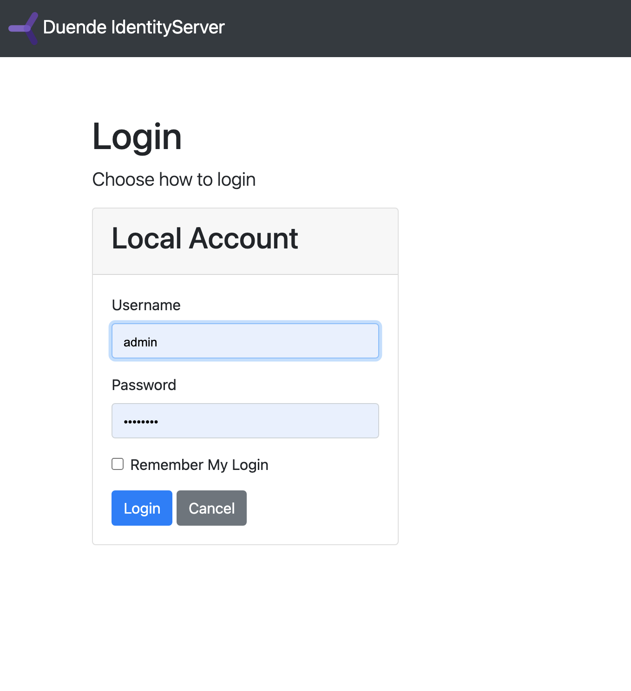
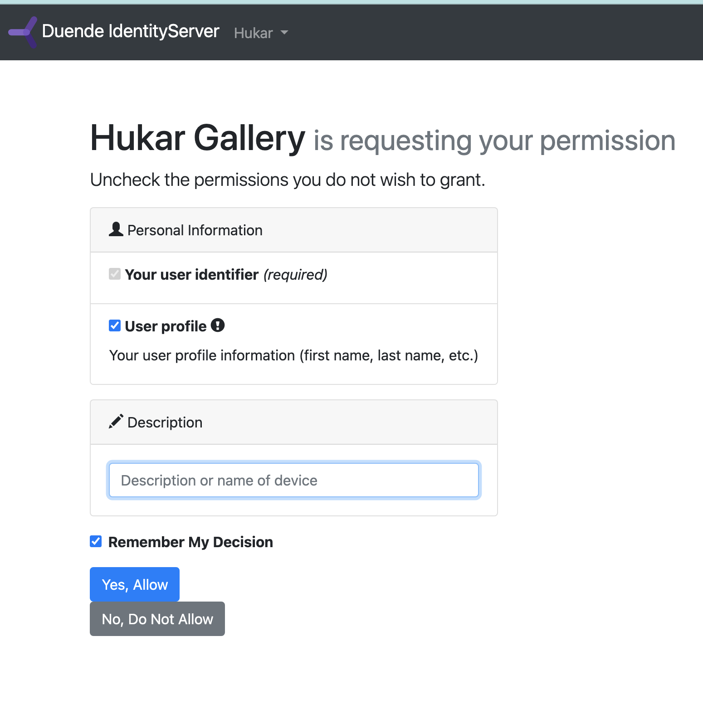
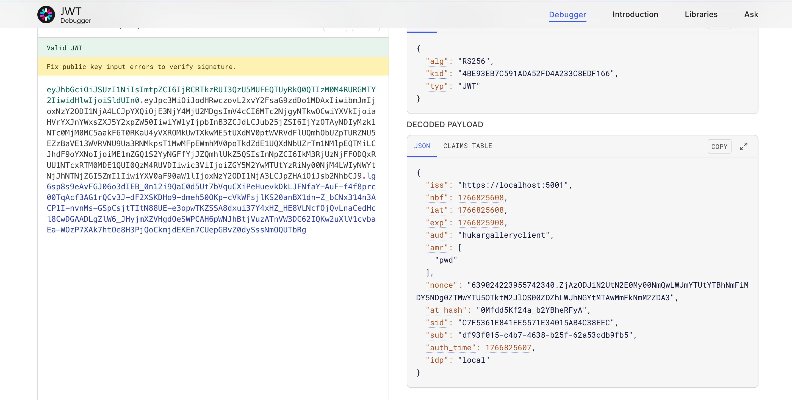
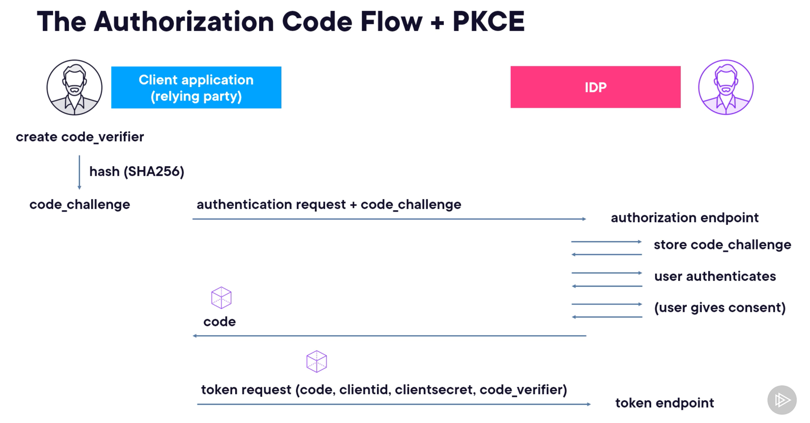
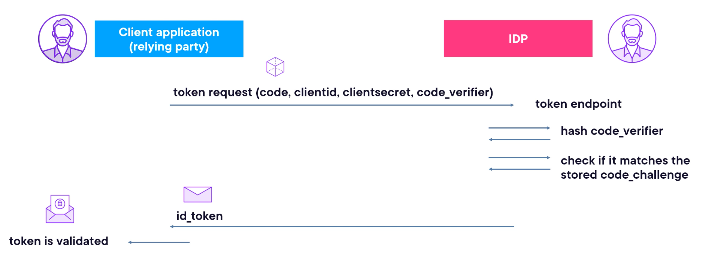
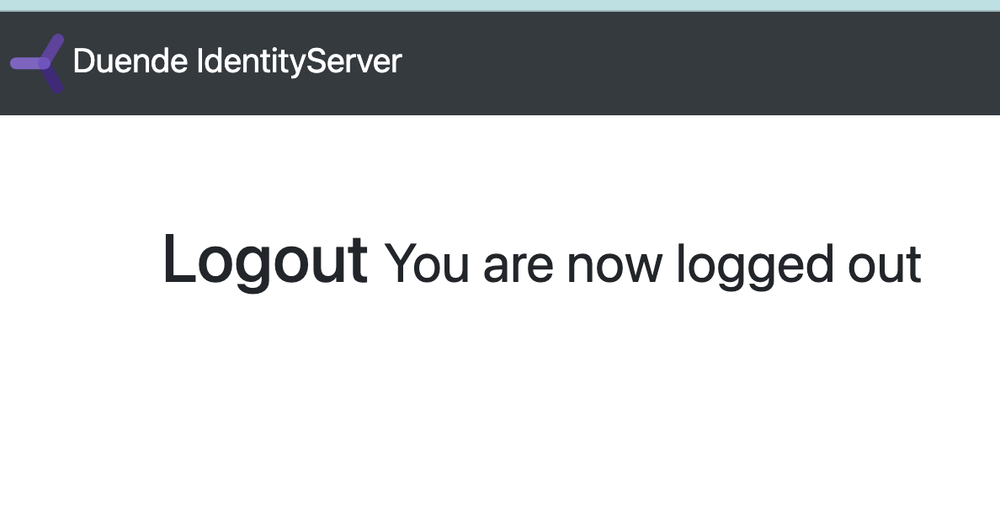
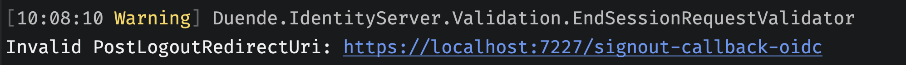

# 04. Sécuriser le processus d'authentification de l'utilisateur


## `authorization code flow` 

Tout commence par une requête à l'`authorization` endpoint :

```url
https://idprovider/connect/authorize?
client_id=hukarappclient
&redirect_uri=https://hukarappClient/signin-oidc
&scope=openid profile
&response_type=code
&response_mode=form_post
&nonce=6775677...juhsffder
```

L'url de `connect/authorize` est fournit par le `discovery document`.

### `response_type`

Sa valeur va déterminer quel type de `flow` on utilise :


`Implicit` et `Hybrid` flow sont considérés comme obsolète.

L'`Id Provider`, après avoir authentifié et obtenu le consentement de l'utilisateur, renvoie un `authorization code` au client.

Ce `code` est visible dans l'url, on parle de `front channel`.


## `Front` et `Back` `Channel`

Le `Front channel` implique le navigateur.

Le `Back channel` est une communication serveur à serveur.

> ### Front channel
>
> Le message passe **par le navigateur (user-agent)**.
>
> - Typiquement : redirects, navigation, chargement d’iframe, etc.
> - L’utilisateur *et tout ce qui est “autour”* (plugins, historique, referer, logs côté client, etc.) est dans le chemin.
>
> Exemples OIDC :
>
> - Redirect vers l’IdP pour login/consent
> - Redirect retour vers ton app avec `code` + `state`
> - (Parfois) `id_token` en “implicit flow” (aujourd’hui plutôt évité)
>
> 👉 Le front channel peut être en **GET ou POST** (ex : `response_mode=form_post` renvoie via un POST auto-submis depuis une page HTML).
>
> ### Back channel
>
> Le message passe **directement entre serveurs** (ton backend ↔ IdP), sans transiter par le navigateur.
>
> - Typiquement : appel HTTP server-to-server, avec client authentication (secret, mTLS, private_key_jwt…)
> - Ce canal est “hors vue” du navigateur.
>
> Exemples OIDC :
>
> - Ton serveur appelle le **token endpoint** (`/token`) pour échanger le `code` contre des tokens (souvent en POST)
> - Ton serveur appelle **userinfo**, **introspection**, **revocation**, etc.
>
> 👉 Le back channel est *souvent* en POST, mais ce n’est pas la définition. On pourrait faire un GET server-to-server (même si c’est rarement approprié).
>
> ------
>
> ## Pourquoi on voit souvent GET en front et POST en back (mais c’est une corrélation, pas la règle)
>
> - Le front channel utilise beaucoup **redirects**, et un redirect HTTP est naturellement basé sur une URL → donc souvent **GET avec query string**.
> - Le back channel échange des secrets/tokens → on préfère **POST** (corps de requête, pas dans l’URL), et les standards OAuth/OIDC ont normalisé ça.
>
> Mais OIDC permet explicitement :
>
> - Front channel en POST : `response_mode=form_post` (les paramètres reviennent dans un POST)
> - Back channel en GET : possible en théorie, juste pas standard pour `/token`
>
> ## Exemple concret (Authorization Code Flow + PKCE)
>
> 1. **Front channel**
>    Browser : app → IdP (redirect)
>    Browser : IdP → app (redirect avec `code` + `state`)
> 2. **Back channel**
>    Backend de l’app → IdP `/token` : échange du `code` contre tokens
>
> Même si tu utilises `form_post` au retour, l’étape 1 reste front channel.
>
> ------
>
> Si tu veux une règle “sécurité” associée :
>
> - **Front channel** : ok pour des artefacts temporaires et non sensibles (code, state, nonce)
> - **Back channel** : là où on met ce qui doit rester confidentiel (tokens, refresh, secrets client)


## Authorization code

Un `token` avec une durée de vie très courte prouvant que l'utilisateur s'est authentifié auprès de L'`Identity Provider`.

l'`authorization code` passe par le `front channel` et utilise la redirection du navigateur.


## Token Endpoint

Une fois le `authorization code` reçu, l'app (le client) va contacter l'`IDP` de serveur à serveur (`back channel`). Il peut passer ses credentials d'application et le code récupéré précédemment et recevoir en échange l'`id_token`.

L'`id-token` sera vérifié et permettra de créer un `user` (une liste de `claims`) accessible par l'application.


## Configurer le `Identity Server`

Dans `Config.cs`

```cs
public static class Config
{
    // ...

    public static IEnumerable<Client> Clients => [
        new Client
        {
            ClientName = "Hukar Gallery",
            ClientId = "hukargalleryclient",
            AllowedGrantTypes = GrantTypes.Code,
            RedirectUris =
            {
                "http://localhost:5226/signin-oidc"
            },
            AllowedScopes =
            {
                IdentityServerConstants.StandardScopes.OpenId,
                IdentityServerConstants.StandardScopes.Profile
            },
            ClientSecrets =
            {
                new Secret("hukarsecret".Sha256())
            }
        }
    ];
}
```

`AllowedGrantTypes` : représente les `flow` authorisés, ici `GrantTypes.Code` correspond à `Authorization Code Flow`.

C'est tout ce qui est nécessaire du côté de l'`Identity Provider`.


## Configurer le `Client`

Il faut installer le `nuget` :
```bash
Microsoft.AspNetCore.Authentication.OpenIdConnect
```

```cs
builder.Services.AddAuthentication(cfg =>
{
    cfg.DefaultScheme = CookieAuthenticationDefaults.AuthenticationScheme;
    cfg.DefaultChallengeScheme = OpenIdConnectDefaults.AuthenticationScheme;

}).AddCookie(CookieAuthenticationDefaults.AuthenticationScheme)
.AddOpenIdConnect(OpenIdConnectDefaults.AuthenticationScheme, options =>
{
    options.SignInScheme = CookieAuthenticationDefaults.AuthenticationScheme;
    options.Authority = "https://localhost:5001";
    options.ClientId = "hukargalleryclient";
    options.ClientSecret = "hukarsecret";
    options.ResponseType = "code";
    // options.Scope.Add("openid"); // par défaut
    // options.Scope.Add("profile"); // par défaut
    // options.CallbackPath = new PathString("/signin-oidc"); // par défaut
    options.SaveTokens = true;
});
```

`SignInScheme` : implique qu'un `cookie` sera créé et gardera l'authentification si celle-ci réussie.

`Authority` : C'est l'`IDP` (`Identity Provider`). Le `middleware` va se servir de cette `URL` pour lire le `discovery endpoint` et savoir où trouver les différents `endpoints` et autres informations. 

`options.ResponseType = "code"` represente l'`Authorization Code Flow`. `PKCE` étant obligatoire pour ce `flow`, le `middleware` l'active automatiquement.

`options.SaveTokens` : permet de réutiliser les `token` après (le passer à l'`API` par exemple) si mis à `true`.

## Les propriétés “default” importantes :

- **`DefaultScheme`**
   👉 *fallback* global : si un default spécifique n’est pas défini (authenticate/challenge/…), on retombe sur `DefaultScheme`.

- **`DefaultAuthenticateScheme`**
   👉 utilisée quand le framework fait `AuthenticateAsync()` sans schéma explicite (ex : `UseAuthentication()` et/ou l’auth implicite liée à l’authorization). C’est ce qui **remplit `HttpContext.User`** (si succès).

- **`DefaultChallengeScheme`**
   👉 utilisée quand on fait `ChallengeAsync()` (typiquement : `[Authorize]` sur une ressource et user non authentifié) :

  - pour un site : souvent **redirect vers login / OIDC**
  - pour une API : souvent **401 + WWW-Authenticate** (JWT).

- **`DefaultForbidScheme`**
   👉 utilisée quand on fait `ForbidAsync()` (typiquement : user authentifié **mais** pas autorisé) → 403 ou redirect “access denied” selon le handler.

- **`DefaultSignInScheme`**
   👉 utilisée quand on fait `SignInAsync()` sans schéma explicite. Très important avec les handlers “remote” (OIDC/OAuth) : ils s’authentifient “auprès d’un tiers”, puis **demandent à un schéma local** (souvent Cookie) de **persister la session**. 

- **`DefaultSignOutScheme`**
   👉 utilisée par `SignOutAsync()` sans schéma explicite (cookie signout local, et/ou signout OIDC si tu le déclenches).

  

> ## Attention !
>
> Il faut être en `https` et avoir les certificats `trusté` par le système  pour que cela fonctionne :
>
> ```bash
> dotnet dev-certs https --check --trust // voire si trusté
> 
> dotnet dev-certs https --trust
> ```
>
> 


## Sécuriser une page

```cs
@attribute [Authorize]

<PageTitle>Counter</PageTitle>

<h1>Counter</h1>
```

L'attribut `[Authorize]` va déclencher `ChallengeAsync`, comme `DefaultChallengeScheme` pointe vers le handler d'`OIDC`, on va être redirigé ves le serveur `Identity Provider` (`IDP`) :



S'il n'y a pas de `user` authentifié (persisté grâce au `Cookie`), on sera redirigé vers la page de `login` de `Duende IdentitySErver`.


## Écran de consentement

On a joute à la config de l'`IDP` dans `Config.cs` :

```cs
public static IEnumerable<Client> Clients => [
        new Client
        {
            ClientName = "Hukar Gallery",
            ClientId = "hukargalleryclient",
            AllowedGrantTypes = GrantTypes.Code,
            RedirectUris =
            {
                "https://localhost:7227/signin-oidc"
            },
            AllowedScopes =
            {
                IdentityServerConstants.StandardScopes.OpenId,
                IdentityServerConstants.StandardScopes.Profile,
                // IdentityServerConstants.LocalApi.ScopeName
            },
            ClientSecrets =
            {
                new Secret("hukarsecret".Sha256())
            },
            RequireConsent = true
        }
    ];
```



On peut alors cocher et décocher le `user profile`.


## Middleware pour logger le `Token`

```cs
public class TokenLoggerMiddleware(RequestDelegate next, ILogger<TokenLoggerMiddleware> logger)
{
    private readonly RequestDelegate _next = next;
    private readonly ILogger<TokenLoggerMiddleware> _logger = logger;

    public async Task InvokeAsync(HttpContext context)
    {
        var token = await context.GetTokenAsync(OpenIdConnectParameterNames.IdToken);

        var userClaims = new StringBuilder();

        foreach (var claim in context.User.Claims)
        {
            userClaims.AppendLine($"{claim.Type} : {claim.Value}");
        }
        
        _logger.LogInformation("token & claims : {Token} \n {userClaims}  \n", token, userClaims);

        await _next(context);
    }
}
```

`context.GetTokenAsync("id_token")` récupère le `token`.

`OpenIdConnectParameterNames.IdToken` contient la valeur `"id_token"`.

On obtient :

```bash
info: HukarGallery.Middlewares.TokenLoggerMiddleware[0]
      token & claims : eyJhbGciOiJSUzI1NiIsImtpZCI6IjRCRTkzRUI3QzU5MUFEQTUyRkQ0QTIzM0M4RURGMTY2IiwidHlwIjoiSldUIn0.eyJpc3MiOiJodHRwczovL2xvY2FsaG9zdDo1MDAxIiwibmJmIjoxNzY2ODI1NjA4LCJpYXQiOjE3NjY4MjU2MDgsImV4cCI6MTc2NjgyNTkwOCwiYXVkIjoiaHVrYXJnYWxsZXJ5Y2xpZW50IiwiYW1yIjpbInB3ZCJdLCJub25jZSI6IjYzOTAyNDIyMzk1NTc0MjM0MC5aakF6T0RKaU4yVXROMkUwTXkwME5tUXdMV0ptWVRVdFlUQmhObUZpTURZNU5EZzBaVE13WVRVNU9Ua3RNMkpsT1MwMFpEWmhMV0poTkdZdE1UQXdNbUZrTm1NMlpEQTMiLCJhdF9oYXNoIjoiME1mZGQ1S2YyNGFfYjJZQmhlUkZ5QSIsInNpZCI6IkM3RjUzNjFFODQxRUU1NTcxRTM0MDE1QUI0QzM4RUVDIiwic3ViIjoiZGY5M2YwMTUtYzRiNy00NjM4LWIyNWYtNjJhNTNjZGI5ZmI1IiwiYXV0aF90aW1lIjoxNzY2ODI1NjA3LCJpZHAiOiJsb2NhbCJ9.lg6sp8s9eAvFGJ06o3dIEB_0n12i9QaC0d5Ut7bVquCXiPeHuevkDkLJFNfaY-AuF-f4f8prc00TqAcf3AG1rQCv3J-dF2XSKDHo9-dmeh50OKp-cVkWFsjlKS20anBX1dn-Z_bCNx314n3ACP1I-nvnMs-GSpCsjtTItN88UE-e3opwTKZSSA8dxui37Y4xHZ_HE8VLNcfOjQvLnaCedHcl8CwDGAADLgZlW6_JHyjmXZVHgdOeSWPCAH6pWNJhBtjVuzATnVW3DC62IQKw2uXlV1cvbaEa-WOzP7XAk7htOe8H3PjQoCkmjdEKEn7CUepGBvZ0dySssNmOQUTbRg 
      
http://schemas.microsoft.com/claims/authnmethodsreferences : pwd
sid : C7F5361E841EE5571E34015AB4C38EEC
http://schemas.xmlsoap.org/ws/2005/05/identity/claims/nameidentifier : df93f015-c4b7-4638-b25f-62a53cdb9fb5
auth_time : 1766825607
http://schemas.microsoft.com/identity/claims/identityprovider : local
```




## `PKCE` protection

Un `authorization code` perdu permet un attaquant de remplacer la victime lors d'une `session`.

L'attaquant a maintenant les privilèges de la victime.



Il y a un `code_verifier` et son `hash` le `code_challenge`.

Le `code_challenge` est envoyé avec la requête d'authentification et il est stocké par l'`ID Provider`.

Ensuite, lors de la demande du `token`, le `code_verifier` est envoyé.

Avec `SHA256` il n'est pas possible de déduire le `code_verifier` depuis le `code_challenge`.



Le `token endpoint` va hasher le `code_verifier` et vérifier que ce `hash` correspond bien au `code_challenge` envoyé précédement (et stocké).


## `Logout`

### Créer des boutons `login` et logout (dans `NavMenu.razor`)	

```react
    // ...
	<AuthorizeView>
        <Authorized>
                <Button @onclick="Logout">
                    Logout
                </Button>
        </Authorized>
        <NotAuthorized>
                <Button @onclick="Login">
                    Login
                </Button>            
        </NotAuthorized>
    </AuthorizeView>
</nav>
```

```cs
void Logout() => Navigation.NavigateTo($"/logout", forceLoad:true);

void Login() => Navigation.NavigateTo($"/login", forceLoad:true);
```

#### ! `forceload: true` est obligatoire, sinon une exception est levée


### les endpoints nécessaires

```cs
app.MapGet("/login", async (HttpContext context) =>
{
    var redirectUrl = "/";
    await context.ChallengeAsync(OpenIdConnectDefaults.AuthenticationScheme,
        new AuthenticationProperties { RedirectUri = redirectUrl });
});

app.MapGet("/logout", async (HttpContext context) =>
{
    var redirectUrl = "/anonymous";
    await context.SignOutAsync(CookieAuthenticationDefaults.AuthenticationScheme, 
        new AuthenticationProperties { RedirectUri = redirectUrl});
}).RequireAuthorization();
```

`/logout` n'est accessible que si on est authentifié (`RequireAuthorization`).

Le `login` utilise `ChallengeAsync` avec `OpenIdConnect`, tandis que le `SignOutAsync` utilise les `Cookies`.

> **`ChallengeAsync("oidc")`** = *“pas de session locale → déclenche le handler OIDC pour rediriger vers l’IdP et obtenir une identité”* ; **`SignInAsync("Cookies")`** = *“identité obtenue → le handler Cookies la persiste localement en émettant le cookie de session”*.
>
>  `/login` fait un **Challenge OIDC** (redirect), et au retour OIDC **sign-in automatiquement dans Cookies** via `SignInScheme`; `/logout` sur **Cookies** supprime la session locale (et pour aussi déconnecter l’IdP, on ajoutes en plus un `SignOutAsync("oidc")`).


### Version de `LogOut` complète (`OIDC`  et `Cookies`)

```cs
app.MapGet("/logout", (HttpContext context) =>
{
    var redirectUrl = "/anonymous";
    var props = new AuthenticationProperties { RedirectUri = redirectUrl };

    return Results.SignOut(
        props,
        [
            CookieAuthenticationDefaults.AuthenticationScheme,
            OpenIdConnectDefaults.AuthenticationScheme,
        ]
    );
}).RequireAuthorization();
```


Cela va invoquer `SignOutAsync` deux fois.


## `Redirection` après le `Logout`

Pour le moment après un `logout`, on arrive bloqué sur la page de `Logout` du `ID Provider` :



C'est parce que l'`url` de `callback` n'est pas bonne, il y a d'ailleur un `Warning` dans les logs de `Duende.Identity` :




