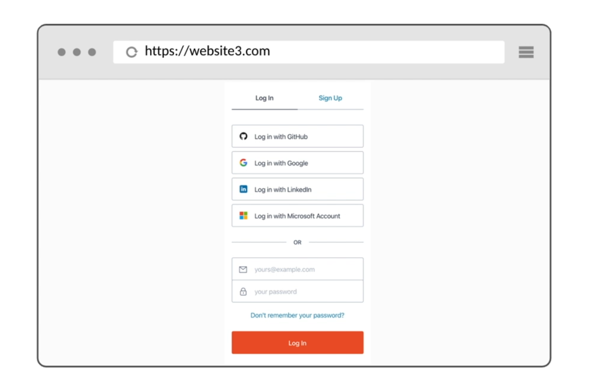
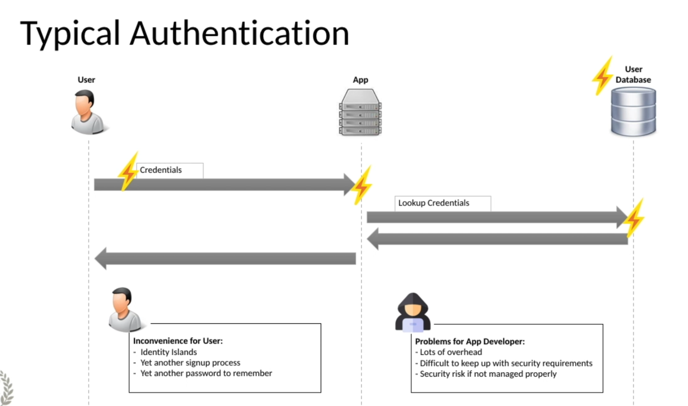
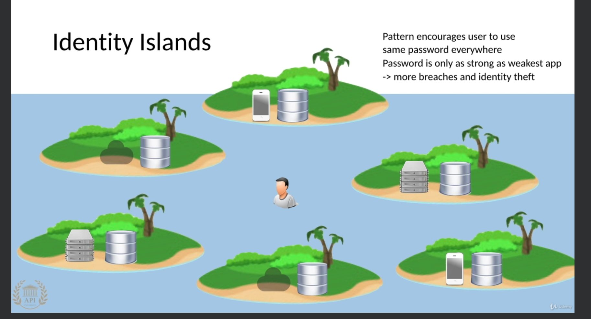
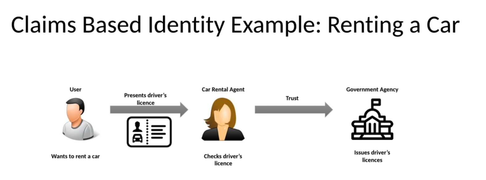
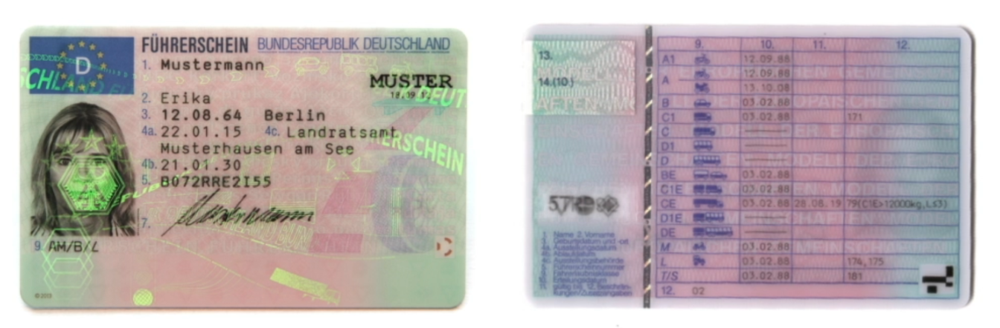
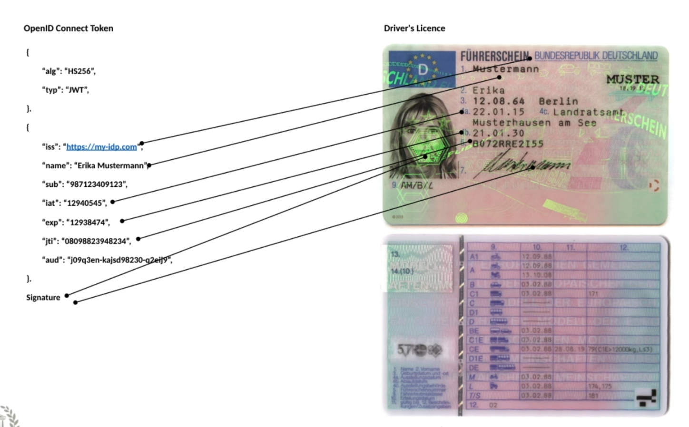
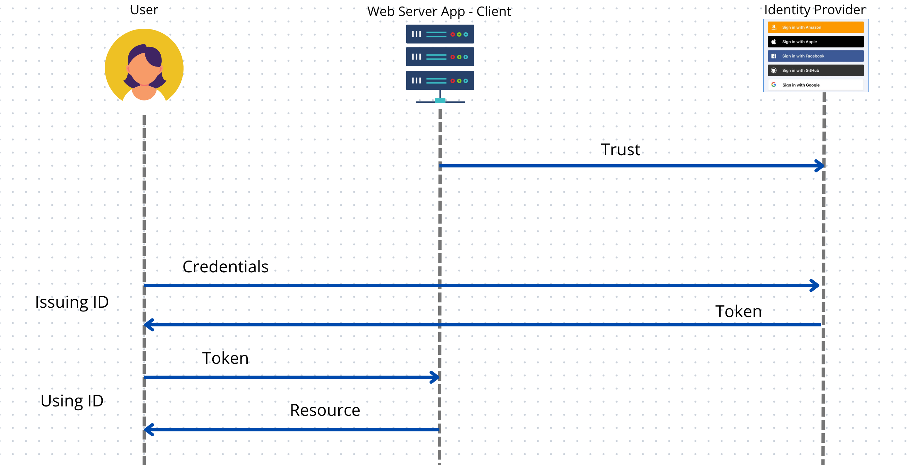

# 01 Introduction

## Pourquoi `OpenId Connect`

La multiplication des services (des apps) web oblige a recommencer le choix d'un `username` et d'un `password` une multitude de fois.

On a tendance à réutiliser les mêmes `credentials` sur plusieurs site , et si l'application avec le moins de sécurité se fait hacker, le `password` peut donner accès aux autres applications (qui elles sont bien sécurisées).

Avec `OIDC`, une application vous donne le choix de vous logger avec un acompte déjà existant, cela évite de multiplier les `credentials`, cela permet d'en centraliser la gestion.

## Termes et définitions

### `Identity`

C'est un nom unique pour une personne ou un appareil (`device`).

### `Authentication`

C'est le processus de vérifier une `Identity`.

### `Authorization`

C'est une fonctionnalité au-dessus `Identity` et qui octroie des droits d'accès. Il faut donc d'abord avoir une `Identity` avant d'avoir des `Authorizations`.

Les accès accordés (`grant access`) sont basés sur un ensemble de règles, où les règles dépendent de l'`Identity`.

### `Access Rights` (les droits d'accès)

Ce sont des privilèges pour accéder à certaines données ou utiliser (appeler) certaines fonctionnalités

## `Authentication` typique

En plus d'être un problème de sécurité complexe pour les développeur de l'`app`, c'est fastidieux (`tedious`) pour l'utilisateur. Celui-ci devra gérer un nouveau `password` et un nouvel `username` ou réutiliser un ancien (- sic -).

### `Identity` Islands

Chaque `App` gère sa propre version de l'`Identity` d'un `User`. La sécurité en cas de réutilisation des mêmes `credentials` est celle de l'élément (l'`app`) le plus faible.

## Leverage external `Identity Provider`

C'est un pattern qui tire profit d'avoir un `Identity Provider` externe à son système, à son `App`.

C'est le cas dans le monde réel et les `Identities` (carte d'identité, permis de conduire, carte d'étudiant, ...) sont généralement gérées et fournies par l'état.

Ce scénario demande une confiance entre le loueur de voiture et le gouvernement. Il doit avoir confiance dans les documents octroyés par celui-ci.

`issuing Id` : délivrer une `Carte d'identité`

## `Driver Licence` exemple

On peut appeler le permis de conduire `Driver Licence Token`.

- On a la preuve que le `Token` est valide grâce à ses propriétés difficile à falsifier comme un hologramme.
- Il contient les `Identity Claims`.

## Corrélation entre le `Permis de conduire` et le `OpenId Connect Token`

Il y a trois parties :

1. ce sont les informations sur le `Token`, l'algorithme `"alg": "hs256"` et le type de `Token` `"typ":"jwt"`.

2. C'est le `payload`

   l'émétteur `issuer` :  `"iss":"https://my-idp.com`

   le nom `"name":""Erike M.`

   la date d'émission `issued at` :  `"iat":"<timestamp>"`

   la date d'expiration `"exp":"<timestamp>"`

   Le numéro de `Token` : `"jti":"08973420093433`

3. La signature de la personne et celle de l'émetteur (`issuer`)

## `OpenId` Connect

C'est un type de sécurité qui utilise une `Identity` basé sur les `Claims`.

Un `Claim` est une déclaration à propos d'un objet.

## `Claims` Based Identity

- `Claim` : déclaration sur un objet
- `Claim Provider` : celui qui créé les `Claims`
- `Subject` : l'entité sur laquelle les `Claims` portent
- `Trust` : Si une partie en relation fait confiance à l'`Identity Provider`, elle peut aussi faire confiance aux `Claims` générées par l'`Identity Provider` associées au `Subject`

## Avantage d'`OpenId Connect`

### Pour le `User`

- Une expérience simple pour `signup` et `login`
- Pas besoin de remplir de formulaire de `signup`
- Pas besoin de signé si une session avec le `OpenId Connect Provider` existe déjà
- Pas besoin de se souvenir d'un autre `username/password`

### Pour le développeur de l'`Application`

- Une experience sympa de `signup` et de `login` pour l'utilisateur
- Il ne gère pas lui-même l'`Identity` et l'infrastructure d'`Authentication`
- Il ne doit pas fournir de support en cas de problème d'authentification ou de changement des données de l'utilisateur utilisées pour le `login` (nom, mot de passe, email)
- Moins de riques de sécurité, pas de risque de se faire hacker les `credentials` de ses utilisateurs

### Pour l'`Id Provider`

- L'opportunité de construire avec les `apps` des développeur un ecosystème au service d'un même utilisateur
- L'opportunité de renforcé la confiance de l'utilisateur et des partenaires (`apps`)
- Devenir un intervenant central dans l'ecosystème digitale de l'utilisateur
- L'opportunité de faire sa publicité en étant présent à chaque `login` apge
- L'opportunité de construire une `DB` de clients potentiellement intéressés  par d'autre services accessible via `OpenId Connect`
- La possibilité d'en apprendre plus sur ses utilisateurs en observant leurs `app` et l'usage des `applications` partenaires
- Créer de la connaissance à propos de ses clients pour améliorer son offre et ses services