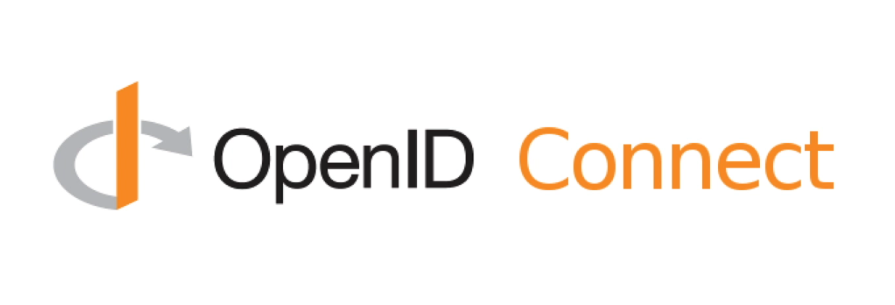

# 02 `OpenId` Connect

## qu'est-ce que `OpenId Connect`

- C'est un protocole standardisé
- Il permet de passer de manière sécurisé des données d'identité (`Claims`) d'un `Provider` à un `Client` (`Web App, Mobile App`)
- Il garantit l'intégrité et la confidantialité des données d'identité

## Bref historique

- Créé en 2014
- Le standard est maintenu par la `OpenID Foundation`
- http://openid.net/connect
- Les premiers `OpenId Connect provider` : `google`, `microsoft`, `paypal`

## Comment fonctionne `OpenId Connect`

`OpenId Connect` est une sur-couche de `OAuth 2.0` (protole de délégation d'`Authorization`).

Il délivre les `Identity Claims` de l'utilisateur via 2 options

- `ID Token`
- Un endpoint d'`API` nommé `/userinfo`

## `Identity Claims` via `ID Token`

C'est un jeton standardisé : `Json Web Token` - `JWT` prononcé `[jot]`.

Il est protégé par une signature cryptographique ou par cryptage ou les deux :

- `Json Web Signature` - `JWS` le contenu est lisible par n'importe qui
- `Json Web Encryption` - `JWE` le contenu est crypté

On peut combiner les deux solutions en mettant un `JWS` dans un `JWE` et cela reste un `JWT` valide.

Son `payload` est un objet `Json` contenant les `Claims` sous forme de paire `clé/valeur`.

## `Identity Claims` via `Userinfo API`

C'est une `Restful API`.

Elle est protégée par `OAuth`

- Droits accès grossier (sans détail) : `OAuth Access Token`
- Droits accès fin - granulaire : `OAuth scope` (`openid`, `address`, `email`)

Il délivre un objet `Json` contenant les `Claims` sous forme de paire `clé/valeur`