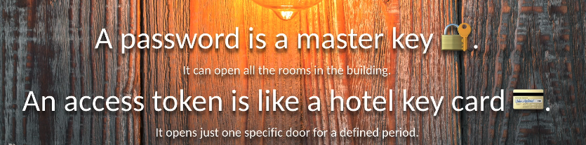

# 02 `OpenId` Connect

## qu'est-ce que `OpenId Connect`

- C'est un protocole standardisé
- Il permet de passer de manière sécurisé des données d'identité (`Claims`) d'un `Provider` à un `Client` (`Web App, Mobile App`)
- Il garantit l'intégrité et la confidentialité des données d'identité

`OpenId Connect` est basé sur les standard du web et les meilleurs pratiques : `OAuth`, `JSON`, `TLS`, `JWT`, `JWS`, `JWE`, `JWK`, `JWA`

`JWS` Json Web Signature

`JWE` Json Web Encryption

`JWK` Json Web Key

`JWA` Json Web Algorithm

## Bref historique

- Créé en 2014
- Le standard est maintenu par la `OpenID Foundation`
- http://openid.net/connect
- Les premiers `OpenId Connect provider` : `google`, `microsoft`, `paypal`

## Comment fonctionne `OpenId Connect`

`OpenId Connect` est une sur-couche de `OAuth 2.0` (protole de délégation d'`Authorization`).

Il délivre les `Identity Claims` de l'utilisateur via 2 options

- `ID Token`
- Un endpoint d'`API` nommé `/userinfo`

## `Identity Claims` via `ID Token`

C'est un jeton standardisé : `Json Web Token` - `JWT` prononcé `[jot]`.

Il est protégé par une signature cryptographique ou par cryptage ou les deux :

- `Json Web Signature` - `JWS` le contenu est lisible par n'importe qui
- `Json Web Encryption` - `JWE` le contenu est crypté

On peut combiner les deux solutions en mettant un `JWS` dans un `JWE` et cela reste un `JWT` valide.

Son `payload` est un objet `Json` contenant les `Claims` sous forme de paire `clé/valeur`.

## `Identity Claims` via `Userinfo API`

C'est une `Restful API`.

Elle est protégée par `OAuth`

- Droits accès grossier (sans détail) : `OAuth Access Token`
- Droits accès fin - granulaire : `OAuth scope` (`openid`, `address`, `email`)

Il délivre un objet `Json` contenant les `Claims` sous forme de paire `clé/valeur`

## `OpenId Connect` Flow

### `Id Token` Flow

L'`Authorization Code` est la confirmation que le `resource Owner` permet ou accorde les droits d'accès (`granting access rights`) à son `Identity` à l'application `Client`.

Le `Client` va utiliser `Authorization: Basic cf5Tghj...` pour passer ses `credentials` et renvoyer l'`Authorization Code`.

Le `OIDC Server` renvoie un `json` avec un `Access Token`, un `Refresh Token` et un `Id Token`. 

Le `Client` utilise ensuite l'`Access Token` pour accéder au `resource Server`, celui-ci teste la validité du `Token` auprès du `OIDC Server` et renvoie la `Resource` si le `Token` est valide.

### `/userinfo` APi

Dans ce cas le `Resource Server` est implémenté dans `OpenId Connect`.

Le `OIDC Server` retourne les `Claims` en `Json`.

On a maintenant `Identity as a service` d'une manière pratique pour l'application `Client`.

## B2B2C architecture

Aujourd'hui il y a généralement trois acteurs dans un système informatique :

- Celui qui possède les données et les exposes à l'aide d'une `API`.
- Celui qui présente et créé des fonctionnalité sur ces données, le développeur d'application `Client`.
- L'utilisateur finale à qui appartient les données. 

Le moyen de sécurisé un tel système est `OAuth` :

L'utilisateur ne donne sa clé à personne sauf le `OAuth Server`.

On résous ici le problème du `Password Anti-Pattern` où on court le risque de donner sa clé à une application tiers, celle-ci ayant ainsi potentiellement accès à l'ensemble des données de l'utilisateur.

## `OAuth 2.0`

- c'est la base technique pour `OpenId Connect`

- Standard: IETF RFC 6749 (Internet Engineering Task Force)

- Ce n'est pas : `Authentication`

- Ce n'est pas :  `Authorization`

- Ce n'est pas : `Federation`

- C'est juste : Une `Deleguation` de l'`Authorization`

Je peux délégué mon autorisation pour quelque chose de très spécifique.

## Différence entre un `password` et un `Access Token`

Un `password` est comme un `passe-partout`, il peut ouvrir toutes les portes.

Un `Access Token` est comme le `cardpass` d'un hôtel, il ne donne accès qu'à une chambre pour une période bien précise.

## Les débuts d'`OpenId Connect`

Au départ, chaque acteur du web devait créer sa propre représentation du `Resource Owner`, sa propre `APi` pour définir l'`Identity`, l'appelant au choix `customer API`, `profile PAI` ou encore `person API`.

 Chacune de ces représentations avait ses propres champs : `name`, `username`, `firtsname` et autre.

  Les compagnies importantes se dirent que ce n'était pas `future oriented` et décidèrent qe créer un standard : `OpenId Connect`.

`OpenId Connect` est une couche Identité sur le protocole `OAuth`.

Il y a une nouvelle `resource` par rapport au simple `OAuth`, c'est `UserInfo`.

## `OAuth` vs `OpenId Connect`

| OAuth                                                        | OpenID Connect                                               |
| ------------------------------------------------------------ | ------------------------------------------------------------ |
| C'est un standard pour la sécurité des `APi`                 | Authorise les applications à accéder aux attributs d'identité du `Resource Owner`. |
| Permet aux applications d'accéder aux `resources` en rapport avec ses droits d'accès | Est construit sur le protocole (le pattern) `OAuth`          |
| Prévient la fuite d'information sur le `Resource Owner` vers l'`App` |                                                              |
| Protège les `credentials`du `Resource Owner`                 |                                                              |

`OAuth` ne permet pas au `Client` d'accéder aux attributs d'identité.

`OpenId Connect` évite que chaque entreprise n'ai à créer sa propre `API` d'`Identity`. `OIDC` standardise cette `API` et l'appelle `userinfo API`.

## `OpenId Connect` et `Authentication`

`OIDC` n'est pas un mécanisme d'`authentication`, ce mécanisme reste une `blackbox` pour `OIDC`.

Peu importe comment l'`authentication` est réalisé, une facteur, plusieurs facteur, biométrique, par contre `OIDC` nécessite un mécanisme d'`authentication`.

