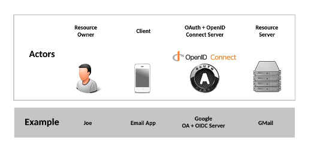

# 03 Les acteurs

### `Resource Owner` 
#### : `RO`, `User`, `End-User`, `Subject` (`sub`) dans le contexte d'`OIDC`. 
Une ressource `userinfo` contient les attributs d'identité du `resource Owner`. 

Il délégue certains droits d'accès sur certaines ressources à l'application tiers.

### `Client` 
#### : `Relaying Party` (partie prenante), `App`, `Audience` (`Aud`).
Il veut accéder accéder aux `resources` du `User`. 

Il obtient et détient les `Access Token`, `refresh Token` et `Id Token`. 

Il ne détient pas les `credentials` du `User`. Il a aussi une identité (`Client Id`, `Client Secret`).

### `OAuth Server` 
#### :  `OAuth Provider OP`, `Authorization server AS`, `Issuing Autority ISS`, `Token Issuer`, `Security Token service STS` 
Doit avoir un système (un écran) de `login` et de `consent` (consentement). 

Il doit permettre aux `App` de pouvoir s'enregistrer, il possède aussi une `DB` pour gérer les `Token` (avec leurs `metadata`). 

Il doit offrir la possibilité à l'utilisateur de pouvoir révoquer tous les `Access Token` le concernant.

### `Resource Server ` 
#### : `APi`, `endpoint`. Il détient les ressources qui appartiennent au `User`.
Il protège les données avec un `Access Token` (`coarse granular`) et les `scopes` (`fine granular`). 

Il rend les `resources` accessibles grâce à une `Restful API`.

### `Userinfo Resource Server` 
Fournit par le `OpenId Connect Server`. 

Il détient les attributs d'identité du `User`. 

Il protège les données `userinfo resource` avec un `Access Token` (coarse granular) et les `scopes` (fine granular). 

`userinfo` est disponible sous forme d'une `Restful API`.

### `OpenId Connect Server` 
#### : `OIDC Provider`, `OIDC Server`, `Identity Provider`. 
Il contient la même que le `OAuth Server` et en plus un `/userinfo endpoint` 

Il émet quelques `Token` en plus et en gère aussi un peu plus.

#### Composants

- Un mécanisme d'`authentication`
- Un composant (mécanisme) de consentement de partager des informations d'identité avec le `Client`.
- Un `Token Management Component` (comme une `DB`), il enregistre les `Tokens`, leur état et lie le `Token` à l'identité du `User`. Il lie aussi le `Token` au `Client` en ayant fait la demande. Il lie aussi le `Token` aux autres `Tokens` (`code`, `refresh`).
- Un composant en self-service d'enregistrement des `Client`. Cela permet de recevoir les `credentials` pour le `Client`.
- `userinfo resource server` qui fournit les `Claims` du `Resource Owner` de manière standardisée.

