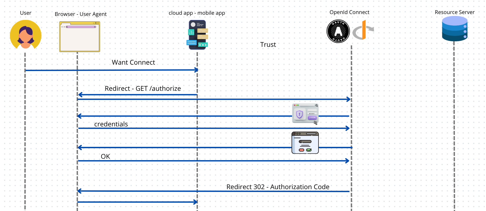
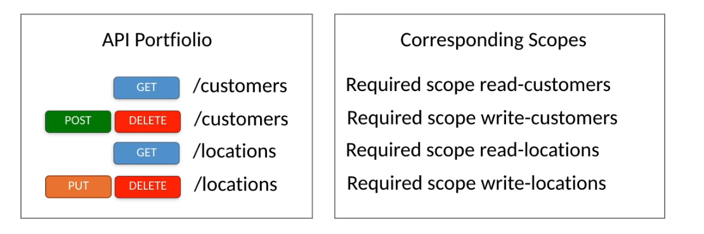
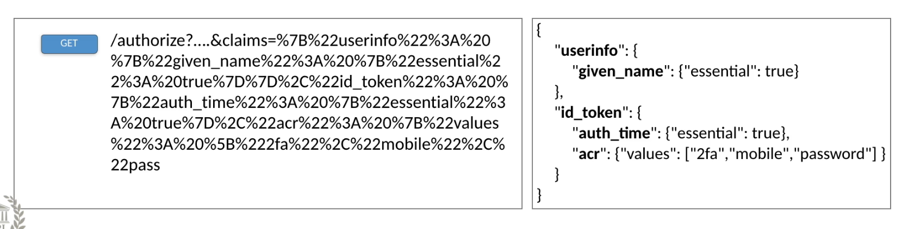

# 04 `Authorization Endpoint`


## Les `endpoints` d'`OpenId Connect`

- `Authorization Endpoint`
- `Resource Endpoint`
- `Userinfo Endpoint`
- `Token Endpoint`
- `Redirect Endpoint`


##  l'`URL`

Sur le `OAuth et OpenId Connect server`.

L'adresse n'est pas standardisé, on pourrait utiliser à priori n'importe quelle `URL`.

Accessible via la méthode `GET`.

```http
GET /authorize
```

## Les input `Query Parameters`

Le `Client` doit spécifier des `Query Parameters`.

### `state` 
Permet de lier la requête et la réponse venant du `OAuth Server` car celle-ci n'est pas une réponse directe (`request/response`) mais asynchrone (retourner depuis le navigateur via un `redirect`). C'est un nombre aléatoire unique.
###  `scope` 
Permet au `Client` de spécifier ls droits d'accès souhaités de manière granulaire. Il contient une liste de droits d'accès associés au futur `Access Token`. POur utiliser `OIDC`, cette liste doit contenir la valeur `openid`. Sinon la requête est classé comme `OAuth Request`.
### `response_type` 
Peut être `Authorization Code Flow`,  `OpenId Connect Flow`, ...
### `client_id` 
Vérifie juste le `client id` sans utilisé le `client secret` (plus tard vérifie sur le `/token endpoint`). Vient de l'enregistrement sur le serveur `OpenId Connect`.
### `redirect_uri` 
C'est l'`URI` à laquelle le `OAuth Server` va retourner de manière asynchrone l'`Authorization Code`. C'est l'`URL` du `Redirect endpoint`. Cette `URL` doit être fournie lors de l'enregistrement de l'application `Client` sur le `OIDC Server`. Cette `URL` doit être public car elle doit être accessible par le navigateur, ou encore accessible sur le périphérique mobile (`URL local`) dans le cas d'un `GSM`.
### `nonce` 
Cette valeur est utilisée pour lier le `id_token` à la session du `User`. Optionnel pour le `Authorization Code Flow` mais obligatoire pour l'`Implicit Flow`. Si il est fourni, le `nonce claim` est présent dans l'`id_token` comme un `Claim`. Est utilisé pour prévenir les `replay attacks`.

### `claims`

Le paramètre optionnel `claims`est utilisé pour demander des `claims` individuelles. La valeur du paramètre `claims` est un objet `json` qui décrit les `claims` devant être présentes dans le `id_token` et le endpoint `userinfo`. `scope` lui est utilisé pour obtenir un `package` de `claims` alors que `claims` sélectionne des `claims` de manière individuelle.

### `display`

Indique comment le `Client` veut que le `OpenId Connect Provider` affiche les écrans de `login` et de `consent`.  

Les valeurs possibles sont :

- `page` une web `page` entière dans le navigateur
- `popup`
- `touch` sur un périphérique tactile
- `wap` sur un téléphone

### `prompt`

Indique comment le `Client` veut que `OIDC Provider` gère la ré-aithentification après que le `token` ait expiré.

Les valeurs possibles sont :

- `none` aucune `UI` ne sera affichée, si l'utilisateur doit agir, une erreur sera lancée.
- `login` l'`UI` de `login` sera affichée.
- `consent` l'`UI` de `consent` sera affichée.
- `select_account` une `UI` pour que l'utilisateur choisisse un acompte sera affichée.

### `max_age` 

Indique la durée de vie en seconde choisie par le `Client`. Après le `User` devra de nouveau s'authentifier. Le `auth_time` doit alors être présent dans le `id_token`.

### `ui_locales`

Indique le choix du `Client` pour le `locale` de l'`UI` (`login` et `consent`)

### `id_token_hint`

L'`id_token` fourni précédement par le `OIDC Provider` pour le `User` connecté. Il peut être utilisé pour identifier une session active du `User`, ne nécessite donc pas d'interaction du `User`.

### `login_hint`

Si le `Client` a déjà une idée du `username` utilisé par le `User` avec l'`OIDC Provider`, il peut être fourni ici. Cela signifie que pour une raison, le `username` est stocké par l'application `Client`.

### `acr_values`

Valeurs possibles pour l'`acr claim` séparées par un espace.


## Les output `Query Parameters` à travers l'`URI` de `redirect`

### `authorization code` 
Pour le `Authorization Code Grant`
### `access token` 
Pour le `Inplicit Grant` (manque de sécurité)


## Fonction du `Authorization Endpoint`

Être sûr que le `User` est authentifié et qu'il consent à partager ses données.

Typiquement ce `endpoint` est une application `web` avec un `frontend` et accessible via le navigateur. C'est une application `HTML` hégbergée par le `OAuth Server`.

`OAuth/OpenId Connect` est agnostic quant à la méthode d'authentification utilisée, `signin`,  `2fa`, `mfa`, autres ...

La sortie est la confirmation de l'autrhentification et de la délégation des droits d'accès. Le `Authorization Endpoint` renvoie sa réponse au `Redirect Endpoint`.

Ce n'est pas un réponse directe, mais une redirection effectuée après le formulaire de login ou de consentement.

Quand l'authentification et le consentement sont terminés, le retour est envoyé sous la forme d'un `HTTP redirect` (statut code `302`) avec le header `location` pointant (contenant) sur l'`URL redirect` et utilisant les `Query Parameters` pour retourner avec une faible durée de vie l'`Authorization Code` et l'`Id Token` contenant les `claims` et la signature du `OpenId Connect Server`. C'est une redirection venant du navigateur.

Ce processus doit utiliser `TLS`. 


## Validations sur le `Authorization endpoint`

Le `Authorization Server` doit valider tous les paramètres en accord avec la spécification `OAuth 2.0`.

Vérifer si les paramètres entrants correspondent aux données obtenues lors de l'enregistrement du `Client`.

Vérifier que le pramètre `scope` est présent et contient bien une valeur `openid scope`. Si ce n'est pas le cas la requête reste valide mais ce n'est pas une `OIDC request`, juste une `OAuth request`.

Le `Authorization Server` doit vérifier que tous les paramètres obligatoires sont présent et leurs utilisation conforme à la spécification.

Si la `Claim` `sub` (`subject`) est demandée avec une valeur précise pour le `ID Token`, le `Authorization Server` ne peut que renvoyer une réponse positive si le `User` identifié par la valeur de `sub` a une session active avec le `Authorization Server` ou a été authentifié comme résultat de la requête. L'`Authorization Server` ne doit pas répondre avec un `ID Token` ou un `Access Token` pour un `User` différent même si celui-ci a une session active avec l'`Authorization server`. Une requête peut aussi bien être construite avec un paramètre `id_token_hint` ou en réclamant précisément une valeur de `Claim` si le paramètre `claims` est supporté par l'implémentation.




## Scopes

Ils sont utilisés pour contrôler les accès de manière fine (`fine grained`).

On peut contrôler les accès au niveau du type de `Resource` voire même au niveau de certains `attributs` de certaines `Resources`.

`OpenId Connect` utilise ce concept standardisé par `OAuth` avec des `scopes` prédéfinis utilisable avec le `userinfo endpoint`.


### Best Parties pour les `scopes`

Les créateurs d'`API` doivent faire respecter une approche `fine-grained` (détaillée) des contrôles d'accès.

Au moins `2 scopes` par `Resource` (`read` et `write`).

 


### Les mécanismes

Les `scopes` sont réclamés sur l'`Authorization Endpoint` quand un `Client` demande un `Access Token`.

Plusieurs valeurs de `scope` peuvent être renseignées dans une liste avec un espace comme séparateur.

Les `scopes` sont pré-enregistrés avant d'être utilisés. Les `scopes` demandés dans la requête à l'`Authorization Endpoint` ne peuvent être qu'un sous-ensemble des `scopes` préalablements enregistrés. Chaque droit d'accès doit être montré et confirmé par le `User` sur l'écran de consentement. Ces droits d'accès doivent toujours être consentit par le `User`.


### Les `scopes` standardisés de `OpenId`

#### `openid`

Le `scope` de base pour utiliser `OIDC`, il indique une interaction `OIDC`. Il est nécessaire pour recevoir un `id_token` et accéder au `userinfo endpoint`.

#### `profile`

Rend accessible l'ensemble (la totalité) du `package` de `claims` par exemple : `name`, `family_name`, `given_name`, `middle_name`, `nickname`, `preferred_username`, `profile`, `picture`, `website`, `gender`, `birthdate`, `zoneinfo`, `locale`, `updated_at`.

#### `email`

Donne accès aux `claims` : `email`, `email_verified`.

#### `address`

Donne accès à la `claim` `address`.

#### `phone`

Donne accès aux `claims` : `phone_number`, `phone_number_verified`

C'est standardisé, normalement chaque `OIDC Provider` est capable de fournir ces `scopes`.


### Syntaxe des `scopes`

Ce sont des valeurs `ASCII` sensible à la `case`.

Les différents `scopes` sont relié avec un espace (`%20` en `URL Encoded`).

Il est possible de mélanger des `scopes` standardisés de `OIDC` et spécifique à chaque `OAuth Provider`.

```http
GET /authorize?...&scope=openid%20profile%20email%20address%20phone...
```


## `claims` avec `OpenId Connect`

Alternativement à `scope` qui défini un `package` de `claims`, on peut utiliser le parmètre `claims`.

C'est un paramètre optionnel qui prend un objet `json` comme valeur qui permet de définir quelles `claims` seront disponnibles dans le `id_token` et le `userinfo endpoint`.



Le `json` est `URL encoded` pour être passé par les `Query Parameters`.

Il y a deux parties, une définissant les `claims` de l'`id_token` et l'autre du `userinfo endpoint`.

Une `claim` obligatoire est marquée avec `"essential":true`.

On peut aussi définir une liste de valeur comme dans le cas de `"acr"`.


