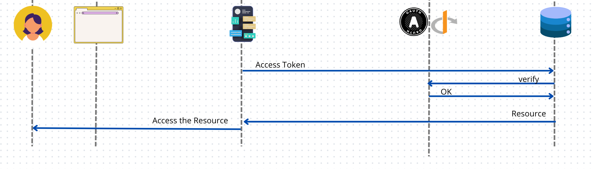
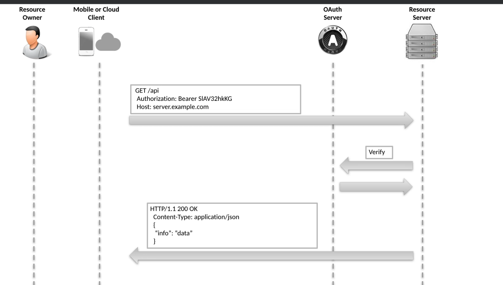
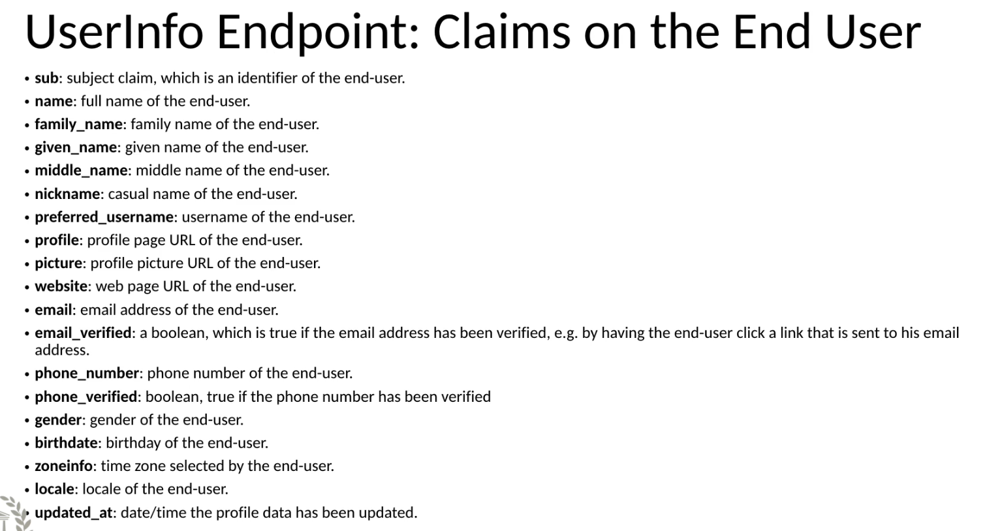
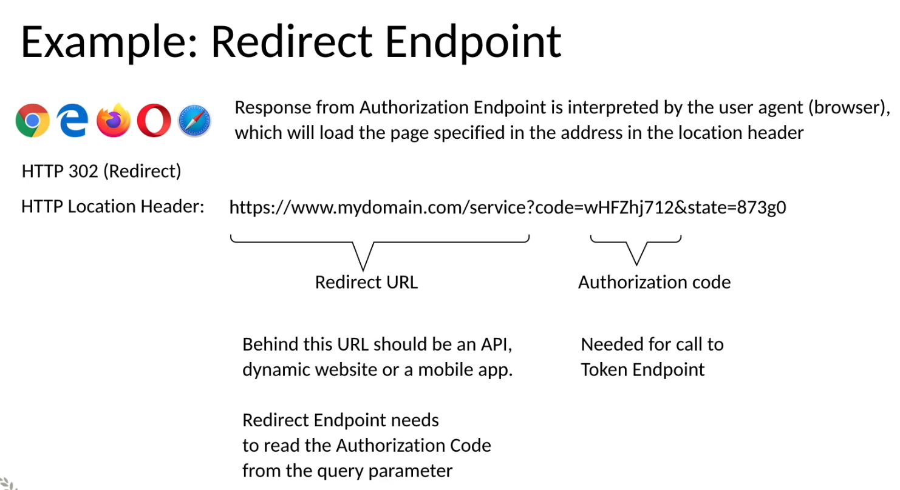
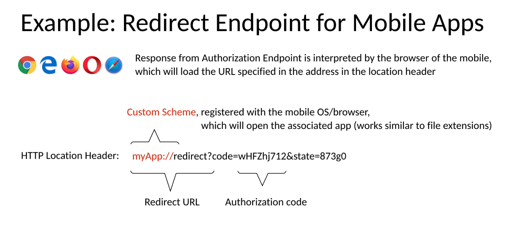

# 05 Les autres `Endpoints` dans `OpenId Connect`

## `Resource Endpoint`

Il est réalisé sur le `Resource Server`.

```http
/api
Authorization: bearer {access token}
```

Il renvoie une représentation de la `Resource`.

Un `Access Token` valide est requis pour accéder au `resource endpoint`. Cette `Access Token` doit avoir un `scope` compatible avec cette `Resource`.





Le `Resource Server` peut aussi renvoyer une erreur :

`401 Unauthorized` s'il n'y a pas d'`access token` ou de `header` : `Authorization`.

`403 Forbidden`  si le `scope` n'est pas approprié.


## `userinfo endpoint`

 Seulement utilisé avec `OpenId Connect`, c'est un `resource endpoint` et tout ce qui est valable pour celui-ci, est aussi valable pour `userinfo endpoint`.

Il est protégé par un `Access Token`.

```http
GET /userinfo
Authorization: Bearer {access_token}
```

C'est un `Resource Endpoint` standardisé et fourni par le `OIDC server`.

Pour y accéder il faut un `Access Token` valide avec au moins un `scope` : `openid`.

Ce `endpoint` délivre un ensemble d'attribut (`Claim`) du `User` authentifié dans un format `json` standardisé. Il n'est pas défini pour `OAuth` mais seulement pour `OIDC`.


### Qu'est-ce que c'est ?

Une `Resource` protégé retournant des informations sur le `User`.

### Claims

Les `claims` renvoyées sont déterminées par le `scope` et/ou le `claims configuration`.

### Prérequis

Attend un `OAuth Access Token`, c'est à dire un `Bearer token` dans le `header` : `Authorization`.

Accepte les requêtes `GET` et `POST`.

Supporte `CORS` (`Cross-Origin Resource Sharing`).

Les `claims` du `userinfo` doivent être retournées sous la form d'un objet `json`.

La `claim` : `sub` (`subject`) doit toujours être retournée par la réponse de `userinfo`.

Obligation de `TLS` (`Transport Layer security`).

### Cryptage

Si la réponse de `userinfo` est signé et/ou crypté, alors les `claims` sont retournées dans un `jwt` et le `Content-Type` doit être `application/jwt`. Habituellement la réponse est seulement signée et pas cryptée.


### Liste des `claims`



Ce sont les `claims` standardisée, on peut ajouter ses propres `claims`.


#### Les `Claims` de l'`Authentication`

#### `nonce`

Identifiant utilisé pour associer une session et un `id_token`. Utile pour prévenir les `replay attacks`.

#### `auth_time`

Date/time de l'`authentication`.

#### `at_hash`

Valeur du `hash` du `Access Token`.

#### `c_hash`

Valeur du `hash` de l'`Authorization Code`.

#### `acr` : `Authentication Context Class Reference`

Décris un ensemble de méthodes d'authentification équivalentes dans le contexte donné, soit sous la forme d'une `URI` absolue-t, soit une valeur définie par `RFC 6711`.

#### `amr` : `Authentication Methods Reference`

Un tableau `json` des méthodes d'authentification supportées.

#### `sub_jwk`

Clé public pour vérifier la signature d'un `id_token`.


## `Token endpoint`

```http
POST /token
Authorization: Basic {clientId}:{clientSecret}
Content-Type: application/x-www-form-urlencoded
```

Il se trouve sur le `Authorization Server` et est généralement disponnible à l'adresse `/token` avec la méthode `POST`.

Il dispose d'une protection `basic` avec les `credentials` du `Client` : `client id` et `client secret`. C'est un appelle sur le `Back Channel` qui ne nécessite pas d'interaction avec le `User`.

C'est un appelle `M2M` `Machine To Machine`.

### Input Form Parameters

- `grant_type`
- `code`
- `client_id`
- `redirect_uri`


### Output (avec un objet `json`)

- `Access Token`
- `Refresh Token`
- `ID Token`


### Validations sur le `Token Endpoint`

Authentifie le `Client` via `Basic Auth`.

S'assure que l'`Authorization Code` est celui qui a été émis au `Client` authentifié.

Vérifie que l'`Authorization Code` est valide (émis pour ce `client`, dans la période de validité, n'a jamais encore été utilisé). L'`Authorization Code` ne peut être utilisé qu'une seule fois `One Time Code`.

S'assure que le paramètre `redirect_uri` est identique à celui envoyer pour la `Authorization Request`.

Vérifie que l'`Authorization Code` utilisé a été émis en réponse à une requête `OpenId Connect Authentication`, si c'est le cas un `ID Token` sera retourné depuis le `Token Endpoint`.


## `Redirect Endpoint`

```http
GET Redirect_URI
```

Une requête `HTTP Redirect` (`302`) est déclenchée par l'`Authorization Endpoint` via le navigateur (`user agent`).

Est implémenté sur le `Client` pour interpréter le résultat délivré par le `Authorization Endpoint`.

Le `Client` extrait de l'`URL` :

- `Authorization Code`
- `ID Token`
- Parfois `Access Token` (`Implicit Flow`)


### Input Query Parameters

- `state`
- `scopes`
- `code`



Dans le cas d'un `GSM`, on redirige vers la machine locale elle-même grâce au `Custom Scheme` :



On doit enregistrer son `Custom Scheme` sur le `mobile`.


