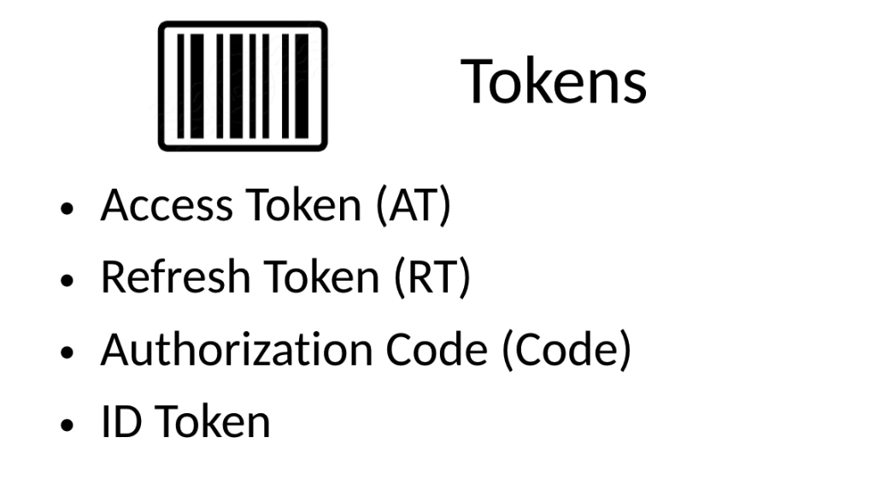
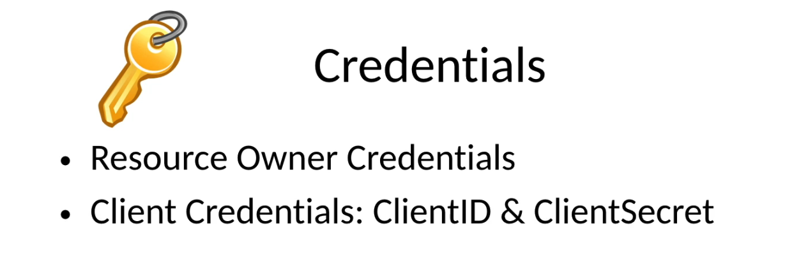
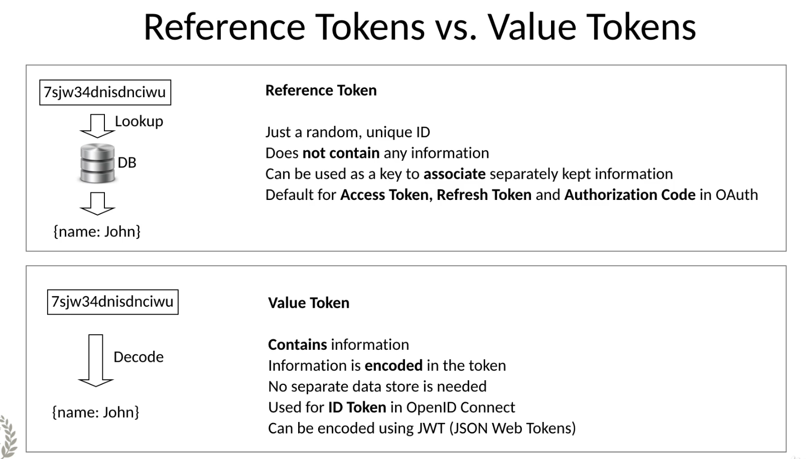
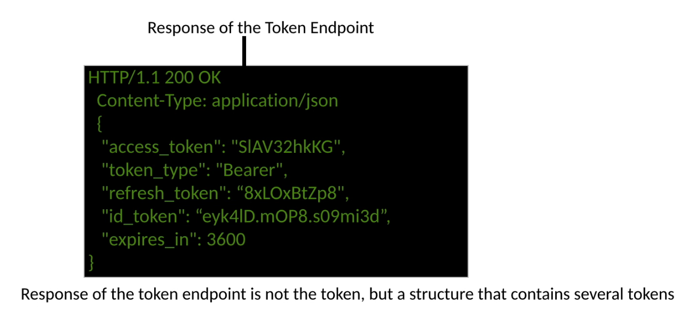
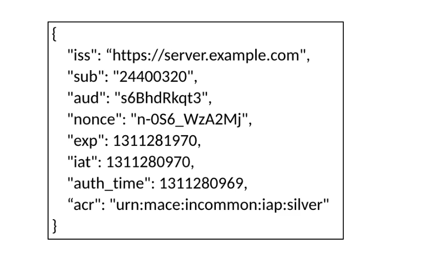
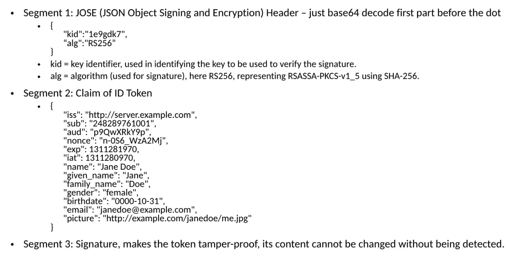

# 06 `Tokens`, `Codes` et `Credentials` dans `OpenId Connect`






## `Tokens Types`

On peut diviser les `tokens` utilisés dans `OIDC` en deux types : `Reference` et `Value`.



### `Reference Token`

Juste un numéro aléatoire et unique.

Il ne contient pas d'information, il est utilisé comme clé (`index`, `primary key`) pour associé des informations gardées séparement (dans une `db`).

C'est le `token` par défaut pour les `Access Token`, `Refresh Token` et `Authorization Code` dans `OAuth`.


### `Value Token`

Il contient de l'information.

L'information est encodé dans le `token` sans avoir besoin d'une `DB` séparée.

Il est utilisé pour les `ID Token` dans `OpenId Connect`. Peut-être encodé en utilisant `JWT`.

Il permet de dé-centraliser l'architecture, car il n'y a pas à chercher l'information correspondante dans une `DB`, mais il expose des données en cas de perte ou de vol du `Token`.


### `Reference Token` vs `Value Token`

Le `Value Token` est le plus puissant type de `token`.

On peut utiliser un `Value Token` comme un `Reference Token` mais pas l'inverse.

Si on veut encoder et crypter un `Value Token` et ne jamais dire à personne que c'est réellement un `Value Token`, on peut l'utiliser comme `Reference Token`.

`Access Token` est généralement un `Reference Token`, mais certain utilise un `JWT` crypté comme `Access Token`.


## `Access Token`

Le porteur du `token` a les droits d'accès associés avec ce `token`.

Pour accéder à des `resources` protégées, un `Access Token` est suffisant.

L'identité du porteur du `token` n'est pas vérifier plus loin dans le processus.

Les `Reference Token` ne contiennent aucune donnée sur le `User`.

Est valide sur une certaine période de temps.

Comparable à un ticket de métro. Quiconque possède le `Token` est autorisé à accéder à la `Resource`, l'accès n'est pas relieé à une identité. S'il est perdu, quelqu'un d'autre peut l'utiliser.


### `Access Token Validation`

S'assurer que l'`Access Token` et le `ID Token` vont bien ensemble.

Basé sur le `claim` optionnel `at_hash` dans l'`ID Token`.

L'`hashage` des octets de l'`Access Token` utilise l'algorithme spécifié dans le `claim` : `alg` du `header` : `Jose` de l'`ID Token`. Pour exemple, si la valeur de `alg` est `rs256`, l'algorithme de `hashage` associé est `SHA-256`.

Prend la moitié la plus à gauche du `hash` et l'encode en `Base64URL`. Le résultat obtenu doit correspondre à la valeur du `claim` : `at_hash` de l'`ID Token`.


### `Token` vs `Response` du `Token Endpoint`

Voici une réponse du `Token Endpoint` :

```http
HTTP/1.1 200 OK
Content-Type: application/json

{
	"access_token": "...",
	"token_type": "Bearer",
	"refresh_token": "...",
	"id_token": "...",
	"expires_in": 3600
}
```




## `Refresh Token`

Il a une période de validité plus grande que celle de l'`Access Token`.

Il est utilisé pour demander un nouvel `Access Token` et un nouvel `ID Token`, après qu'ils aient tous les deux expiré.

Il permet un court-circuit, le `User` n'a pas besoin de se reconnecter (re-authentiifer). On utilise alors le `Back Channel`. 

> Le `Front Channel` fait intéragir le `User`, alors que le `Back Cahnnel` est une interaction `M2M` machine à machine.

N'est jamais utilisé pour accéder aux `Resources`, n'est jamais envoyé directement au `Resource Server`.

Le `Refresh Token` n'est pas disponible dans tous les `Flows` `OAuth` ou `OIDC`. `Refresh Token` est disponible seulement lorsque le `Token Endpoint` est utilisé et que le `Client` est authentifié. Il n'est pas disponible avec `Implicit Flow`.


## `Authorization Code`

Il est très similaire à un `Token` (`reference token`).

La validité est limité à quelques secondes ou minutes, juste assez de temps pour que le `Client` utilise l'`Authorization Code` pour demander un `Access Token` au `Token Endpoint`.

Il peut être échanger contre un `Access Token` uniquement sur le même `OAuth or OIDC Server` qui l'a généré.


## `ID Token`

Uniquement disponible avec `OIDC`.

C'est un `Value Token`, il contient de l'information sur le `User` et comment il a été authentifié  (`name`, `email`, ...).

Il a la forme d'un `JWT`.

Un `JWT` peut-être signé et/ou crypté => `JWE`, `JWS`.

Il est possible de validé la signature et ainsi vérifier que l'authentification a été proprement effectuée.


### Content

Le contenu principal d'un `ID Token` est une liste de `claims` :



L'`ID Token` est divisé en trois segments :

#### Segment 1 : `JOSE` (`JSON Object Signing and Encryption`)

Seulement encoder en `Base64`, c'est le `header` qui contient la clé `kid` et l'algorithme `alg` permettant de vérifier la signature.

#### Segment 2 : Les `claims`

#### Segment 3 : La signature

Les trois segments sont séparés par deux points.




## `ID Token` Validation

Les `id_tokens` cryptés on besoin d'être décryptés en utilisant la clé spécifié lors de l'enregistrement du `Client`.

Le `claim` : `iss` (`issuer` = émetteur) doit être égal à l'`issuer identifier` du `OIDC Provider`.

Le `claim` : `aud` doit être égal au `ClientID` du `Client` ou contenir le `ClientID` si la valeur de `aud` est un tableau.

Si le `claim` : `aud` est un tableau,le `claim` : `azp`  doit se trouver dans le `ID Token` et sa valeur égal à `ClientID`.

Le `Client` doit valider l'émetteur du `token` d'une des manières suivante :

- Si le `token` est transporté par `TLS` (`Transport Layer security`), le `TLS certificate` peut être utilisé.
- Sinon, la signature de l'`id_token` doit être vérifier en respectant les règles de `JWS` et en utilisant le crypto algorithme renseigné dans le `JOSE header`.
- Si le `claim` : `aud` est une valeur unique et qu'un algorithme `MAC-based` est utilisé, le `clientSecret` (les octets en `UTF8`) est utilisé comme clé pour valider la signature.


