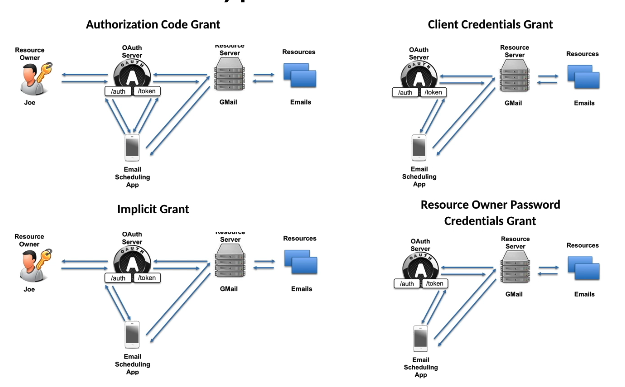

# 07 Les `Flows` dans `OpenId Connect`

Les `flows` sont aussi appelés `Grant Type`  (type d'accès).

## Les `Flows`

On a trois différents `flows`  et leurs `sous-flow` entre parenthèse :

1. `Authorization Code Flow` (`code`)
   - Tous les `Tokens` viennent du `Token Endpoint`, les `Tokens` ne sont pas révélés au navigateur.
   - Le `Client` est `authentifié`
   - On peut utiliser des `Refresh Token`
   - Le `Client` doit pouvoir garder en sécurité son `Client Secret`
2. `Implicit Flow` (`id_token token`, `id_token`)
   - Tous les `Token` viennent de l'`Authorization Endpoint`, les `Tokens` sont révélé au navigateur.
   - Le `Client` ne peut pas s'`authentifier`.
   - Les `Refresh Token` ne sont pas possible.
3. `Hybrid Flow` (`code id_token token`, `code id_token`, `code token`)

## `OAuth Grant Type`

Pour `OpenId Connect` on n'utilise seulement `Authorization Code Grant` et `Implicit Grant`.

Les `Client Credentials Grant` et `Resource Owner Password Credentials Grant` n'utilise pas l'`authentification` d'un `User` et n'ont donc aucun sens dans `OIDC`.

`OIDC` retourne des informations sur l'utilisateur `authentifié`.

Il existe un troisième `Hybrid Flow`, un mix entre les deux premiers.

## Choisir le bon `OpenId Connect Flow`

| Propriété                                                    | Authorization Code Flow | Implicit Flow | Hybrid Flow |
| ------------------------------------------------------------ | ----------------------- | ------------- | ----------- |
| Tous les `tokens` sont retournés par le `Authorization Endpoint` | no                      | yes           | no          |
| Tous les `tokens` sont retournés par le `Token Endpoint`     | yes                     | no            | no          |
| Les `tokens` ne sont pas révélés au navigateur               | yes                     | no            | no          |
| Le `Client` doit être `authentifié`                          | yes                     | no            | yes         |
| Les `Refresh Tokens` sont possible                           | yes                     | no            | yes         |
| La communication est un aller-retour                         | no                      | yes           | no          |
| la pluspart des communications sont `server-to-server`       | yes                     | no            | varies      |
|                                                              |                         |               |             |

