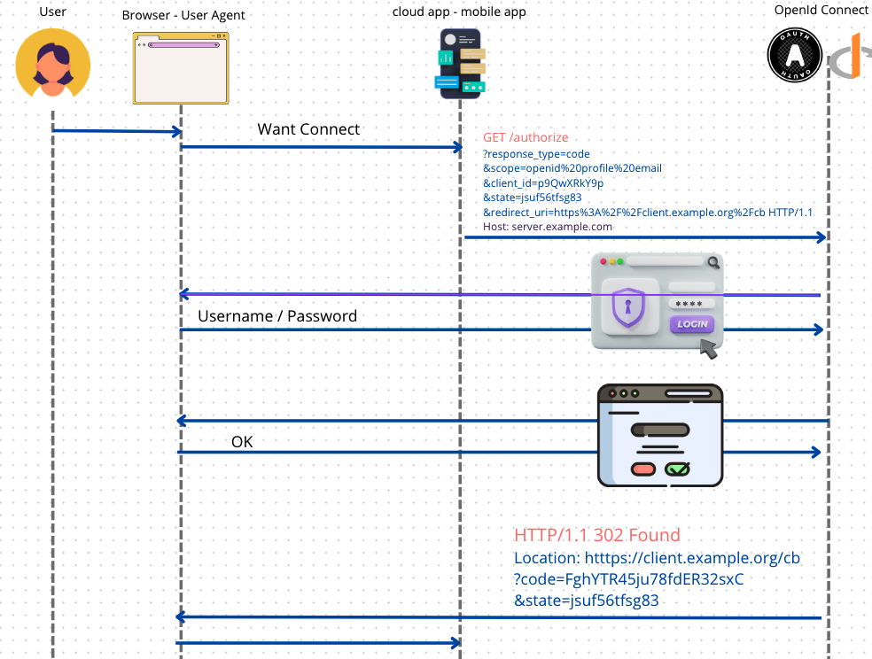

# 08 `Authorization Code Flow`

 ### `response_type=code`


## Propriété

Tous les acteurs sont authentifiés : `User`, `Client` (`clientId/clientSecret`, `TLS Certificate`), `OIDC Server` (`TLS Certificate` et `signature`).

C'est un `flow` agréable pour le `User` car le `Refresh Token` permet d'obtenir un nouvel `Access Token` sans devoir obliger le `User` à se ré-authentifier.

L'`Access Token`, le `Refresh Token` ainsi que l'`ID Token` sont émit par le `Token Endpoint` dans une communication `Machine-To-Machine`. Ils ne transitent jamais par le navigateur. La surface d'attaque est donc très petite.

Il est plus complexe et nécessite plus d'aller-retour (`roundtrips`) mais il est plus sécurisé.


## `Authorization Endpoints`

Effectue l'authentification de l'utilisateur.

Est appelé par une redirection du navigateur.

Envoie par un `redirect` dans le navigateur vers le `Redirect Endpoint` du `Client`.

Doit utiliser `TLS`.

Le résultat est un `Authorization Code`.



```http
GET /authorize
?response_type=code
&scope=openid%20profile%20email
&client_id=p9QwXRkY9p
&state=jsuf56tfsg83
&redirect_uri=https%3A%2F%2Fclient.example.org%2Fcb HTTP/1.1
Host: server.example.com
```

Le mécanisme d'authentification n'est pas défini par `OpenId Connect`, le `username`/`password` utilisé dans le `flow` est là à titre d'exemple possible.

L'`Authorization Endpoint` est simplement un site web avec un formulaire d'authentification.

Si tout est `Ok` un `HTTP redirect` est envoyé au navigateur par l'`OIDC Server` :

```http 
HTTP/1.1 302 Found
Location: htttps://client.example.org/cb
?code=FghYTR45ju78fdER32sxC
&state=jsuf56tfsg83
```

Le navigateur change lui-même l'adresse dans la barre d'adresse. C'est en passant des paramètres dans l'`URL` (`query parameters`) que le `OIDC Server` répond de manière asynchrone au `Client`.


## `Redirect Endpoint`

Il est implémenté par le `Client`.

Il est appelé depuis le navigateur par un `redirect`.

Il reçoit :

- `code` : contient l'`Authorization Code`
- `state` : pour relier cette réponse à la requête envoyé par le `Client` à l'`Authorization Endpoint`. Nécessaire car l'interaction est asynchrone et ne suit pas le pattern `request-response`

Le `redirect` se transforme en `GET request` effectuée par le navigateur.

```http
GET htttps://client.example.org/cb
?code=FghYTR45ju78fdER32sxC
&state=jsuf56tfsg83
```

