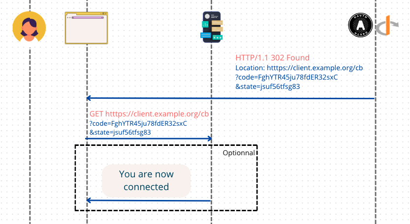
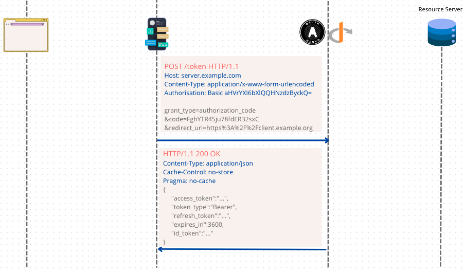
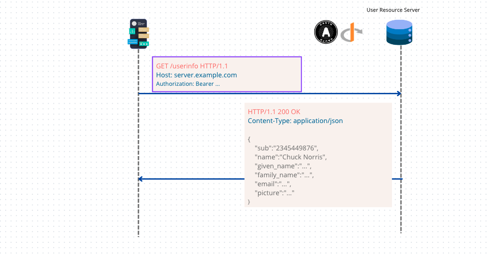

# 08 `Authorization Code Flow`

 ### `response_type=code`


## Propriété

Tous les acteurs sont authentifiés : `User`, `Client` (`clientId/clientSecret`, `TLS Certificate`), `OIDC Server` (`TLS Certificate` et `signature`).

C'est un `flow` agréable pour le `User` car le `Refresh Token` permet d'obtenir un nouvel `Access Token` sans devoir obliger le `User` à se ré-authentifier.

L'`Access Token`, le `Refresh Token` ainsi que l'`ID Token` sont émit par le `Token Endpoint` dans une communication `Machine-To-Machine`. Ils ne transitent jamais par le navigateur. La surface d'attaque est donc très petite.

Il est plus complexe et nécessite plus d'aller-retour (`roundtrips`) mais il est plus sécurisé.


## `Authorization Endpoints`

Effectue l'authentification de l'utilisateur.

Est appelé par une redirection du navigateur.

Envoie par un `redirect` dans le navigateur vers le `Redirect Endpoint` du `Client`.

Doit utiliser `TLS`.

Le résultat est un `Authorization Code`.


```http
GET /authorize
?response_type=code
&scope=openid%20profile%20email
&client_id=p9QwXRkY9p
&state=jsuf56tfsg83
&redirect_uri=https%3A%2F%2Fclient.example.org%2Fcb HTTP/1.1
Host: server.example.com
```

Le mécanisme d'authentification n'est pas défini par `OpenId Connect`, le `username`/`password` utilisé dans le `flow` est là à titre d'exemple possible.

L'`Authorization Endpoint` est simplement un site web avec un formulaire d'authentification.

Si tout est `Ok` un `HTTP redirect` est envoyé au navigateur par l'`OIDC Server` :

```http 
HTTP/1.1 302 Found
Location: htttps://client.example.org/cb
?code=FghYTR45ju78fdER32sxC
&state=jsuf56tfsg83
```

Le navigateur change lui-même l'adresse dans la barre d'adresse. C'est en passant des paramètres dans l'`URL` (`query parameters`) que le `OIDC Server` répond de manière asynchrone au `Client`.


## `Redirect Endpoint`



Il est implémenté par le `Client`.

Il est appelé depuis le navigateur par un `redirect`.

Il reçoit :

- `code` : contient l'`Authorization Code`
- `state` : pour relier cette réponse à la requête envoyé par le `Client` à l'`Authorization Endpoint`. Nécessaire car l'interaction est asynchrone et ne suit pas le pattern `request-response`

Le `redirect` se transforme en `GET request` effectuée par le navigateur.

```http
GET htttps://client.example.org/cb
?code=FghYTR45ju78fdER32sxC
&state=jsuf56tfsg83
```

À la réception de l'`Authorization Code`, le `Client` peut s'il le veut prévenir l'`User` qu'il est maintenant connecté.

L'`Authorization Code` a une durée de vie très courte (environ une minute) et il ne peut être utilisé qu'une seule fois.


## `Token Endpoint`



On utilise l'`Authorization Code` sur le `Token Endpoint`.

Le `Client` envoie une requête `POST` vers le `Token Endpoint` du `OIDC and OAuth Server`.

`Authorization: Basic` utilise les `cedentials` du `Client` : `Base64Encode(client_id:client_secret)`

```http
POST /token HTTP/1.1
Host: server.example.com
Content-Type: application/x-www-form-urlencoded
Authorisation: Basic aHVrYXI6bXlQQHNzdzByckQ=

grant_type=authorization_code
&code=FghYTR45ju78fdER32sxC
&redirect_uri=https%3A%2F%2Fclient.example.org
```

C'est un dialogue `Machine-To-Machine`, c'est une communication `Back Channel` dans lequel le `User` ne participe pas.

Le champ `redirect_uri` est ajouté comme une vérification en plus.

La réponse du `Token Endpoint` est un objet `JSON`.

```http
HTTP/1.1 200 OK
Content-Type: application/json
Cache-Control: no-store
Pragma: no-cache

{
	"access_token":"...",
	"token_type":"Bearer",
	"refresh_token":"...",
	"expires_in":3600,
	"id_token":"..."
}
```

`token_type` et `expires_in` se référent à l'`Access Token`.

Il envoie un `Access Token`, un `Refresh Token` et un `Id Token` en échange d'un `Authorization Code`.


### Vérifications sur le `Token Endpoint`

Exige l'authentification du `Confidential Client`.

Authentifie le `Client` si l'authentification du `Client` est inclus.

S'assure que le `authorization code` a été émis pour le `Client Confidential` authentifié, ou si le `Client` est `Public`, pour le `client_id` de la requête.

Vérifie que l'`Authorization Code` est valide et s'assure que le paramètre `redirect_uri` est présent et identique à la valeur incluse dans la requête d'`Authorization` initial s'il y était inclus.


## `Userinfo Endpoint`



Le `Userinfo Endpoint` est fourni par le `OIDC OAuth Server`.

On lui envoie l'`Access Token`

```http
GET /userinfo HTTP/1.1
Host: server.example.com
Authorization: Bearer ...
```

Le `User Resource Server` renvoie un lot de `Claims` sous la forme d'un objet `json`.

```http
HTTP/1.1 200 OK
Content-Type: application/json

{
    "sub":"2345449876",
    "name":"Chuck Norris",
    "given_name":"...",
    "family_name":"...",
    "email":"...",
    "picture":"..."
}
```

C'est une `Resource` protégé qui retourne des informations sur le `User`.

Il attend un `Access Token`.

Il accepte les requêtes `POST` et `GET`.

Il supporte `CORS`.

Les `Claims` doivent être retournées sous la forme d'un objet `json`.

La `claim` : `sub` doit obligatoirement être retournée dans la réponse de `/userinfo`.

Nécessite d'utiliser `TLS` (`Transfert Layer security`).

Si la réponse de `/userinfo` est signé et/ou crypté, les `claims` sont retournées dans un `JWT` et le `Content-Type` doit être `application/jwt`.

