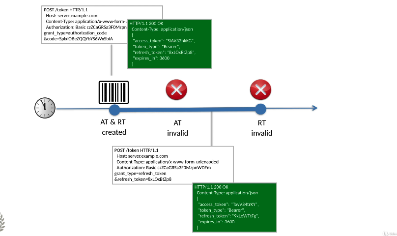
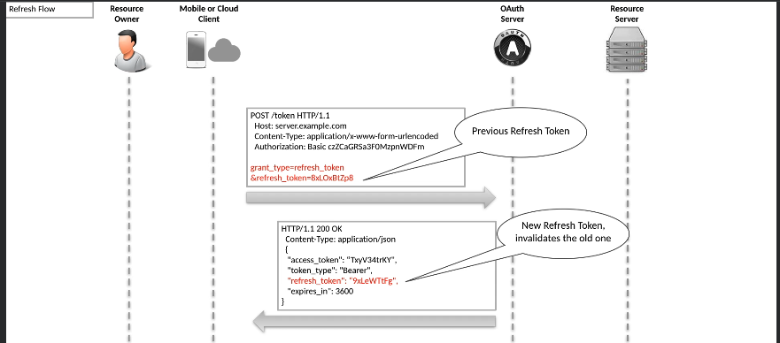
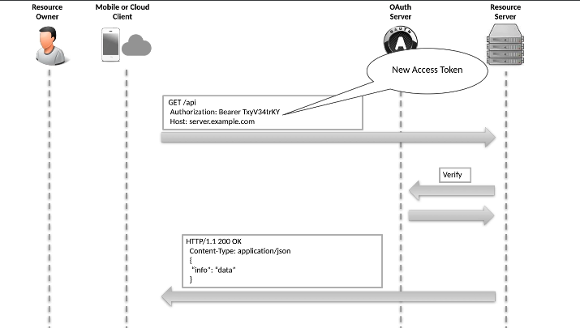
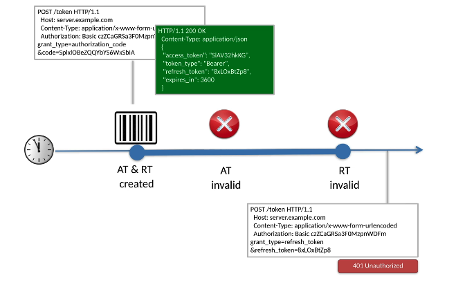

# 09 `Refresh Flow`

On l'utilise quand l'`Access Token` a expiré et que le `Refresh Token` est disponible et encore valide.

Seulement disponible pour un `Client` authentifié utilisant l'`Authorization Code Flow` ou l'`hybrid Flow`. N'est pas disponible pour l'`Implicit Flow`.

Ainsi le `Client` peut rafraîchir l'`Access Token` sans intervention du `User`.


## Les étapes du `Refresh Flow`



1. Le `Client` demande des `Tokens` au `Token Endpoint` en utilisant le `Refrresh Token` comme paramètre.
2. Il reçoit de nouveaux `Tokens` (`Access`, `Refresh`, `Id`).
3. Le `Client` accède à une `Resource` avec le nouvel `Access Token`.

La durée de validité du `Refresh Token` n'est pas renvoyée comme information, cette durrée est juste supérieur à celle de l'`Access Token`.

Si l'`Access Token` est périmé et le `Refresh Token` toujours valide, il est possible de faire une requête spécial vers le `Token Endpoint`.

```http
POST /token HTTP/1.1
Host: server.example.com
Content-Type: application/x-www-form-urlencoded
Authorization: Basic ...

grant_type=refresh_token
&refresh_token=...
```

Le `Client` peut programmer (`schedule`) une requête `Refresh Token` s'il reçoit une réponse négative avec son `Access Token` ou s'il surveille (`track`) le temps de validité de son `Access Token` (`expires_in`).

Il reçoit en réponse de nouveaux token. l'ancien `Refresh Token` est désactivé lorsque le nouveau `Refresh Token` est produit.

```http
HTTP/1.1 200 OK
Content-Type: application/json

{
    "access_token":"...",
    "token_type": "Bearer",
    "refresh_token": "...",
    "expires_in": 3600
}
```



Il est alors possible d'accéder à une `Resource` :



Si on essaye d'obtenir de nouveaux  `Tokens` avec un `Refresh Token` périmé, on obtient une réponse :

```http
HTTP/1.1 401 Unauthorized
```

On est alors obligé d'impliquer le `User` pour une authentification partant du début.



Il vaut mieux prévoir un mécanisme pour ne jamais en arriver là en programmant (`schedule`) une requête `Refresh Token` juste avant que l'`Access Token` ne périme.


