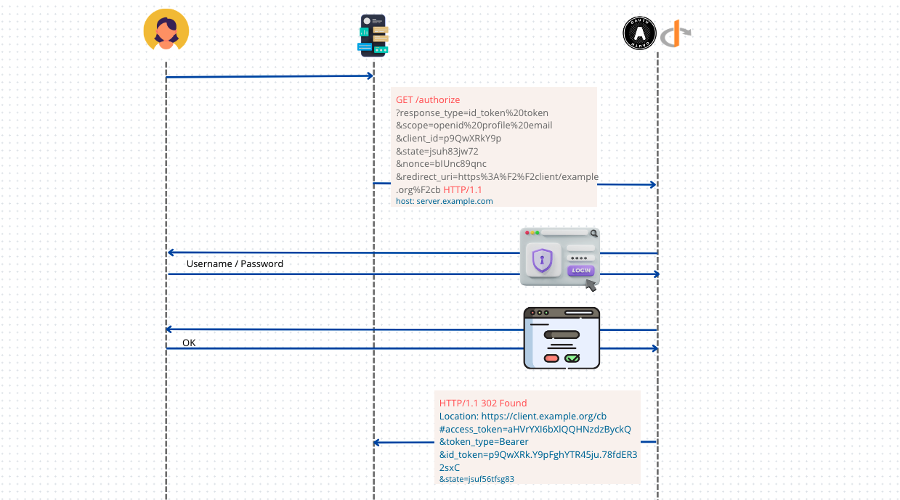
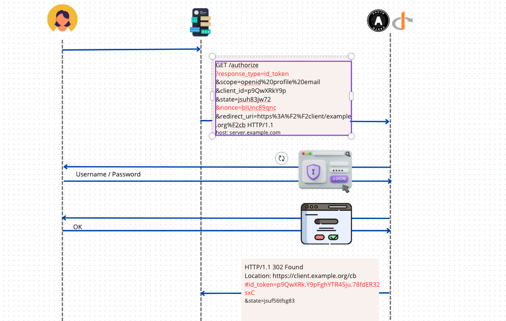

# 10 `Implicit Flow`

Ce flow n'utilise pas le `Back Channel` ni le `Token Endpoint`.

Il est adapté pour les application n'ayant pas de `backend` et tournant dans le navigateur.

Les `Id Token` et `Access Token` sont délivrés par le `Authorization Endpoint`.

Il existe deux versions :


# 1. Flow `response_type=id_token token`



Ce `flow` délivre à la fois un `Id Token` et un `Access Token`.

```http
GET /authorize
?response_type=id_token%20token
&scope=openid%20profile%20email
&client_id=p9QwXRkY9p
&state=jsuh83jw72
&nonce=bIUnc89qnc
&redirect_uri=https%3A%F2%F2client/example.org%F2cb 
  HTTP/1.1
host: server.example.com
```

Le  paramètre `nonce` est un paramètre spécial qui est toujours possible d'utiliser dans `OpenId Connect`, il est obligatoire pour un `Implicit Flow`, il prévient d'une `Replay Attack`.

Après la phase d'authentification et de consentement, le serveur `OIDC OAuth` renvoie par le `frontchannel` un `Access Token` et un `Id Token` grâce à un `redirect`.

```http
HTTP/1.1 302 Found
Location: https://client.example.org/cb
#access_token=aHVrYXI6bXlQQHNzdzByckQ
&token_type=Bearer
&id_token=p9QwXRk.Y9pFghYTR45ju.78fdER32sxC
&state=jsuf56tfsg83
```

Cette fois-ci on n'a pas des `Query Parameters` mais plutôt un `Fragment` avec `#`.


## Validation côté `Client`

### Vérifier l'`Id Token`

La `claim` : `nonce` est obligatoire dans l'`Id Token` (il est optionnel dans les autes `flows`.

Les `claims` : `at_hash` et `c_hash` sont obligatoire dans l'`Id Token`.

Le `Client` doit valider la signature de l'`Id Token` en accord avec `JWS`.

Le `Client` doit vérifier que le `claim` : `nonce` ait la même valeurque celle envoyée dans la requête d'authentification.


### Vérifier que l'`Access Token` et l'`Id token` vont ensemble

Obtenir le `Hash` des octets en représentation `ASCII` de l'`access_token`en utilisant le paramètre `alg` de l'en-tête (`header`) de l'`Id Token` (`JOSE Header`). Si `alg` vaut `RS256` alors l'algorithme utilisé est `SHA-256`.

La deuxième moitié la plus à gauche du `hash` est encodée en `Base64Url`.

la `claim` :  `at_hash` (`access token hash`) de l'`Id Token` doit correspondre au résultat obtenu précédemment.


# 2. FLow `response_type=id_token`



Seul un `Id Token` est délivré.

Il utilise aussi un `Fragment` plutôt que les `Query Parameters`.


