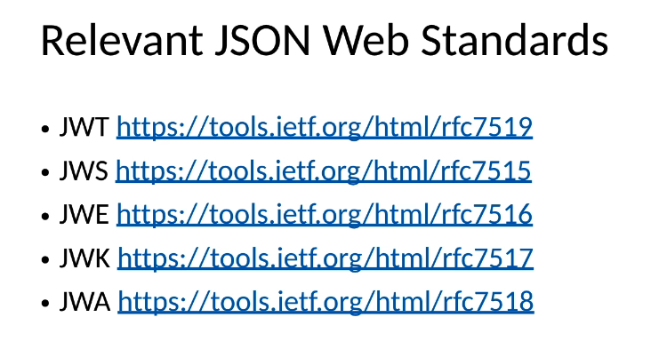
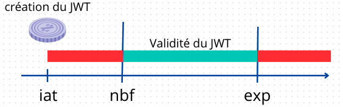
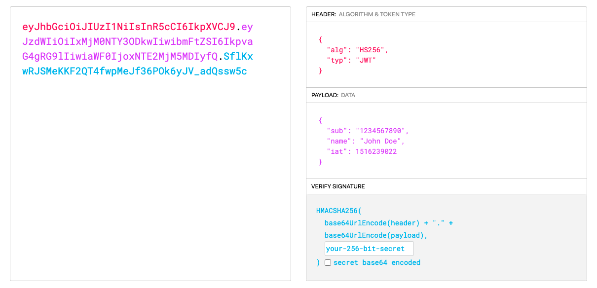

# 12 `Json Web Token`

## Technologies et standards de `JWT`

`JWT` est indépendant de `OpenId Connect` et peut-être utilisé dans d'autres contextes. L'`Id Token` de `OIDC` utilise `JWT`.

`JWT` peut-être signé, crypté ou les deux. Les standards pour la signature et le cryptage sont :

- `JWS` - `Json Web Signature` pour les `Web Tokens` signés
- `JWE` - `Json Web Encryption` pour les `Web Tokens` cryptés

L'infrastructure utilisée pour signé et crypté est aussi standardisée :

- `JWK` - `Json Web Key` des `metadata` pour clé cryptographique permettant de signer/crypter
- `JWA` - `Json web Algorithm` Enregistrement d'algorithme pour signer/crypter

https://datatracker.ietf.org/doc/html/rfc7519 (l'actuel `url` pour `jwt`)

## `JWT` - `Json Web Token`

C'est un conteneur cryptographique pour sécuriser la valeur d'un `Token` transféré de l'expéditeur au destinataire.

C'est une représentation standardisé des `claims`.

Utilisée par `OpenId Connect` pour ses `Id Token`.

`JWT` offre au destinataire la possibilité de prouver :

- L'authentification : que le `Token` est bien créé par l'expéditeur (`JWS`)
- La non-répudiation : l'expéditeur ne peux pas nier qu'il a envoyé le `token` (`JWS`)
- L'intégrité : Le `token` ne peut pas être modifier en transite (`JWS`)
- La confidentialité : Le `token` ne peut être lu que par le destinataire (`JWE`)

## Utiliser `JWT`

`JWT` contient ses données, pas besoin d'infrastructure supplémentaire (`DB`).

`JWT` est adapté aux `micro services` et au architectures distribuées, il peut facilement être transmis par `API`.

Il n'a pas besoin d'une `DB` centralisée pour être vérifié.

Point négatif : Il ne peut pas être révoqué facilement, il n'y a pas d'autorité centrale pour vérifier la révocation (comme `OAuth` pour les `Access Token`).

`JWT` est valide pour une certaine période de temps, par exemple 24h et il expire. Il n'y a pas de façon simple de simuler un `log out` pour le rendre invalide.

`JWT` et `Id Token` définissent un standard pour les `claims`.

`JWT` est plus générique qu'un `Id Token`. Un `Id Token` de `OIDC` défini certaines `claims` comme obligatoire, ce qui n'est pas le cas pour `JWT` pour qui chaque `claim` est optionnelle.

Un `Id Token` est un `JWT` spécialisé à `OIDC`.

## Les `claims` standardisés de `JWT`

`iss`: l'émetteur (`issuer`) sous la forme d'une `URL`.

`sub` : `subject` identifier, l'identifiant de l'utilisateur authentifié, localement unique et jamais réassigner par l'émetteur (`issuer`).

`aud` : `audience(s)` pour qui ce `JWT` est destiné.

`exp` : temps d'expiration du `JWT` (il ne sera plus accepté de le traité après ce temps).

`iat` : date d'émission du `JWT`.

`nbf` : temps avant quoi le `JWT` n'est pas accepté.

`jti` : identifiant de ce `JWT`.

Ces `claims` standardisées sont aussi le `payload` du `JWT`.

On peut créer ses propres `claims` mais pas réinventer celles existantes (si on veut un identifiant pour le `JWT` on doit (obligation) utiliser `jti` par exemple).

## Protéger un `JWT`

On a trois options :

1. `Signature` : L'intégrité est protégé, les `claims` de l'objet `Json` sont utiliser comme `payload` dans la structure d'un `JWS` `Json Web Signature`.
2. `Cryptage` : La confidentialité est assurée. Les `claims` de l'objet `Json` sont utilisés comme du texte brut dans la structure d'un `JWE` `Json Web Encryption`.
3. `Signature et Cryptage` : Les `claims` définies par le `JWT` sont le `payload` d'un `JWS` et le `JWS` résultant est le texte brut (`plaintext`) d'un `JWE`. Un `JWT` mis dans un `JWE`.

## Sérialization

On a deux types de sérialisation :

- `Conpact Serialization`
- `Json Serialization`

Les algorithmes de `serialization` dépendent de quel type de `JWT` on a affaire : `JWS` ou `JWE`.

## Distinguer si un `JWT` est un `JWE` ou un `JWS`

- méthode 1 : Dans la `Compact Serialization`, le nombre de segments en `Base64URLencoded` séparé par un pooint `.` diffère pour `JWS` et `JWE`: 
  - `JWS` : `3` segments
  - `JWE` : `5` segments
- méthode 2 : Si l'attribut `enc` existe dans le `JOSE Header`, c'est un `JWE`, sinon c'est un `JWS`.
- méthode 3 : Si l'attribut `alg` du `JOSE Header` reprèsente une signature ou un algorithme `MAC`, ou s'il n'y a pas de valeur, c'est un `JWS`. Il faut pouvoir avoir la liste des algorithme de `signature` (fournie par `JWA`).

https://jwt.io/

On voit ici un `JWT` en trois partie : le `header`, le `payload` (les `claims`) et la `signature`. C'est en fait un `JWS` (`3` segments).

​		

