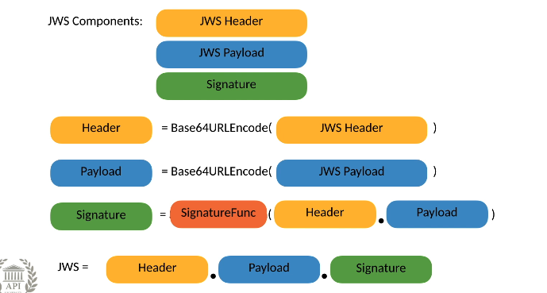
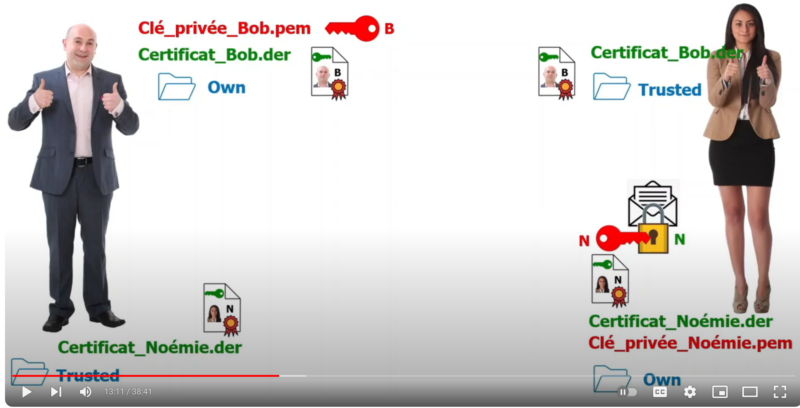
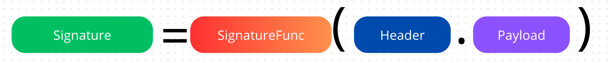
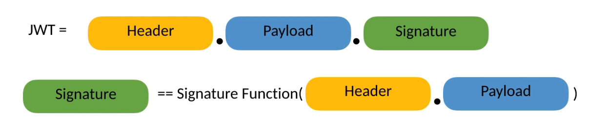
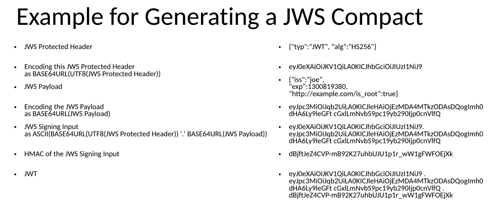

# 13. `JWS` : `Json Web Signature`

Représente un contenu sécurisé par une signature digitale ou `Message Authentication Codes` (`MACs`) utilisant une structure de donnée basée sur `JSON`.


## Deux `serializations` pour `JWS`

### `JWS` Compact Serialization

-  une serialization compacte et `URL-safe`
- Pensée pour des environnement avec contrainte d'espace
- Peut-être utilisé dans les `HTTP Authorization headers`
- Peut-être utilisé dans des `URI` comme `Query Parameters`
- Ne peux pas représenter le `header` non protégé.


### `JWS` `JSON` serialization

Plus lisible, peut représenter le `header` non protégé.


## Anatomie d'un `JWS`



### `JWS` header

`JOSE Header` = `JSON Object Signing and Encryption`

Consiste en :

- `JWS` Protected Header
- `JWS` Unprotected Header (ne peux pas être représenté avec `Compact Serialization`)

Les champs du `header` ne sont pas des `claims` ce sont justes des metadatas permettant de construire le `JWS`.

#### `alg` 

 L'algorithme utilisé pour signer le `JWS` (depuis le répertoire `JWA`). Un `JWT` non sécurisé est un `JWS` utilisant comme valeur pour `alg` : `none`.

#### `jku`

Une `URL` pointant vers un `JWK` contenant la clé pour signer ce `JWS`

#### `jwk`

Clé publique imbriquée (`embedded`) de la clé de signature (`signing key`) au format `JWK`

#### `kid`

Identifiant de la clé utilisé dans ce `JWS`

#### `x5u`

`URL` du certificat de la clé public `x.509` ou du certificat `chain` correspondant à la clé utilisé pour signer le `JWS`

#### `x5c`

`x.509` certificat de la clé public ou le certificat `chain` correspondant à la clé utilisé pour signer le `JWS`

#### `x5t`

`x.509`  certificat `SHA-1 thumbprint` correspondant à la clé utilisé pour signer le `JWS`

#### `x5t#256`

`x.509`  certificat `SHA-256 thumbprint`

#### `typ`

Le `Media Type` de ce `JWS`. Les valeurs possibles sont : n'importe quel `content` défini par le registre `IANA`. Les valeurs typiques sont `application/jose` ou `application/jose+json`.

#### `cty`

`Content Type` du payload du `JWS` utilisant les standardisassions du web pour les `Content Type` (`IANA Registry`)

#### `crit` : optionnel

Un tableau d'attribut `custom` du `header`. Important pour comprendre pour le destinataire du `token`.


> ## Cértificat `x.509`
>
> https://www.youtube.com/watch?v=58FUQzWxs3Y&ab_channel=Herv%C3%A9Discours
>
> 
>
> On a besoin d'un intervenant extérieur `Autorité de Certification` : `CA`.
>
> L'organisme lie une clé public à une entité et délivre un `Certificat`, celui-ci va dans un dossier `own`.
>
> Les certificats reçu sont eux placés dans un dossier `Trusted`. Les certificats douteux (rejetés) sont eux placé dans un dossier `Rejected`.
>
> `clé privée` : fichier `.pem`
>
> `clé public` dans le certificat : fichier pour le certificat `.der`
>
> Pr défaut un certificat va dans le dossier `Rejected` et après examination peut-être transféré dans le dossier `Trusted`.
>
> Il existe des certificats `auto-signé` (`self signed`), c'est au destinataire de juger s'ils sont de confiance.
>
> ### `x.509`
>
> C'est une norme définissant une structure très utilisée de certificats de sécurité.


### `JWS` Payload

Doit être un objet `Json` de `claims`.


### `Signature`



Utilise une `SignatureFunc` définie dans le `header` avec l'attribut `alg`.

On la calcule en appliquant cette `SignatureFunc` sur `Signing input`.

Formule du `Signing Input` :

```cs
(
    ASCII(Base64URLEncoded(UTF8(JWSProtectedHeader)))
    .
    Base64URLEncoded(JWSPayload)
)
```

### `SignatureFunc`

Il existe deux types de fonction de signature :

- `Shared Secret` algorithme (Dans `OIDC` le `ClientSecret` est utilisé)
- paire de clé `public/privée` algorithme

Tous ces algorithme sont définis dans `JWA registry`. 


## `JWS` Serialization

Il y a deux types de `serialization` :

- `Compact Serialization`
- `Json Serialization`

### `JWS Json Serialization`

```json
{
    "header": "Base64URLEndcode(JWS Unprotected Header), non-integrity-protected",
    "protected": "Base64URLEndcode(JWS Protected Header), integrity-protected",
    "payload": "Base64URLEndcode(JWS Payload)",
    "signature": "Base64URLEndcode(JWS Signature)",
}
```

Tous n'est pas lisible, mais les différentes parties, elle, le sont.


### `JWS Compact Serialization`

```css
Base64URLEndcode(JWS Protected Header).
Base64URLEndcode(JWS Payload).
Base64URLEndcode(JWS Signature)
```

Chaque partie est séparée par un point.


### `JWT` Vérification



Cette vérification peut être faite offline.

Aucune connexion avec l'émetteur (`issuer`) du `token` n'est nécessaire.

La révocation du `token` n'est pas possible.



// à faire en `c#`


