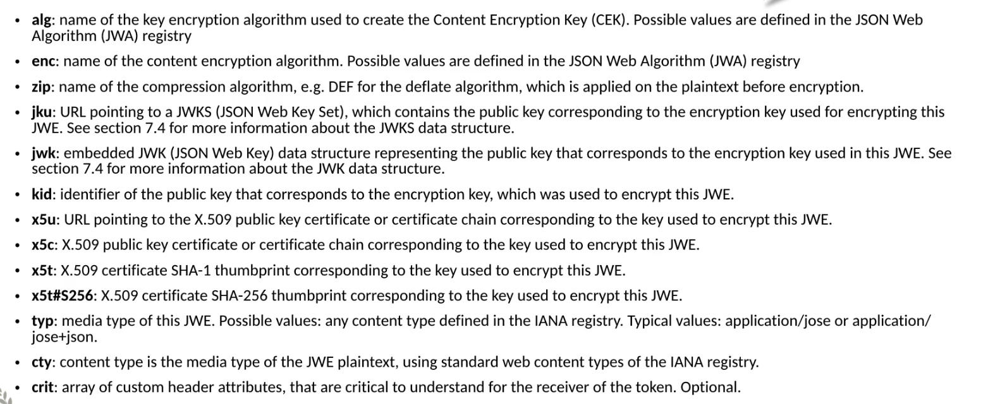
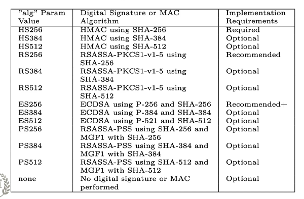
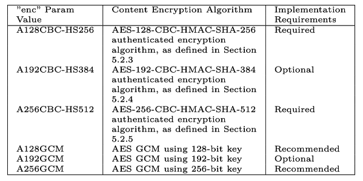
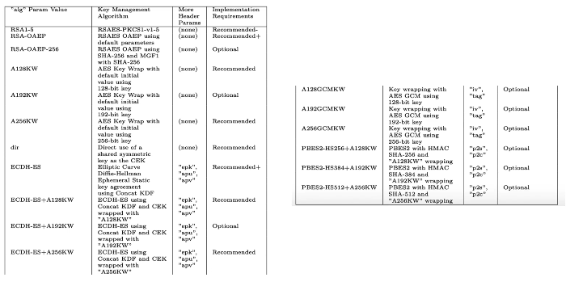

# 14. `JWE` : `Json Web Encryption`

Contenu crypté en utilisant une data structure basé sur `Json`.

Le contenu n'est pas forcement du `Json`, cela peut-être un `string` (par exemple un `JWS`).

Peut-être sérialisé de deux manières :

- `JWE Compact Serialization`
  - compacte et. c'est une représentation `URL - Safe`
  - Pour les `header` d'`Authorization` `HTTP`
  - Pour les `Query Parameters` des `URI`
  - Peut seulement inclure le `JWE Protected Header` pas le `JWE Unprotected Header`
- `JWE Json Serialization`
  - Représente le `JWE` en `Json`


## Contenu d'un `JWE`

- `Header` (`JOSE Header`)
  - `Protected Header`
  - `Shared Unprotected Header`
  - `Per-Recipient Unprotected Header`
- `Encrypted Key`
- `Initialization Vector`
- `Ciphertext`
- `Additional Authenticated Data`
- `Authentication Tag`

​		

## Champs du Header

Ce ne sont pas des `claims` mais des attributs.



Ce sont les mêmes que `JWS` plus deux nouveaux

### `enc`

Nom de l'algorithme de cryptage du contenu.Les valeurs possibles sont définies par `JWA` (`Json Web Algorithm`) registre.

### `zip`

nom de l'algorithme de compression, par exemple `DEF` pour `deflate algorithme`, qui est appliqué sur le `plaintext` avant d'être crypté.

Il y a deux types d'algorithme de cryptage dans un `JWE` :

- `key encryption algorithme` : `alg`
- `content encryption algorithme` : `enc`


## `JWE` Sub-Header

Les champs de `Header` peuvent être séparés en trois :

- Protected Header
- Shared Unprotected Header
- Per-Recipient Unprotected Header

`Protected Header` font partis de `JWE Encryption Input`

`Shared` et `Per-Recipient` `Unprotected Header` ne font pas partis de `JWE Encryption Input`.

`JWE Compact serialization` ne supporte que `Protected Header`.

Si on a des `Unprotected Header` on doit utiliser plutôt `Json serialization`.


## `JWE` Encrypted Key

Ce déroule en deux étapes :

1. on génère de manière aléatoire un `Content Encryption Key` (`CEK`).
2. On crypte le `CEK` avec la clé public du destinataire (`recipient`) en utilisant l'algorithme spécifié dans le champ `alg` du `JWE Protected Header`.

Le résultat est la `JWE Encrypted Key`.


## `JWE` Initialization Vector

Un `vector` (un tableau) remplie de valeur générées aléatoirement.


## `JWE` Ciphertext : texte chiffré

C'est le résultat du cryptage.

C'est un cryptage authentifié (?).

Crypté en utilisant l'algorithme défini dans le champs `enc` du `JWE Protected Header`.

Utilise les paramètres suivant :

- Le `plaintext`
- le `CEK` comme clé de cryptage
- le `JWE Initialization Vector`
- le `JWE Additional Authenticated Data`


## `JWE Additional Authenticated Data` et `JWE Authentication Tag`

`Additional Authenticated Data` peut être n'importe quelle valeurs d'entrée, par exemple le `JWE Protected Header`. Comme partie du cryptage, cette valeur est authentifiée, produisant le `JWE Authentication Tag`.

L'algorithme de cryptage (défini par le champ `enc` du `JWE Protected Header`) est utilisé pour créer un texte chiffré et aussi créer l'`Authentication Tag` si des `Additional Authenticated Data` (données authentifiées additionnelles) sont fournies comme données d'entrée. 


## `JWE` Compact Serialization

```ruby
Base64Url(UTF8(JWE Protected Header)).

Base64Url(JWE Encrypted Key).

Base64Url(JWE Initialization Vector).

Base64Url(JWE Ciphertext).

Base64Url(JWE Authentication Tag)
```


## `JWE` Json Serialization

`recipient` = destinataire

Il y a `7` champs dans ce `Json`. C'est une représentation un peu plus compliquée :

```json
Base64Url(JWE Initialization Vector){
    "protected":"Base64Url(UTF8(JWE Protected Header))",
    "unprotected":"JWE Shared Unprotected Header",
    "recipient":[
       "header":"JWE Per-Recipient Unprotected Header",
        "encrypted_key":"Base64Url(JWE Encrypted Key)"
    ],
    "iv":"Base64Url(JWE Initialization Vector)",
    "ciphertext":"Base64Url(JWE Ciphertext)",
    "tag":"Base64Url(JWE Authentication Tag)",
    "aad":"Base64Url(JWE AAD)"
}
```


## `JWK` `Json Web Key`

Représente les métadonnées à propos d'une clé de cryptage `cryptographc key`.

Il contient un certain nombre d'attributs standardisés à propos de la clé utilisée pour crypter ou pour signer.

### `kid`

L'identifiant unique de la clé.

### `alg`

Algorithme utilisé avec cette clé, comme trouvé dans le `Json Web Algorithm` registry (`JWA`).

### `kty`

Identifie la classe d'algorithmes cryptographique utilisé en combinaison avec cette clé. Valeur d'exemple `RSA` ou `EC` (`Elliptic Curve`).

### `use`

Utilisation de la clé publique, les valeurs possibles sont `enc` et `sign`.

### `key_ops`

`Key Operations` Opération de la clé, les valeurs possibles sont : `sign`, `verify`, `encrypt`, `decrypt`, `wrapKey`, `unwrapKey`, `deriveKey` et `deriveBits`.

### `x5u`

 `x.509` Url

### `x5c`

certificat `x.509` `chain`

### `x5t`

 certificat `x.509` empreinte (thumbprint) `SHA-1`

### `x5t#256`

 certificat `x.509` empreinte (thumbprint) `SHA-256`


## `JWKS` - Json Web Key Set

Une collection de `JWK`. Possède un attribut `keys` qui est un tableau de `JWK`.


## `JWA` - Json Web Algorithm

C'est un registre standardisé pour les algorithmes cryptographique.

Ces algorithmes peuvent être utilisés en combinaison avec les spécifications de `Json Web Signature`, `Json Web Encryption` et `Json Web Key`.


## `JWA` : Algorithme `MAC` pour `Json Web Signature`




## `JWA` : Algorithme de Cryptage du contenu pour `Json Web Encryption`

Dans l'attribut `enc`.




## Algorithme de cryptage de clé pour `Json Web Encryption`

Dans le champ `alg`.

