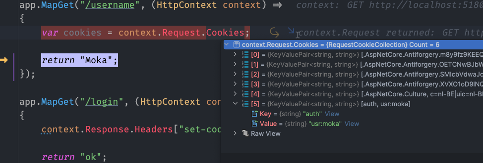
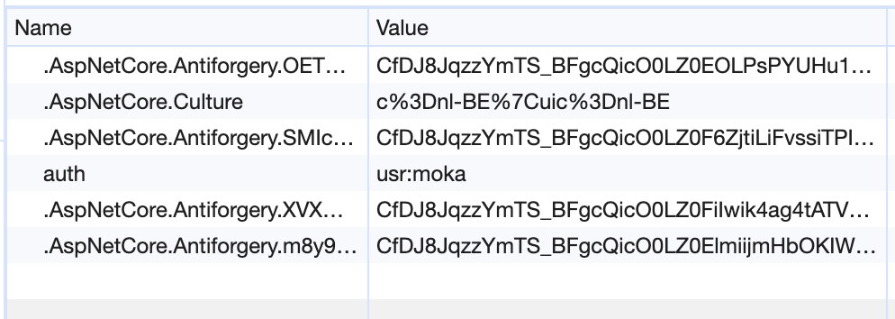
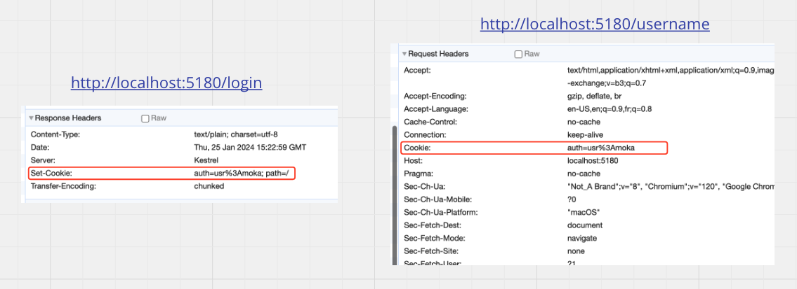
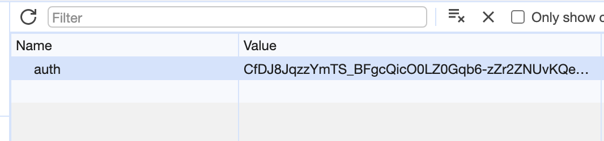
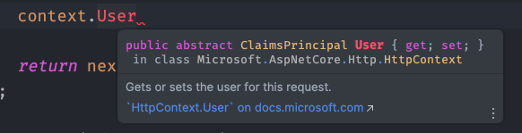
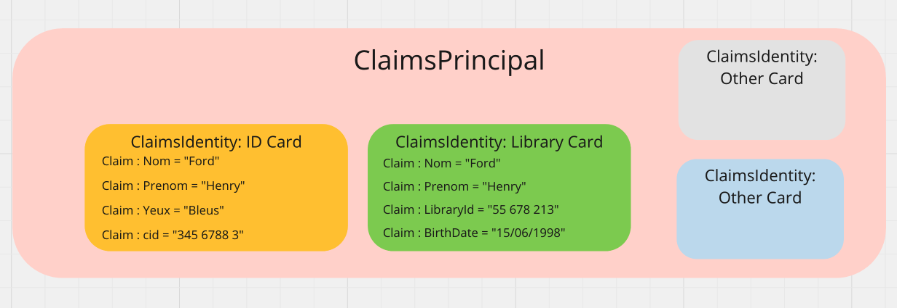

# 01 Authentification `from scratch`

## Authentification de base

ON crée deux `endpoints` un `username` et un `login` utilisant les `Cookies` pour s'authentifier :

`login`

```cs
app.MapGet("/login", (HttpContext context) =>
{
    context.Response.Headers["set-cookie"] = "auth=usr:moka";
    
    return "ok";
});
```

On peut aussi écrire :

```cs
context.Response.Cookies.Append("auth","usr:moka");
```


`username`

```cs
app.MapGet("/username", (HttpContext context) =>
{
    var payload = context.Request.Cookies.FirstOrDefault(p => p.Key == "auth").Value;

    var name = payload.Split(":")[1];
    
    return name;
});
```

`Cookies` est un `IEnumerable<KeyValuePair<string,string>>` des `cookies` envoyés dans le `header` de la requête du navigateur.






### Échange de `Cookies`

L'`api` ajoute un `Cookie` grâce au `Header` : `set-cookie` puis le navigateur renvoie sa liste (ici un seul) de `cookies` à toute requête venant du même serveur.



Le serveur peut ainsi connaitre la valeur de `auth` par exemple.


## Ajouter de la protection : `AddDataProtection`

```cs
builder.Services.AddDataProtection();
```


### `Protector.Protect`

```cs
using Microsoft.AspNetCore.DataProtection;

app.MapGet("/login", (HttpContext context, IDataProtectionProvider dpp) =>
{
    var protector = dpp.CreateProtector("auth-cookie");
    context.Response.Cookies.Append("auth",protector.Protect("usr:moka"));
    
    return "ok";
});
```

> Le paramètre de `CreateProtector` doit être unique au cas de figure prévu. Cette valeur n'est pas destinée à être gardée secrète.

On obtient une version cryptée de notre `cookie` :



```
auth=CfDJ8JqzzYmTS_BFgcQicO0LZ0Gqb6-zZr2ZNUvKQebRy0OInMhpk-HvLAXw7-4MQGqv-PlDSDzXOquveUA3nP94zKL8uLRJJJ--Q4PiPeQ1YhXW_Hx-uBM7P8DYCCBk9WTsFw; path=/
```


## `protector.Unprotect`

Et pour récupérer son `username` on exécute la fonction inverse :

```cs
app.MapGet("/username", (HttpContext context, IDataProtectionProvider ddp) =>
{
    var protector = ddp.CreateProtector("auth-cookie");
    
    var payloadProtected = context.Request.Cookies.FirstOrDefault(p => p.Key == "auth").Value;

    // s'il n'y a pas de cookie
    if(payloadProtected is null) return Results.LocalRedirect("/login");
    
    var payload = protector.Unprotect(payloadProtected);

    var name = payload?.Split(":")[1];

    return Results.Ok(name);
});
```

S'il n'y a pas de `cookie` déjà en place, on redirige (`Results.Redirect`) vers `login`.


## Créer un service d'authentification

`AuthService.cs`

```cs
public class AuthService(IDataProtectionProvider ddp, IHttpContextAccessor accessor)
{
    public void SignIn()
    {
        var protector = dpp.CreateProtector("auth-cookie");
    context.Response.Cookies.Append("auth",protector.Protect("usr:moka"));
    }
}
```

Il faut ajouter un `service` pour `IHttpContextAccessor` dans `Program.cs` :

```cs
builder.Services.AddHttpContextAccessor();
```


## Créer un `middleware` pour intercepter le `Cookie`

On veut créer un `middleware` dont le rôle est d'intercepter le `Cookie` d'authentification et de créer un `user` en conséquence.

```cs
app.Use((contex, next) => {
    var dpp = context.RequestServices.GetRequiredService<IDataProtectionProvider>();
    
    var protector = dpp.CreateProtector("auth-cookie");
    
    var payloadProtected = context.Request.Cookies.FirstOrDefault(p => p.Key == "auth").Value;

    if(payloadProtected is null) return Results.LocalRedirect("/login");
    
    var payload = protector.Unprotect(payloadProtected);

    var name = payload?.Split(":")[1];
    
    return next();
});
```

La différence entre `GetService` et `GetRequiredService` et que dans le deuxième cas la méthode ne peut pas renvoyer `null`.

Dans le `context` on a un `User` qui est un `ClaimsPrincipal`, on peut s'en servir pour passer les informations du `Cookie` au différents `endpoints delegate`.




### Afficher le `ClaimsPrincipal` : `User` dans le `endpoint`

```cs
app.MapGet("/username", (HttpContext context) =>
{
    return Results.Ok(context.User);
});
```

```json
{
"claims": [],
"identities": [
        {
            "authenticationType": null,
            "isAuthenticated": false,
            "actor": null,
            "bootstrapContext": null,
            "claims": [],
            "label": null,
            "name": null,
            "nameClaimType": "http://schemas.xmlsoap.org/ws/2005/05/identity/claims/name",
            "roleClaimType": "http://schemas.microsoft.com/ws/2008/06/identity/claims/role"
        }
    ],
"identity": {
        "name": null,
        "authenticationType": null,
        "isAuthenticated": false
    }
}
```

On a donc un `User` par défaut avec des valeurs par défaut pour ses propriétés.

> ## erreur `System.Text.Json.JsonException: A possible object cycle was detected.`
>
> Pour éviter cette erreur il faut configurer les options du `Serializer` :
>
> ```cs
> builder.Services.Configure<JsonOptions>(options =>
> {
>  options.SerializerOptions.ReferenceHandler = ReferenceHandler.IgnoreCycle;
> });
> ```
>
> attention il faut les deux imports suivant et pas d'autres :
>
> ```cs
> using System.Text.Json.Serialization;
> using Microsoft.AspNetCore.Http.Json;
> ```
>
> 

## Renseigner le `ClaimsPrincipal`

```cs
app.Use((contex, next) => {
    // ...
    
    var claims = new List<Claim>();
    claims.Add(new Claim(key, value));
    var identity = new ClaimsIdentity(claims);
    
    cts.User = new ClaimsPrincipal(identity);
    
    return next();
});
```

Une `List<Claim>` est une liste des propriétés de l'utilisateur (son nom, son email, la couleur de ses yeux, ... ).

Une `ClaimsIdentity` est comparable à une carte d'identité, un passport ou autre.

C'est une carte vous identifiant et contenant des propriétés qui vous sont propre (les `claims`).



Le `ClaimsPrincipal` peut être vue comme un portefeuille de cartes.

```cs
// exemple de portefeuille avec deux cartes

List<Claim> claims = [];

claims.Add(new Claim("name", "coco"));
claims.Add(new Claim("email", "coco@gmail.com"));

var identity = new ClaimsIdentity(claims);

claims.Add(new Claim("Driving Licence", "345666209"));

var drivingLicence = new ClaimsIdentity(claims);

context.User = new ClaimsPrincipal([identity, drivingLicence]);
```


## Utiliser le `ClaimsPrincipal`

```cs
app.MapGet("/username", (HttpContext context) =>
{
    return Results.Ok(context.User.Claims.First(c => c.Type == "usr").Value);
});
```

Ou plus simple sur le `ClaimsPrincipal` il existe une méthode permettant d'extraire un `claim` en passant lui le `type` :

```cs
app.MapGet("/username", (HttpContext context)
    => Results.Ok((object?)context.User.FindFirst("usr")?.Value)
);
```


