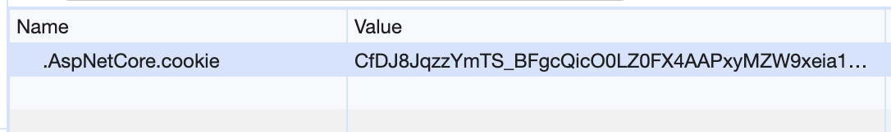
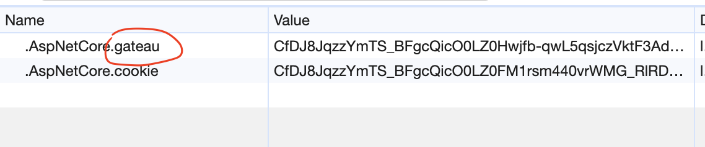

# 02 Authentification avec `ASP.NET`

Il existe dans le `framework` des outils implémentant déjà le `middleware` et le `service` coder `from scratch` à la fiche `1`.


## Ajouter le service : `AddAuthentication`

```cs
builder.Services.AddAuthentication("cookie")
    .AddCookie("cookie");
```

`"cookie"` est le nom du `scheme` d'authentification.


## Ajouter le `middleware` : `UseAuthentication`

```cs
app.UseAuthentication();
```


## `login`

```cs
app.MapGet("/login", async (HttpContext ctx) => {
    List<Claim> claims = [
        new Claim("usr", "hukar")
    ];
    
    var identity = new ClaimsIdentity(claims, "cookie");
    var user = new ClaimsPrincipal(identity);
    
    await ctx.SignInAsync("cookie", user);
    
    return "ok";
});
```


## Création du `Cookie`

C'est maintenant `ASP.NET` qui s'occupe de créer un `Cookie` :



Le nom du `cookie` suit la syntaxe `.AspNetCore.<authenticationScheme>`.

Si je change `authenticationScheme` en `gateau` par exemple :

```cs
var cookieScheme = "gateau";
```

```cs
builder.Services.AddAuthentication(cookieScheme)
    .AddCookie(cookieScheme);
```

```cs
app.MapGet("/login", async (HttpContext ctx) =>
{
    List<Claim> claims = [new Claim("usr", "hukar")];
    var identity = new ClaimsIdentity(claims, cookieScheme);
    
    await ctx.SignInAsync(cookieScheme, new ClaimsPrincipal(identity));
    
    return "ok";
});
```

On obtient :




## `username`

Le code du `endpoint` ne change pas :

```cs
app.MapGet("/username", (HttpContext context)
    => Results.Ok((object?)context.User.FindFirst("usr")?.Value)
);
```

