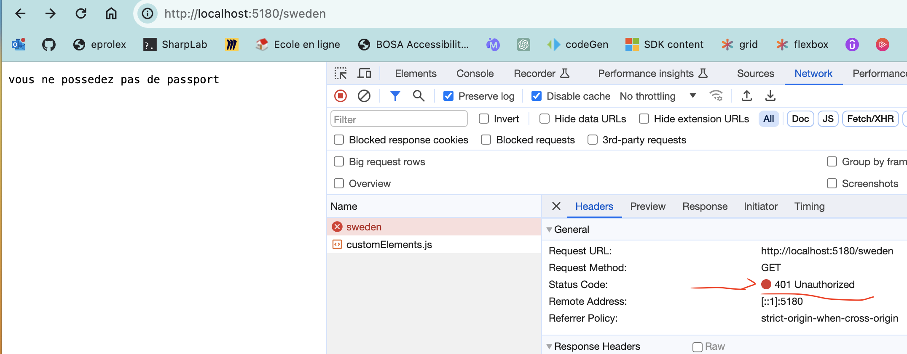

# 03 Authorization `from scratch`

## Définition

Si l'`authentication` permet de savoir qui vous êtes, l'`authorization` permet de savoir s'il vous est permis d'accéder à une ressource (un `endpoint`).

Si un `passeport` représente votre `authentication`, un `claim` de type `"paseport_type"` va définir vos `authorization`.


## `401 Unauthorized` Non authentifié et `403 Forbidden` accès refusé (non authorisé)

Ajoutons d'abord un `claim` régulant l'accès à une pays :

```cs
app.MapGet("/login", async (HttpContext ctx) => {
    List<Claim> claims = [
        new Claim("usr", "hukar"),
        new Claim("passport_type", "eu") // <- ici
    ];
    
    var identity = new ClaimsIdentity(claims, "Passport");
    var user = new ClaimsPrincipal(identity);
    
    await ctx.SignInAsync(authScheme, user);
    
    return "ok";
});
```

Le deuxième argument du constructeur `ClaimsIdentity` est `authenticationType`, le type de la carte d'identification en quelque sorte, ici je donne la valeur `"Passport"`.

Puis créons un `endpoint` représentant un pays : `sweden`

```cs
app.MapGet("/sweden", (HttpContext ctx) =>
{
```

On vérifie que la personne a un `passeport` :

```cs
	if (!ctx.User.Identities.Any(x => x.AuthenticationType == "Passport"))
```

ou

```cs
	if (ctx.User.Identities.All(x => x.AuthenticationType != "Passport"))
    {
        ctx.Response.StatusCode = 401; // UNAUTHORIZED
        return "vous ne possedez pas de passport";
    }
```

On vérifie que le `passeport` est adapté :

```cs
	if (!ctx.User.HasClaim("passport_type", "eu"))
    {
        ctx.Response.StatusCode = 403; // FORBIDDEN
        return "votre passeport ne vous permez pas d'accéder à ce pays";
    }
```

Si tout est correcte on donne l'accès :

```cs
    return "Vous êtes le bienvenue en Suède";
});
```




## Création d'un `middleware` d'`authorization`

Si on a plusieurs `endpoints`, on ne veut pas répéter encore et encore les mêmes vérifications, on créé un `middleware` chargé de gérer l'`authorization`.

```cs
app.Use((ctx, next) =>
{
    if (ctx.Request.Path.Value == "/login") return next();
    
    // Check if passport exists
    if (ctx.User.Identities.All(i => i.AuthenticationType != "Passport"))
    {
        ctx.Response.StatusCode = 401; // NOT AUTHORIZED
        ctx.Response.WriteAsync("Vous n'avez pas de Passeport");
        return CompletedTask;
    }
    
    // Check if passport is valid for sweden => "eu"
    if (!ctx.User.HasClaim("passport", "eu"))
    {
        ctx.Response.StatusCode = 403; // FORBIDDEN
        ctx.Response.WriteAsync("Votre passeport n'est pas valable pour ce pays");
        return CompletedTask;
    }

    return next();
});
```

Les `endpoints` peuvent alors être drastiquement simplifiés :

```cs
app.MapGet("/sweden", () => "all is ok for Sweden");

app.MapGet("/danmark", () => "all is ok for Danmark");
```

La première ligne permet de pouvoir se `loguer` sans être `authentifié`.

En utilisant des `attributs` et la `reflection` il serait possible de proposer des options par `endpoint`, c'est ce que propose le framework `ASP.NET`.