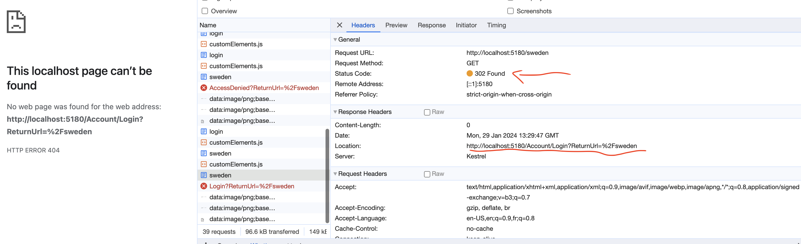
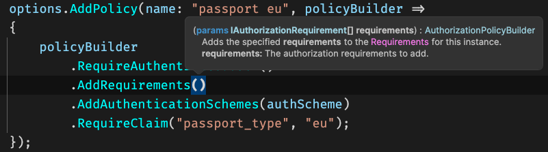
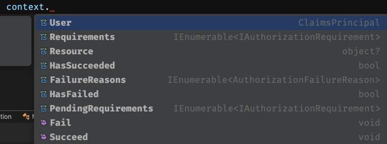

# 04 Authorization avec `ASP.NET`

## Mise en place

```cs
app.UseAuthorization();
```


## Ajouter les règles d'`authorization`

On doit ajouter des `policies` au service `Authorization` :

### `AddPolicy(<name>,<Action<PolicyBuilder>>)`

```cs
builder.Services.AddAuthorization(options =>
{
    options.AddPolicy("passport eu", policyBuilder =>
    {
        policyBuilder
            .RequireAuthenticatedUser()
            .AddAuthenticationSchemes(authScheme)
            .RequireClaim("passport_type", "eu");
    });
});
```

Le `policy builder` utiliser une `fluent API` pour créer des `politiques d'authorisation`.


## Protéger un `endpoint`

### `RequireAuthorization`

```cs
app.MapGet("/sweden", (HttpContext ctx) => "Vous êtes le bienvenue en Suède")
    .RequireAuthorization("passport eu");
```

On retrouve le nom (`string`) donné à la `authorization policy`.

Il y a un système de redirection géré par `aps.net` :



Le code `302` est une redirection vers l'`url` renseignée par le `header` `Location`, ici `http://localhost:5180/Account/Login?ReturnUrl=%2Fsweden`.


## `Custom Requirement`

On peut créer ses propres `Requirements` grâce à la méthode `AddRequirements`



On peut lui passer une ou plusieurs `class` implémentant `IAuthorizationRequirement`


### Créer une classe `MyRequirement`

```cs
public class MyRequirement : IAuthorizationRequirement { }
```

On doit aussi créer un `Handler`

```cs
public class MyRequirementHandler : AuthorizationHandler<MyReqirement>
{
    protected override Task HandleRequirementAsync(AuthorizationHandlerContext context, MyRequirement requirement)
    {
        // context.User
        // context.Succeed(new MyRequirement());
        
        return Task.CompletedTask
    }
}
```

On obtient alors le `context` d'authorisation :



Ce `context` donne accès au `User` et aux méthodes `Fail` et `Succeed`.
