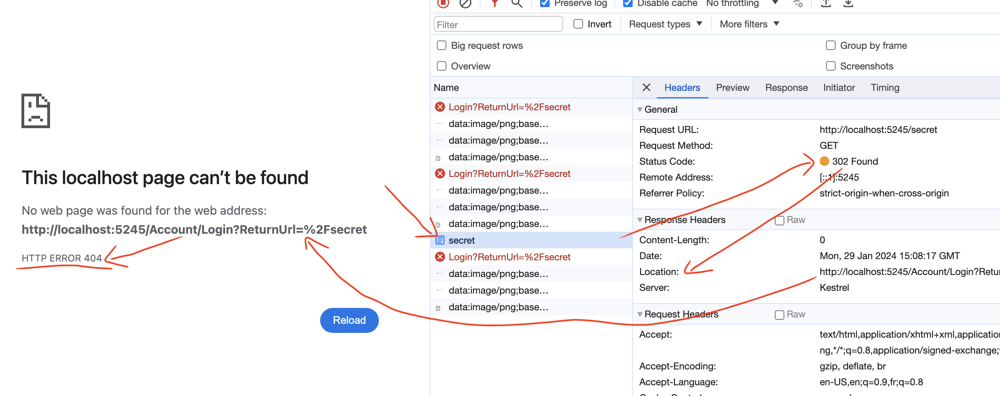

# 05  les Rôles

## Mise en place

Dans `Program.cs`

```cs
builder.Services.AddAuthentication()
    .AddCookie("cookie");

builder.Services.AddAuthorization();

builder.Services.AddController();

// ...

app.UseAuthentication();
app.UseAuthorization();

app.MapControllers();

app.Run();
```

Puis on ajoute deux `controllers` :

`Controllers/HomeController.cs`

```cs
[ApiController]
public class HomeController : ControllerBase
{
    [HttpGet("/")]
    public string Index() => "Index route";
    
    [HttpGet("/secret")]
    [Authorize(Roles = "admin")]
    public string Secret() => "Secret route";
}
```

`Controllers/accountController.cs`

```cs
[ApiController]
public class AccountController : ControllerBase
{
    [HttpGet("/login")]
    public IActionResult Login() => SignIn(
    	new ClaimsPrincipal(
        	new ClaimsIdentity(
            	[
                    new Claim(ClaimTypes.NameIdentifier, Guid.NewGuid().ToString()),
                    new Claim("nickname", "hukar")
                ],
                "cookie"
            )
        ),
        authenticationScheme: "cookie"
    );
}
```

Si on essaye d'aller à l'`url` : `/secret`, on obtient une redirection (`302`) puis finalement un code `404` :




## Spécifier le rôle

La gestion des `rôles` est construite sur les `policy` et sur les `Claims`.

On a besoin de deux choses :

- un `Claim` qui représente le rôle.
- Définir que ce `Claim` est de type `RoleClaimType` avec le paramètre `roleType` du constructeur de `ClaimsIdentity`.

```cs
public IActionResult Login()
    {
        Claim[] claims = [
            new Claim(ClaimTypes.NameIdentifier, Guid.NewGuid().ToString()),
            new Claim("my_role_claim_whateF***", "admin")
        ];

        var identity = new ClaimsIdentity(
            claims, 
            authenticationType: "cookie",
            nameType: null,
            roleType: "my_role_claim_whateF***"
        );
        var user = new ClaimsPrincipal(identity);

        return SignIn(user, "cookie");
    }
```

`.net` va créer une `policy` à la volée pour vérifier ce `rôle`.

Pas besoin de créer nous-même une `policy`. Cette `policy` est construite une seule fois et stockée dans le `cache` (`policyCache.Store(endpoint, policy)`).


