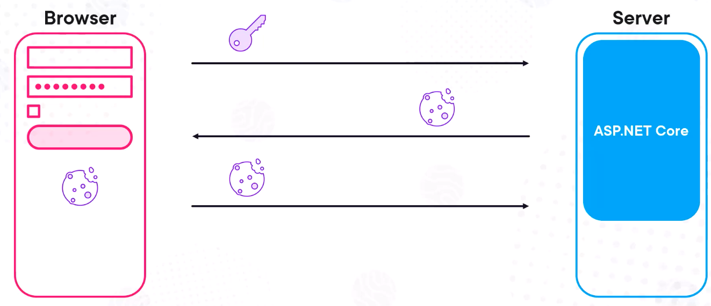
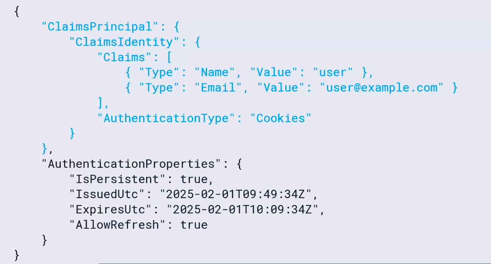

# 01 Authentification avec `Cookie`


## Authentification

C'est l'action de déterminer si quelqu'un est bien celui qu'il prétend être.



Le `cookie` contient le `ClaimsPrincipal` ainsi que quelques propriétés en plus, l'ensemble est encrypté.

L'application `asp.net` est capable de décrypter le `cookie` et retrouver les infos de `ClaimsPrincipal` :



Le `ClaimsPrincipal` est accessible via `HttpContext.User`.


## Implémentation dans `Program.cs`

```cs
builder.Services.AddAuthentication()
    .AddCookie(options =>
    {
        options.LoginPath = "/hukar-login";
        options.LogoutPath = "/hukar-logout";
    });

builder.Services.AddAuthorization();
```

Par défaut le `LoginPath` est `/Account/Login` et le `LogoutPah` est `/Account/Logout`.

```cs
app.UseAuthentication();

app.UseAuthorization();
```


## Implémentation des `endpoints` de `login` et de `logout`

```cs
app.MapGet("/hukar-login", async ([FromQuery] string returnUrl, HttpContext ctx) =>
        {
            Console.WriteLine($"return URL: {returnUrl}");

            var claimOne = new Claim("name", "hukar");
            var claimTwo = new Claim("password", "1234");
            var identity = new ClaimsIdentity([ claimOne, claimTwo ], CookieAuthenticationDefaults.AuthenticationScheme);

            var user = new ClaimsPrincipal(identity);
            
            await ctx.SignInAsync(user);
        });
```


> ## Problème avec `ClaimsIdentity`
>
> Si je ne spécifie pas le `authentication scheme` dans le constructeur de `ClaimsIdentity` :
>
> ```cs
> var identity = new ClaimsIdentity([ claimOne, claimTwo ]);
> ```
>
> J'obtiens l'erreur suivante :
>
> ```
> System.InvalidOperationException: SignInAsync when principal.Identity.IsAuthenticated is false is not allowed when AuthenticationOptions.RequireAuthenticatedSignIn is true.
> ```
>
> 


