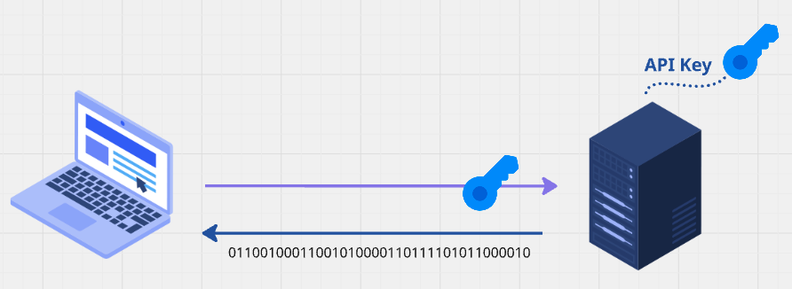

# 02 Authentification par `API Key`


## Présentation

Une façon simple de protéger une `API` est avec une `API Key`.



Le `client` joint une `API Key` à toutes ses requêtes afin de s'authentifier auprès du serveur.

C'est généralement une application tierce qui fournit et gère l'`API Key`.

Il n'existe pas de module tout fait dans `.net`, il faut donc implémenter `from scratch` cette solution.


## Générer la `API Key`

`System.Security.Cryptography`

```cs
public string GenerateApiKey(int size = 64)
{
    using var rng = RandomNumberGenerator.Create();
    
    var byteArray = new byte[size];
    
    rng.GetBytes(byteArray);
    
    return Convert.ToBase64String(byteArray);
}
```

```
JA6/gb6mEL+JNMKftpghJDkPg+ra8volqgHeZhQUOFqRhAtmQV6FW63Y01rU5ZyQP4U0NMBbfiC34Y2fVq0kVQ==
```


## Stocker la clé dans `appsettings.json`

Dans le `client Blazor` et dans le `serveur API`.

> #### !!! À éviter `appsettings.json` en production.
>
> ## Plutôt utiliser les variables d'environnement :
>
> ```bash
> export AppApiKey=qaNztNOBQV10Q+3r7rUKs0Wb5Rl68iYNRBEbtdw2fBKVKg45aqCQKEsuoVXRsGqHbdEoXi8MWup6Uxb3Z0eL5g==
> ```
>
> Dans `Program.cs`
>
> ```cs
> builder.Configuration.AddEnvironmentVariables();
> ```
>
> Puis dans le code :
>
> ```cs
> var apiKey = configuration["AppApiKey"];
> ```
>
> Ceci ajoute la variable d'environnement que pour la session en cours du Terminal.
>
> ### Ajouter une variable de manière permanente
>
> On doit l'ajouter dans `~/.zshrc` :
>
> ```bash
> echo 'export MaSuperClefSecrete="MaValeurDeClef"' >> ~/.zshrc
> source ~/.zshrc
> ```

```json
{
  "Logging": {
    "LogLevel": {
      "Default": "Information",
      "Microsoft.AspNetCore": "Warning"
    }
  },
  "AllowedHosts": "*",
  "ApiKey": "A6/gb6mEL+JNMKftpghJDkPg+ra8volqgHeZhQUOFqRhAtmQV6FW63Y01rU5ZyQP4U0NMBbfiC34Y2fVq0kVQ=="
}
```


## Envoyer la clé depuis le `client`

On va configuré la `factory` (`HttpClientFactory`) :

`Program.cs`

```cs
var apiKey = builder.Configuration["APiKey"];

builder.Services.AddHttpClient("api-hukar", cfg =>
{
    cfg.BaseAddress = new Uri("http://localhost:5005");
    cfg.DefaultRequestHeaders.Add("x-api-key", apiKey);
});
```


> ## Afficher les `headers` reçu dans la requête
>
> `DisplayHeadersMiddleware.cs`
>
> ```cs
> public class DisplayHeadersMiddleware(RequestDelegate next)
> {
>     public async Task InvokeAsync(HttpContext context)
>     {
>         foreach (var (key, value) in context.Request.Headers)
>         {
>             Console.WriteLine($"{key}: {value}");
>         }
>         
>         await next(context);
>     }
> }
> ```
>
> ```cs
> app.UseMiddleware<DisplayHeadersMiddleware>(); // Program.cs
> ```


## Utiliser un `middleware` d'`authentication`

`ApiKeyAuthenticationMiddleware.cs`

```cs
public class ApiKeyAuthenticationMiddleware(RequestDelegate next)
{
    public async Task InvokeAsync(HttpContext context, IConfiguration configuration)
    {
        var apiKey = configuration["ApiKey"];
        var xApiKeyHeader = context.Request.Headers["x-api-key"];

        if (apiKey != xApiKeyHeader)
        {
            context.Response.StatusCode = StatusCodes.Status401Unauthorized;
            return;
        }

        await next(context);
    }
}
```


## Utiliser un `filter` pour l'`authentification`

Permet d'appliquer l'authentification sur les `endpoints` souhaités, contrairement au `middleware` qui agit pour tous les `endpoints`.

```cs
public class ApiKeyAuthenticationFilter(IConfiguration configuration) : IEndpointFilter
{
    public async ValueTask<object?> InvokeAsync(EndpointFilterInvocationContext context, EndpointFilterDelegate next)
    {
        var apiKey = configuration["ApiKey"];

        var xApiKeyHeader = context.HttpContext.Request.Headers["x-api-key"];

        if (apiKey != xApiKeyHeader) return Results.Unauthorized();

        return await next(context);
    }
}
```

